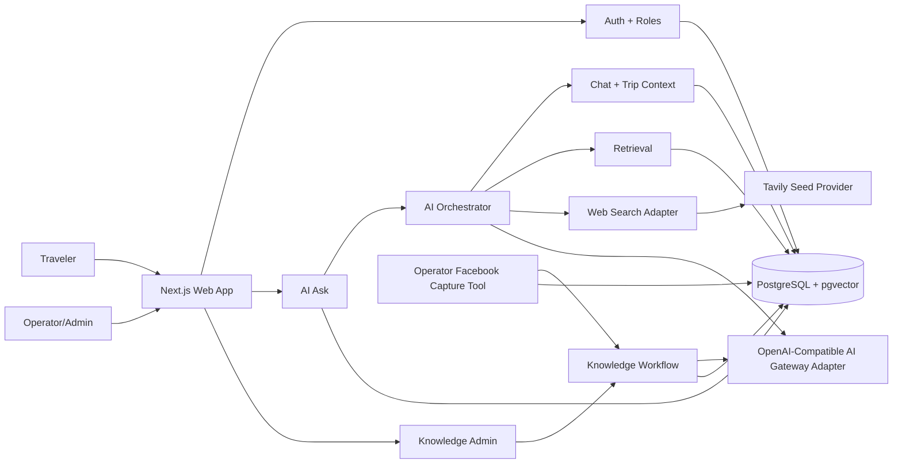
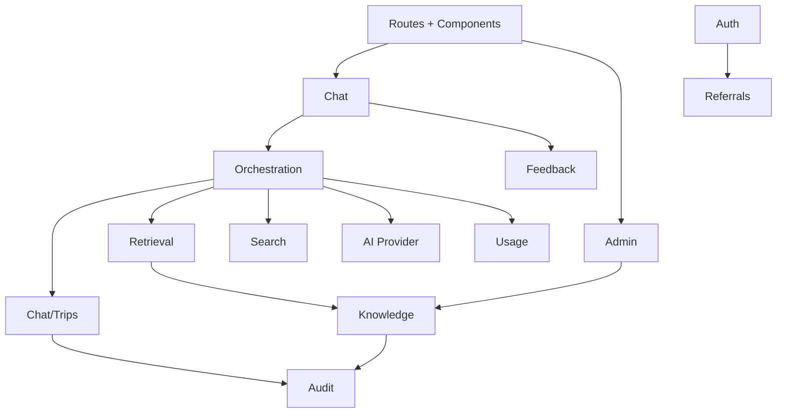
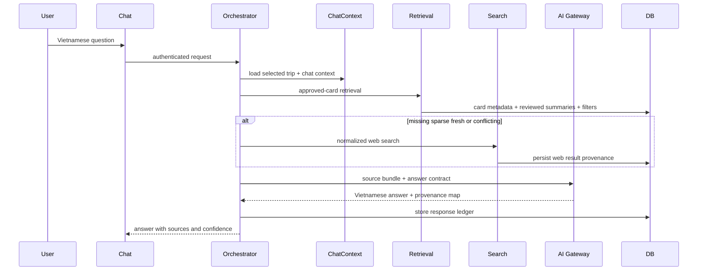

# XuyenViet AI Travel Information MVP Architecture Spine

## Paradigm

Modular monolith, DB-owned retrieval, provenance-first AI orchestration.

The MVP ships one coherent web application and one owned data plane. Product modules stay separated by server-side boundaries, but not by deployable services. AI answer generation is a controlled orchestration pipeline, not free-form model use.

## System Shape

## Adopted Decisions

### AD-1: MVP Runtime Is A Next.js Modular Monolith

Binds: UI, route handlers, server actions, admin, chat, retrieval orchestration, and beta operations live in one TypeScript application.

Prevents: independent chat/admin/retrieval implementations choosing incompatible service contracts or release paths.

Rule: Build feature modules with server-side interfaces; do not split into services for MVP.

Rule: Keep the repository as a root-level Next.js app for the MVP. Do not move to an `apps/web` or multi-app workspace structure for future mobile support unless a later architecture or correct-course decision explicitly approves that restructure.

Rule: Treat a future mobile app as a new client channel over stable server/API boundaries, not a reason to extract shared packages or change deployable shape during the web MVP.

Seed: create-next-app TypeScript, App Router, React Server Components where useful, route handlers/server actions for mutations.

### AD-2: PostgreSQL Owns Product State And Retrieval State

Binds: users, roles, conversations, messages, trip projects, chat/trip context, knowledge cards, source records, embeddings, web results, feedback, and audits share one PostgreSQL data plane.

Prevents: provider-hosted vector stores or search tools becoming hidden source-of-truth for approval state, provenance, or deletion.

Rule: Persist embeddings in pgvector tables linked to first-class product rows; never store retrievable knowledge only inside an external vector store.

Seed: hosted PostgreSQL with pgvector available for later hybrid retrieval. Epic 5 starts with deterministic metadata-filtered retrieval over approved knowledge-card records; Postgres full-text search and vector similarity are deferred until metadata eligibility, provenance, and source-bundle contracts are stable.

### AD-3: Drizzle Owns Schema And Migrations

Binds: schema evolution, data access, and migrations to code-reviewed TypeScript definitions.

Prevents: ad hoc SQL drift across AI Ask, admin, retrieval, and evaluation work.

Rule: All persistent tables and indexes are introduced through migrations; raw SQL is allowed only inside reviewed migration/query helpers for pgvector/full-text operations.

### AD-4: Auth Is Public Sign-In Plus Google OAuth And Server-Side Roles

Binds: public sign-in access, required Google OAuth before AI Ask, and server-side role checks for admin/operator capabilities.

Prevents: client-only authorization, separate admin auth, or accidental operator access for normal travelers.

Rule: Public entry/sign-in routes may be reachable without an allowlist; AI Ask routes and actions require an authenticated session; every admin/operator route/action validates session and role before reading or mutating protected data.

Seed: Auth.js Google OAuth with PostgreSQL-backed sessions/accounts. [ASSUMPTION]

### AD-5: Feature Ownership Boundaries Are Explicit

Binds: module ownership to these domains: Auth, Chat/Trips, Knowledge, Retrieval, Search, AI Orchestration, Admin, Feedback/Eval, Usage, Referrals, Audit.

Prevents: circular ownership of chat/trip context, knowledge cards, sources, and answer provenance.

Rule: UI components call their feature's server entrypoints; feature modules do not reach into another module's tables except through exported server functions or query helpers.

### AD-6: Mutations Are Server-Side And Audited

Binds: chat/trip changes, knowledge approval, card edits, source edits, feedback, and deletion actions to authenticated server-side mutation paths with audit context.

Prevents: client-side writes, unaudited operator edits, or AI directly persisting sensitive state.

Rule: Every mutation records actor, target, operation, timestamp, and relevant before/after summary where appropriate.

Rule: Each mutable aggregate has one owning command module: Chat/Trips owns conversations, messages, trip projects, chat/trip context, chat/trip embeddings, and user-owned deletion of chats/trips; Knowledge owns cards, card sources, raw source material, and card embeddings; Search owns web results; AI Orchestration owns assistant response provenance; Usage owns append-only AI usage events; Referrals owns referral codes and referral attribution; Feedback/Eval owns feedback and eval runs; Audit owns append-only audit events.

Rule: Usage events are operational/accounting telemetry and must not be treated as credit ledger entries.

Rule: MVP referral attribution records do not create rewards, balances, payout obligations, ranking status, or credit conversion.

Rule: Non-owning modules may read through query helpers but must not export or call generic table upserts/deletes for another module's aggregate.

### AD-7: Knowledge Cards Have A Human Approval Lifecycle

Binds: knowledge-card lifecycle to `draft -> approved -> archived`.

Prevents: raw, unreviewed, or Facebook-derived content leaking into normal user answer grounding.

Rule: Only `approved` cards are available to retrieval for traveler answers; raw source material remains operator-only.

Minimum card fields: title, type, route segment/location, summary, source link/label, collected date, confidence label, tags, freshness-sensitive flag, status.

Rule: Every approved card links to at least one normalized `sources` row through `knowledge_card_sources`; retrieval reads source metadata from linked source rows, not free-text card fields.

Rule: Knowledge collection accepts URL, raw text, copied post content, and image/screenshot inputs. Image/screenshot ingestion stores file metadata and operator-only raw material, extracts text/vision notes for operator review, and preserves the image-derived provenance before card approval.

Rule: Traveler answer source bundles must not include `raw_source_material.raw_text` or operator-only fields; operator/admin retrieval paths are separate role-checked functions.

### AD-7A: Facebook Capture Is Operator-Controlled And Raw-Material Only

Binds: queued Facebook URL intake, browser automation capture, raw source material persistence, and later AI extraction.

Prevents: Facebook URL ingestion diverging into public request-path scraping, stored Facebook credentials, unreviewed traveler-visible content, or automated trust upgrades.

Rule: Facebook URLs are first-class `sources` rows with `kind = facebook`; a URL without readable raw text is a queued source, not a failed source and not an AI-readable source.

Rule: The capture mechanism is an operations tool, seeded as a Playwright-based browser automation script using an operator-controlled persistent browser profile on the Ubuntu Desktop operations machine. It is not part of the public traveler request path and must not run from user-triggered web requests.

Rule: The capture tool may read queued Facebook sources, open the canonical URL in the operator's visible browser session, extract visible post text and safe capture metadata, show a confirmation preview, then update the existing `raw_source_material` row. It must not store or persist Facebook cookies, access tokens, local storage, passwords, full HTML dumps, hidden page data, or browser profile data in PostgreSQL.

Rule: Captured Facebook text remains operator-only raw source material. AI extraction can create drafts from it only through the existing knowledge workflow, and every resulting card keeps Facebook/community trust defaults unless an operator explicitly changes source metadata under the approved source policy.

Rule: Capture writes must be auditable as operator/admin mutations where practical: source ID, actor or operations identity, capture timestamp, capture method, before/after raw-text presence, and non-sensitive error summary on failure.

### AD-8: AI Ask Uses A Fixed Context Priority Pipeline

Binds: answer context priority to selected trip project context, current chat session context, approved XuyenViet knowledge, web search fallback, then general model reasoning.

Prevents: feature teams bypassing PRD source/confidence rules or using web/general AI before owned context.

Rule: The AI orchestrator assembles a source bundle before model generation and passes explicit provenance metadata into the answer prompt.

### AD-9: Web Search Is Provider-Adapted And Always Unverified

Binds: web fallback to a search adapter contract: query, title, URL, snippet/content, score, checkedAt, sourceType, confidence.

Prevents: provider lock-in, source-less answer facts, and inconsistent external-source labels.

Rule: Search-derived facts are labeled `unverified` until an operator approves them into knowledge cards; official/provider pages are preferred by query construction, include/exclude domains, country bias, and post-filtering.

Seed: Tavily Search API for MVP fallback because it returns title, URL, content, score, Vietnam country bias, domain filters, and freshness controls. [ASSUMPTION]

Rule: Tavily remains provisional until an architecture spike validates Vietnamese corridor queries, official/provider preference, URL/title/snippet/date availability, rate limits, and failure behavior.

### AD-10: AI Gateway Access Is Adapter-Based And Source-Bundled

Binds: chat generation, extraction, embeddings, and evaluation calls to an OpenAI-compatible AI Gateway provider adapter.

Prevents: direct model calls that invent source labels, write memory directly, or bypass audit metadata.

Rule: Every model call declares purpose, model, prompt version, input source bundle, and output schema expectation where applicable.

Rule: AI provider adapter calls must return or emit usage metadata when available, including model, token counts, provider request ID if available, latency, and failure status. The Usage module persists this metadata without storing raw prompt/response content beyond existing message/provenance records.

Rule: AI Gateway model selection reads from a managed model catalog, not from scattered hard-coded model strings. Each active model record includes gateway model name, intended purposes, capability flags, pricing metadata, and effective date/version information.

Rule: Model capability flags must represent at least text input, image input, image output, embeddings, extraction, evaluation, streaming, and cache pricing support where applicable.

Rule: Usage cost estimates are derived from provider usage metadata plus the selected model pricing record when available. Missing pricing must not block safe answer generation, but it must be visible as missing-cost metadata in usage records.

Rule: Direct OpenAI API calls are not used. AI calls go through the OpenAI-compatible AI Gateway configured by `AI_GATEWAY_BASE_URL` and `AI_GATEWAY_API_KEY` per environment. Public MVP launch is blocked until gateway/provider data-processing settings and privacy notice text are verified so submitted project data is not used for provider model training where configurable.

### AD-11: Answer Provenance Is Persisted, Not UI-Derived

Binds: every assistant answer to stored provenance categories, knowledge card IDs, chat/trip context IDs, web result IDs, model name, prompt version, and evaluation metadata.

Prevents: citations that appear in the UI but cannot be audited, debugged, or measured later.

Rule: The UI renders source/confidence sections from stored response provenance, not by re-parsing the answer text.

Rule: `assistant_response_provenance` is row-per-source-item, not only a JSON blob. Each row stores `message_id`, `source_category`, exactly one nullable source reference for chat/trip/knowledge/web when applicable, source rank, retrieval score, source type, verification status, `used_in_prompt`, `cited_in_answer`, and a source snapshot.

Rule: The orchestrator persists provenance with the assistant message in the same transaction; UI, eval, and audits consume this table only.

### AD-12: Context Is Split Between Chat Sessions And Trip Projects

Binds: current discussion facts to chat sessions and focused travel-planning state to trip projects.

Prevents: overbuilt global memory and keeps personalization understandable in a ChatGPT/Gemini-like session and project model.

Rule: AI extraction proposes chat context or trip project updates; the Chat/Trips module validates allowed travel-planning fields before persistence and rejects clearly disallowed sensitive data.

Allowed chat/trip context: start city, traveler count, child age range, travel preferences, prior trips, avoided/repeated places, budget range, hotel style, driving tolerance, vehicle/EV needs, food/activity preferences, itinerary constraints, and current trip details.

### AD-13: Users Delete Their Own Chats And Trip Projects

Binds: deletion to user-owned chat sessions and trip projects.

Prevents: heavy support workflows and makes data control match familiar chat-product behavior.

Rule: A user can delete a chat session they own; deletion removes or disables that conversation's messages, extracted chat context, derived embeddings, and normal retrieval access.

Rule: A user can delete a trip project they own; deletion removes or disables project context, linked project conversations where product behavior requires it, derived embeddings, and normal retrieval access.

Rule: Deletion may retain minimal non-content audit metadata for operational integrity, but deleted chat/project content must not appear in normal user UI or retrieval context.

Rule: New tables that store chat/project-derived retrievable content must define what happens when the owning chat or trip project is deleted.

### AD-14: Environments And Secrets Stay Separate

Binds: dev, staging, and production to separate databases, secrets, OAuth config, and search/AI API keys.

Prevents: test data, public users, admin rights, and provider credentials from mixing.

Rule: Public sign-in must not require an allowlist; AI Ask and authenticated personalization require Google OAuth; admin/operator access requires Google OAuth plus role check. Local/dev bypasses must not be deployable defaults.

### AD-15: Deployment Seed Is Serverless-Friendly, Provider Not Yet Final

Binds: implementation to a hosted serverless-friendly Next.js runtime and hosted PostgreSQL with pgvector.

Prevents: relying on unmanaged local infrastructure for public MVP traffic.

Rule: Provider-specific features must stay behind config/adapters until deployment and database provider are confirmed.

Seed: Vercel-compatible Next.js deployment plus hosted Postgres such as Neon/Supabase/Railway with pgvector. [ASSUMPTION]

### AD-16: Streaming Starts After Context Assembly

Binds: chat streaming to the moment after retrieval/search context and provenance ledger inputs are assembled.

Prevents: partial AI answers that cannot satisfy source/confidence display requirements.

Rule: Long-running extraction and embedding may run as background tasks with status; user answers must not stream before the orchestrator knows which source categories were used.

Rule: During streaming, partial assistant tokens are transient UI state. The final assistant message, retrieval decision, provenance rows, and usage events are persisted through the orchestrator; the UI must reconcile to persisted final content after completion.

Rule: If streaming fails before finalization, the app shows a recoverable failure state and must not create a misleading completed assistant message.

Seed latency target: first visible answer within 5 seconds without web search and within 10 seconds with web search. [ASSUMPTION]

### AD-17: Epic 5 Retrieval Starts With Metadata-Filtered Approved Cards

Binds: Story 5.1 retrieval behavior, approved-card eligibility, source-bundle inputs, and later hybrid retrieval upgrades.

Prevents: Story 5.1 depending on full-text ranking, embedding generation, vector indexes, or provider-specific ranking before the product has proven safe retrieval eligibility and auditable provenance.

Rule: The Epic 5 MVP retrieval path uses deterministic PostgreSQL metadata filters over current `knowledge_cards`, linked `sources`, and reviewed card summaries. It does not use Postgres full-text search or pgvector ranking for traveler AI Ask retrieval in Story 5.1.

Rule: Traveler retrieval is fail-closed. A card is retrievable only when the current card status is `approved`, linked source metadata is traveler-safe, the card is not archived/rejected/draft, and all required retrieval metadata is present. Unknown, missing, stale, disabled, or operator-only state excludes the item.

Rule: Retrieval filtering must support at least card type, route segment/location, tags, freshness-sensitive flag, confidence/verification labels, and source type. Simple reviewed-title/summary containment checks may narrow candidates only after metadata eligibility filters; they must not become the primary ranking or recall mechanism.

Rule: Hybrid retrieval is introduced later behind the Retrieval module only after metadata-filtered retrieval, source-bundle snapshots, provenance persistence, and fail-closed tests are stable. Full-text/vector scores may add ranking signals later, but they must not bypass current owner-row eligibility filters.

Rule: Indexing/backfill work for later search or embeddings must define activation, stale/disabled transitions, and rebuild behavior before those rows influence traveler answers.

## Shared Data Contracts

Core persisted entities:

- `users`, `accounts`, `sessions`, `roles`
- `referral_codes`, `referral_attributions`
- `trip_projects`, `conversations`, `messages`, `chat_context`, `assistant_response_provenance`
- `context_embeddings`
- `sources`, `raw_source_material`, `knowledge_cards`, `knowledge_card_embeddings`
- `ai_gateway_models`, `web_search_results`, `ai_usage_events`, `feedback`, `eval_runs`, `audit_events`

AI usage event minimum fields: user ID when available, conversation ID when applicable, trip project ID when applicable, message ID when applicable, purpose, provider, model, prompt version when applicable, request timestamp, latency, success/failure status, provider usage metadata when available, and estimated cost fields when configured.

AI Gateway model record minimum fields: gateway model name, display label, provider/gateway identifier when available, intended purposes, capability flags, active status, pricing currency, input unit price, output unit price, cache read/write unit prices when supported, pricing unit, effective timestamp or version, created/updated timestamps, and operator/admin audit metadata where applicable.

Usage events reference the model record or pricing version used for cost estimation when available. Usage events may also retain the raw gateway model name returned by the provider for reconciliation.

Referral attribution minimum fields: referred user ID, referral code, referrer user ID when resolvable, campaign/source metadata when available, captured timestamp, and immutable first-attribution marker. MVP does not calculate reward amounts.

Confidence labels are fixed for MVP: `unverified`, `community`, `curated`, `partner`, `official`.

Persisted confidence uses two underlying fields: `source_type` as `community | partner | official | unknown`, and `verification_status` as `unverified | operator_curated`. Displayed MVP labels are derived from those fields. Web search results always have `verification_status = unverified`, even when `source_type = official`.

Canonical source linkage:

- `sources`: source kind, URL/canonical URL, label, publisher, collected/checked date, source type, verification status, official/partner flags
- `raw_source_material`: source ID, raw text or file metadata, raw metadata JSON, operator-only flag
- `knowledge_card_sources`: card ID, source ID, support level as `primary | supporting | conflicting`
- Embedding rows: owner table, owner ID, content hash, embedding model, embedding status as `active | stale | disabled`, owner status snapshot, created/disabled timestamps

Retrieval must join embeddings back to current owner rows and filter current owner status. Draft or archived knowledge cards must have no active retrievable embeddings. Updating retrievable text marks previous embeddings stale or disabled in the same transaction before new embeddings become active.

Knowledge card types are fixed from the PRD unless changed through PRD update: place, food, hotel area, activity, service, route note, warning, cost note, parking, EV charging, kid-friendly tip, discount/promotion, general travel tip.

Multimodal input rule: User-submitted AI Ask images are owned by the conversation/chat session or selected trip project context that accepted them. Operator-submitted knowledge images are owned by source/raw-source records. New image-bearing tables must define deletion behavior before migration approval.

Multimodal provider rule: Image inputs passed to the Gateway must be validated for allowed MIME type, size, ownership, and surface before provider calls. Raw provider payloads and image-derived notes must not be exposed outside their owning traveler/admin surface.

## Retrieval Contract

Retrieval returns a normalized source bundle:

- `chat_trip_context`: selected trip project context and current chat session context used
- `knowledge`: approved cards with IDs, titles, summaries, confidence, source metadata, freshness flags, and scores
- `web`: external results with URL, title, snippet/content, checkedAt, provider score, and `unverified` confidence
- `general`: explicit marker when model reasoning fills gaps without source grounding

Traveler AI Ask source bundles contain traveler-safe snapshots only. They may include selected trip context, current chat context, approved knowledge-card summaries, linked source metadata, web snippets, and the general-reasoning marker. They must not include `raw_source_material.raw_text`, copied post bodies, image OCR/vision notes, operator-only fields, or admin-only metadata.

Epic 5 Story 5.1 retrieval is metadata-filtered approved-card retrieval. Candidate selection filters current card rows by approved status, traveler-safe source linkage, card type, route/location, tags, freshness-sensitive flag, confidence/verification labels, and source type. Broad semantic ranking, Postgres full-text ranking, and pgvector ranking are later hybrid-search enhancements, not Story 5.1 requirements.

If retrieval eligibility cannot be proven for a candidate, retrieval excludes it and records the exclusion as an implementation-visible reason where practical. Tests for Story 5.1 must prove draft, archived, rejected, stale, disabled, source-missing, and operator-only/raw-source-backed records do not enter traveler source bundles.

Web search triggers when no relevant approved cards are retrieved, fewer than three relevant approved cards are retrieved for a broad planning question, the user asks about freshness-sensitive facts, or retrieved cards conflict.

Every assistant answer stores a `retrieval_decision`: knowledge candidate count, selected knowledge count, relevance threshold, freshness-required flag, conflict-detected flag, web-search-triggered flag, web-search reason, and general-reasoning-used flag. If web results are used because cards conflict or are stale, provenance includes both relevant card IDs and web result IDs.

## Evaluation Contract

Feedback/Eval owns beta quality measurement. It stores versioned beta prompt sets, rubric dimensions, evaluator prompt/model version, run outputs, linked assistant responses/provenance, usefulness scores, hallucinated unsupported-claim flags, missing-uncertainty flags, and generic-ChatGPT comparison flags.

The five PRD beta prompts are the initial required prompt set: magic-moment family trip, sparse-data question, freshness-sensitive question, service/activity question, and route logistics question.

## Operational Envelope

Production must have:

- Separate production database and secrets.
- Server-side auth and role enforcement for protected personalization/admin capabilities.
- Audit trail for operator/admin mutations.
- Logging for model provider, search provider, latency, failures, and answer provenance IDs.
- User-owned deletion path for chat sessions and trip projects.
- Backup/restore path for PostgreSQL before public user onboarding.
- Facebook capture, if enabled, must run from an operator-controlled operations environment with a separate local browser profile and no stored Facebook credentials in application secrets or the database.

## Deferred

- Final deployment provider and hosted PostgreSQL provider.
- Final privacy-policy wording after provider setting verification.
- Facebook content reuse policy beyond provenance and non-official labeling.
- Whether Facebook capture needs explicit per-source retention/deletion controls before broader operator use.
- Dedicated self-service privacy dashboard beyond chat/trip deletion.
- Google Maps integration.
- AI-generated image output until a concrete traveler or operator workflow is approved.
- Public submissions, credit wallets, payment deposits, reward balances, referral reward calculations, ranking multipliers, reward-to-credit conversion, booking transactions, affiliate automation, and partner transaction flows.
- Mobile app channel.
- Service decomposition.
- Postgres full-text ranking and pgvector/hybrid retrieval for AI Ask, until metadata-filtered retrieval and provenance behavior are stable enough to upgrade behind the Retrieval module.
