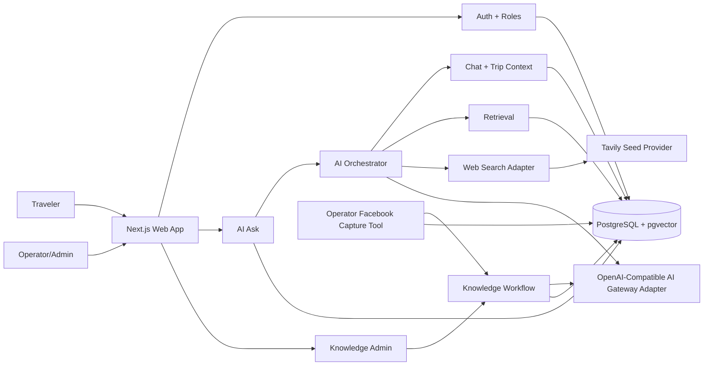
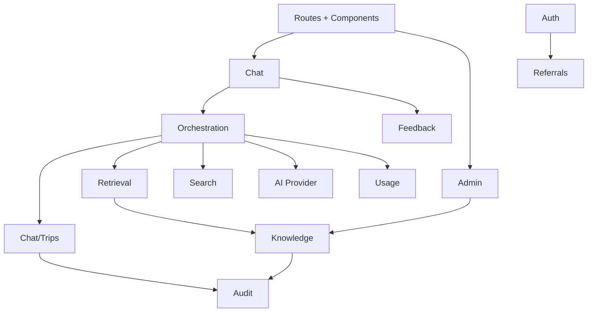

# XuyenViet AI Travel Information MVP Architecture Spine

## Paradigm

Modular monolith, DB-owned retrieval, provenance-first AI orchestration.

The MVP ships one coherent web application and one owned data plane. Product modules stay separated by server-side boundaries, but not by deployable services. AI answer generation is a controlled orchestration pipeline, not free-form model use.

## System Shape

## Adopted Decisions

### AD-1: MVP Runtime Is A Next.js Modular Monolith

Binds: UI, route handlers, server actions, admin, chat, retrieval orchestration, and beta operations live in one TypeScript application.

Prevents: independent chat/admin/retrieval implementations choosing incompatible service contracts or release paths.

Rule: Build feature modules with server-side interfaces; do not split into services for MVP.

Rule: Keep the repository as a root-level Next.js app for the MVP. Do not move to an `apps/web` or multi-app workspace structure for future mobile support unless a later architecture or correct-course decision explicitly approves that restructure.

Rule: Treat a future mobile app as a new client channel over stable server/API boundaries, not a reason to extract shared packages or change deployable shape during the web MVP.

Seed: create-next-app TypeScript, App Router, React Server Components where useful, route handlers/server actions for mutations.

### AD-2: PostgreSQL Owns Product State And Retrieval State

Binds: users, roles, conversations, messages, trip projects, chat/trip context, knowledge cards, source records, embeddings, web results, feedback, and audits share one PostgreSQL data plane.

Prevents: provider-hosted vector stores or search tools becoming hidden source-of-truth for approval state, provenance, or deletion.

Rule: Persist embeddings in pgvector tables linked to first-class product rows; never store retrievable knowledge only inside an external vector store.

Seed: hosted PostgreSQL with pgvector available for later hybrid retrieval. Epic 5 starts with deterministic metadata-filtered retrieval over approved knowledge-card records; Postgres full-text search and vector similarity are deferred until metadata eligibility, provenance, and source-bundle contracts are stable.

### AD-3: Drizzle Owns Schema And Migrations

Binds: schema evolution, data access, and migrations to code-reviewed TypeScript definitions.

Prevents: ad hoc SQL drift across AI Ask, admin, retrieval, and evaluation work.

Rule: All persistent tables and indexes are introduced through migrations; raw SQL is allowed only inside reviewed migration/query helpers for pgvector/full-text operations.

### AD-4: Auth Is Public Sign-In Plus Google OAuth And Server-Side Roles

Binds: public sign-in access, required Google OAuth before AI Ask, and server-side role checks for admin/operator capabilities.

Prevents: client-only authorization, separate admin auth, or accidental operator access for normal travelers.

Rule: Public entry/sign-in routes may be reachable without an allowlist; AI Ask routes and actions require an authenticated session; every admin/operator route/action validates session and role before reading or mutating protected data.

Seed: Auth.js Google OAuth with PostgreSQL-backed sessions/accounts. [ASSUMPTION]

### AD-5: Feature Ownership Boundaries Are Explicit

Binds: module ownership to these domains: Auth, Chat/Trips, Knowledge, Retrieval, Search, AI Orchestration, Admin, Feedback/Eval, Usage, Referrals, Audit.

Prevents: circular ownership of chat/trip context, knowledge cards, sources, and answer provenance.

Rule: UI components call their feature's server entrypoints; feature modules do not reach into another module's tables except through exported server functions or query helpers.

### AD-6: Mutations Are Server-Side And Audited

Binds: chat/trip changes, knowledge approval, card edits, source edits, feedback, and deletion actions to authenticated server-side mutation paths with audit context.

Prevents: client-side writes, unaudited operator edits, or AI directly persisting sensitive state.

Rule: Every mutation records actor, target, operation, timestamp, and relevant before/after summary where appropriate.

Rule: Each mutable aggregate has one owning command module: Chat/Trips owns conversations, messages, trip projects, chat/trip context, chat/trip embeddings, and user-owned deletion of chats/trips; Knowledge owns source material, ingestion jobs, cards, card evidence, review/verification recommendations, relations, and search-index dirty markers; Search owns web results; AI Orchestration owns assistant response provenance; Usage owns append-only AI usage events; Referrals owns referral codes and referral attribution; Feedback/Eval owns feedback and eval runs; Audit owns meaningful state-transition and operator-action events.

Rule: Usage events are operational/accounting telemetry and must not be treated as credit ledger entries.

Rule: MVP referral attribution records do not create rewards, balances, payout obligations, ranking status, or credit conversion.

Rule: Non-owning modules may read through query helpers but must not export or call generic table upserts/deletes for another module's aggregate.

### AD-7: Knowledge Cards Are AI-First Provisional Aggregates

Binds: knowledge-card creation, publication, evidence, review, verification, and traveler retrieval.

Prevents: a second claim aggregate, mandatory operator approval, or raw community observations being expressed as official facts.

Rule: An extracted candidate is an operational artifact only. After deterministic validation and an independent AI judge decision, the system creates or updates one canonical `knowledge_card`; no separate persistent claim aggregate exists in the MVP.

Rule: `knowledge_cards` own the current normalized fact, conditions, confidence, freshness risk, a monotonic `content_version`, current judge summary, and separate `publication_state`, `knowledge_state`, `review_state`, and `verification_state`.

Rule: `publication_state` is `active | suppressed | archived`. `knowledge_state` is `community_observation | community_pattern | conditional | uncertain | conflicted | confirmed | superseded`. `review_state` is `none | ai_recommended | in_review | reviewed`. `verification_state` is `not_required | required | corroborated | failed`.

Rule: Only `active` cards may be retrieved. `superseded`, `suppressed`, and `archived` cards are not retrievable. `uncertain` cards are caveat-only. `conflicted` cards cannot support a factual itinerary recommendation. `required` verification is caveat-only until corroborated and never makes a card `confirmed` by itself.

Rule: Every card has one or more current `knowledge_card_evidence` records. Evidence contains only a bounded validated quote/span, source reference, observed/captured time, conditions, support level, display policy, and active/inactive/removed state. Raw source material remains operator-only and never enters traveler source bundles.

Rule: A card may be active without operator review only when code validates its evidence span and privacy policy and the independent judge meets the PRD hard gates and thresholds. Operator approval records review; it is not a publication prerequisite.

Rule: Every evidence record stores a deterministic `independence_key`: the normalized canonical source identity for a directly authored source, or the known original source identity when the capture is a repost/share. `community_pattern` requires at least two active supporting evidence records with distinct independence keys. Freshness-sensitive road, safety, EV, price, hours, availability, booking, and promotion claims automatically set `verification_state = required` and `review_state = ai_recommended`; until corroborated, they are conditional caveats only.

### AD-7A: Facebook Capture Is Operator-Controlled And Raw-Material Only

Binds: queued Facebook URL intake, browser automation capture, raw source material persistence, and later AI extraction.

Prevents: Facebook URL ingestion diverging into public request-path scraping, stored Facebook credentials, unreviewed traveler-visible content, or automated trust upgrades.

Rule: Facebook URLs are first-class `sources` rows with `kind = facebook`; a URL without readable text is a queued source, not a failed source and not an AI-readable source. Each successful capture creates an immutable capture artifact/version with a content hash; jobs and evidence reference that exact capture version, never a mutable raw-text row.

Rule: The capture mechanism is an operations tool, seeded as a Playwright-based browser automation script using an operator-controlled persistent browser profile on the Ubuntu Desktop operations machine. It is not part of the public traveler request path and must not run from user-triggered web requests.

Rule: The capture tool may read queued Facebook sources, open the canonical URL in the operator's visible browser session, extract visible post text and safe capture metadata, show a confirmation preview, then append an immutable capture artifact/version and select it as the source's current capture. It must not store or persist Facebook cookies, access tokens, local storage, passwords, full HTML dumps, hidden page data, or browser profile data in PostgreSQL.

Rule: Captured Facebook text remains operator-only raw source material. The AI-first ingestion pipeline may create active provisional community cards from it only after evidence validation and independent judging. Facebook/community trust defaults remain unless corroboration or an operator changes source metadata under the source policy.

Rule: Capture writes must be auditable as operator/admin mutations where practical: source ID, actor or operations identity, capture timestamp, capture method, before/after raw-text presence, and non-sensitive error summary on failure.

### AD-8: AI Ask Uses A Fixed Context Priority Pipeline

Binds: answer context priority to selected trip project context, current chat session context, active XuyenViet knowledge, web search fallback, then general model reasoning.

Prevents: feature teams bypassing PRD source/confidence rules or using web/general AI before owned context.

Rule: The AI orchestrator assembles a source bundle before model generation and passes explicit provenance metadata into the answer prompt.

### AD-9: Web Search Is Provider-Adapted And Always Unverified

Binds: web fallback to a search adapter contract: query, title, URL, snippet/content, score, checkedAt, sourceType, confidence.

Prevents: provider lock-in, source-less answer facts, and inconsistent external-source labels.

Rule: Search-derived facts are labeled `unverified` until they are ingested into a card that satisfies the applicable publication policy; official/provider pages are preferred by query construction, include/exclude domains, country bias, and post-filtering.

Seed: Tavily Search API for MVP fallback because it returns title, URL, content, score, Vietnam country bias, domain filters, and freshness controls. [ASSUMPTION]

Rule: Tavily remains provisional until an architecture spike validates Vietnamese corridor queries, official/provider preference, URL/title/snippet/date availability, rate limits, and failure behavior.

### AD-10: AI Gateway Access Is Adapter-Based And Source-Bundled

Binds: chat generation, extraction, embeddings, and evaluation calls to an OpenAI-compatible AI Gateway provider adapter.

Prevents: direct model calls that invent source labels, write memory directly, or bypass audit metadata.

Rule: Every model call declares purpose, model, prompt version, input source bundle, and output schema expectation where applicable.

Rule: AI provider adapter calls must return or emit usage metadata when available, including model, token counts, provider request ID if available, latency, and failure status. The Usage module persists this metadata without storing raw prompt/response content beyond existing message/provenance records.

Rule: AI Gateway model selection reads from a managed model catalog, not from scattered hard-coded model strings. Each active model record includes gateway model name, intended purposes, capability flags, pricing metadata, and effective date/version information.

Rule: Model capability flags must represent at least text input, image input, image output, embeddings, extraction, evaluation, streaming, and cache pricing support where applicable.

Rule: Usage cost estimates are derived from provider usage metadata plus the selected model pricing record when available. Missing pricing must not block safe answer generation, but it must be visible as missing-cost metadata in usage records.

Rule: Direct OpenAI API calls are not used. AI calls go through the OpenAI-compatible AI Gateway configured by `AI_GATEWAY_BASE_URL` and `AI_GATEWAY_API_KEY` per environment. Public MVP launch is blocked until gateway/provider data-processing settings and privacy notice text are verified so submitted project data is not used for provider model training where configurable.

Rule: YouTube video knowledge analysis, when enabled, runs only in the server-side `youtube:capture` operations script and calls a configured Gemini video-capable model using `GEMINI_API_KEY`. The key is not an AI Gateway credential and the script is its only allowed consumer; it is never exposed to browser code, request-serving routes, audit summaries, or logs. The script accepts an operator-submitted canonical individual-video URL and a versioned prompt, then persists only bounded operator-only evidence, safe metadata, usage, and audit outcomes. It must not request or persist a full transcript, media, YouTube credentials, cookies, HTML, hidden provider payloads, or raw model prompt/response logs.

Rule: Gemini video analysis is evidence generation, not source verification. Every resulting knowledge card remains unverified until the existing human review and approval lifecycle completes. The adapter must fail closed for inaccessible, unsupported, restricted, blocked, or over-limit videos and must never fabricate a transcript or a knowledge card. Playwright/direct browser scraping and undocumented YouTube APIs are excluded from this integration.

### AD-11: Answer Provenance Is Persisted, Not UI-Derived

Binds: every assistant answer to stored provenance categories, knowledge card IDs, chat/trip context IDs, web result IDs, model name, prompt version, and evaluation metadata.

Prevents: citations that appear in the UI but cannot be audited, debugged, or measured later.

Rule: The UI renders source/confidence sections from stored response provenance, not by re-parsing the answer text.

Rule: `assistant_response_provenance` is row-per-source-item, not only a JSON blob. Each row stores `message_id`, `source_category`, exactly one nullable source reference for chat/trip/knowledge/web when applicable, source rank, retrieval score, source type, verification status, `used_in_prompt`, `cited_in_answer`, and a source snapshot.

Rule: The orchestrator persists provenance with the assistant message in the same transaction; UI, eval, and audits consume this table only.

### AD-12: Context Is Split Between Chat Sessions And Trip Projects

Binds: current discussion facts to chat sessions and focused travel-planning state to trip projects.

Prevents: overbuilt global memory and keeps personalization understandable in a ChatGPT/Gemini-like session and project model.

Rule: AI extraction proposes chat context or trip project updates; the Chat/Trips module validates allowed travel-planning fields before persistence and rejects clearly disallowed sensitive data.

Allowed chat/trip context: start city, traveler count, child age range, travel preferences, prior trips, avoided/repeated places, budget range, hotel style, driving tolerance, vehicle/EV needs, food/activity preferences, itinerary constraints, and current trip details.

### AD-13: Users Delete Their Own Chats And Trip Projects

Binds: deletion to user-owned chat sessions and trip projects.

Prevents: heavy support workflows and makes data control match familiar chat-product behavior.

Rule: A user can delete a chat session they own; deletion removes or disables that conversation's messages, extracted chat context, derived embeddings, and normal retrieval access.

Rule: A user can delete a trip project they own; deletion removes or disables project context, all linked project conversations and their messages/chat context, derived embeddings, and normal retrieval access.

Rule: Deletion may retain minimal non-content audit metadata for operational integrity, but deleted chat/project content must not appear in normal user UI or retrieval context.

Rule: New tables that store chat/project-derived retrievable content must define what happens when the owning chat or trip project is deleted.

### AD-14: Environments And Secrets Stay Separate

Binds: dev, staging, and production to separate databases, secrets, OAuth config, and search/AI API keys.

Prevents: test data, public users, admin rights, and provider credentials from mixing.

Rule: Public sign-in must not require an allowlist; AI Ask and authenticated personalization require Google OAuth; admin/operator access requires Google OAuth plus role check. Local/dev bypasses must not be deployable defaults.

### AD-15: Deployment Seed Is Serverless-Friendly, Provider Not Yet Final

Binds: implementation to a hosted serverless-friendly Next.js runtime and hosted PostgreSQL with pgvector.

Prevents: relying on unmanaged local infrastructure for public MVP traffic.

Rule: Provider-specific features must stay behind config/adapters until deployment and database provider are confirmed.

Rule: Production deployment includes a separately supervised Node worker runtime for knowledge extraction and knowledge-search indexing. Worker processes use PostgreSQL job/index state, expose operational logs and health/restart supervision, and are not run inside request-serving serverless executions.

Seed: Vercel-compatible Next.js request deployment plus hosted Postgres and a compatible worker process host. Final providers remain deferred. [ASSUMPTION]

### AD-16: Streaming Starts After Context Assembly

Binds: chat streaming to the moment after retrieval/search context and provenance ledger inputs are assembled.

Prevents: partial AI answers that cannot satisfy source/confidence display requirements.

Rule: Long-running extraction and embedding may run as background tasks with status; user answers must not stream before the orchestrator knows which source categories were used.

Rule: During streaming, partial assistant tokens are transient UI state. The final assistant message, retrieval decision, provenance rows, and usage events are persisted through the orchestrator; the UI must reconcile to persisted final content after completion.

Rule: If streaming fails before finalization, the app shows a recoverable failure state and must not create a misleading completed assistant message.

Seed latency target: first visible answer within 5 seconds without web search and within 10 seconds with web search. [ASSUMPTION]

### AD-17: Traveler Retrieval Uses Indexed Lexical Candidates And Fail-Closed Eligibility

Binds: active-card candidate search, current eligibility checks, source-bundle inputs, indexing work, and later hybrid retrieval upgrades.

Prevents: stale or unsafe knowledge entering traveler source bundles, or an index/ranking implementation bypassing current owner-row eligibility and provenance.

Rule: The MVP retrieval path searches active `knowledge_card_search_documents` lexically, then loads and validates current active cards, state-aware retrieval policy, and traveler-safe linked sources before a candidate can enter a source bundle. The indexing worker owns active, stale, and disabled search-document transitions.

Rule: Traveler retrieval is fail-closed. A card is retrievable only when its current `publication_state` is `active`, its knowledge/verification state permits the requested use, linked source metadata is traveler-safe, current active evidence exists, and all required retrieval metadata is present. Unknown, missing, stale, disabled, suppressed, archived, superseded, or operator-only state excludes the item.

Rule: Retrieval eligibility must support current publication/knowledge/review/verification states, current active evidence, source-safe linkage, card type, route segment/location, conditions, tags, freshness-sensitive flag, displayed confidence, and source type. Lexical score may rank eligible candidates but must not override owner-row eligibility.

Rule: Retrieval projects one machine-readable use policy per selected card: `contextual_use`, `caveat_only`, or `exclude`. `active + community_observation/community_pattern/conditional + not_required/corroborated` is `contextual_use` only within stated conditions and with state-appropriate community wording; `uncertain` or `verification_state = required` is `caveat_only`; `conflicted`, `failed`, `superseded`, non-active publication, or missing active evidence is `exclude`. The answer prompt must enforce this policy.

Rule: Hybrid retrieval is introduced later behind the Retrieval module only after indexed lexical retrieval, source-bundle snapshots, provenance persistence, and fail-closed tests are stable. Full-text/vector scores may add ranking signals later, but they must not bypass current owner-row eligibility filters.

Rule: Indexing/backfill work for later search or embeddings must define activation, stale/disabled transitions, and rebuild behavior before those rows influence traveler answers.

### AD-18: Traveler Frontend Has Three Canonical Shell States

Binds: public entry, first signed-in use, and active AI Ask planning to one frontend state model.

Prevents: homepage, chat-empty, and active-chat stories creating incompatible route/shell/detail behavior.

Rule: The public logged-out homepage is the root entry surface with sign-in CTA and sign-in-gated ask box. It does not render the authenticated app sidebar.

Rule: The logged-in empty AI Ask state renders the app sidebar, centered greeting, centered composer, and starter prompts. It must not render an empty right detail panel before the first answer or selected entity exists.

Rule: Active AI Ask renders left sidebar, center answer/conversation surface, and a right contextual detail panel when a selected answer entity exists.

Seed: Keep `/` as public entry and `/ai-ask` as the authenticated planning shell in the existing Next.js App Router structure.

### AD-19: Contextual Detail Panel Is Derived UI State

Binds: right-panel content to persisted assistant message content, retrieval decisions, and provenance/source-bundle snapshots.

Prevents: the detail panel becoming a second mutable aggregate, a second chat thread, or a UI-only source of truth.

Rule: Detail panel state is derived from selected answer entities and resolved through owning feature read models: Chat/Trips for conversations/projects/context, Retrieval/Knowledge/Search for source-backed detail, and AI Orchestration provenance for assistant-answer source usage.

Rule: The detail panel may expose actions such as `Dùng trong kế hoạch`, `Xem tuyến đường`, or `Lưu` only by calling the owning server-side command module. It must not mutate another feature's aggregate directly.

Rule: The detail panel is not map-first. Google Maps or map-like spatial integration remains deferred and must not be introduced as an implicit dependency of this redesign.

### AD-20: Selectable Answer Annotations Use Persisted, Provenance-Bound Entity Descriptors

Binds: inline source, warning, trip-fact, action, place, hotel-area, route-segment, and cost annotations to a stable persisted render contract.

Prevents: UI teams independently parsing Vietnamese answer prose to create links, detail panels, or provenance claims.

Rule: Selectable answer annotations are best-effort post-answer enrichment. Their descriptors are validated against persisted assistant-message text and stored provenance/retrieval/source-bundle snapshots before storage and rendering.

Rule: A descriptor type is `source | warning | trip_fact | action | place | hotel_area | route_segment | cost`. It includes a display label, answer text range or section, source category, one or more owning provenance-row references where applicable, and bounded traveler-safe display metadata.

Rule: Every annotated range uses `{ start, end, text }`, where `start` and `end` are zero-based UTF-16 code-unit offsets into the final persisted assistant-message content, `end` is exclusive, and `text` exactly equals `content.slice(start, end)`. Ranges require integer bounds `0 <= start < end <= content.length`; the validator rejects overlapping ranges and any mismatch after persistence/backfill. The client renders persisted offsets only and never normalizes, re-searches, or re-matches Vietnamese prose to recover an entity.

Rule: Every descriptor that carries provenance IDs validates every referenced provenance row belongs to the same assistant message, conversation, and user as the annotation. A descriptor with no provenance IDs may not resolve provenance-derived detail or actions. Cross-message, cross-conversation, cross-user, unknown, or duplicate provenance references are rejected for every descriptor type.

Rule: `place`, `hotel_area`, `route_segment`, and `cost` descriptors require at least one persisted provenance-row reference owned by the same assistant message, conversation, and user as the descriptor. Their label and summary must be the validated annotated answer range. A descriptor with unknown, cross-message, cross-conversation, or cross-user provenance; unmatched text; raw source material; operator-only fields; provider payloads; or an inferred source claim is rejected.

Rule: Entity descriptor quick facts use only the server-projected safe provenance view: `title`, `type`, `locationName`, `routeSegment`, `confidence`, `freshnessSensitive`, `sourceType`, `verificationStatus`, `checkedAt`, and safe HTTP `url`. Each quick fact is `{ label, value }`, both trimmed strings of at most 160 characters, with at most six facts per descriptor. URLs remain in the source/provenance view, not arbitrary quick-fact values. No arbitrary `source_snapshot` JSON is passed to annotation generation, persistence, or the traveler UI.

Rule: Entity descriptor actions are optional. A persisted action is `{ command, label, arguments }`, where `command` is a registered owning-feature server command identifier and `label` is an answer-anchored or safe-projection string. The persisted arguments are descriptive only: the owning server read model derives or mints the executable, descriptor-bound argument/capability set for the current user. The command validates that binding as well as typed input, authorization, and ownership at execution. Unknown commands, arbitrary client routing, label-only actions, and arbitrary persisted target IDs are rejected.

Rule: Source/confidence UI remains governed by AD-11: render from stored provenance, not by re-parsing answer text. Entity selection does not create a new mutable place, hotel, route, or cost aggregate; actions remain server-side commands owned by their existing feature module.

### AD-21: Sidebar Read Models Are Chat/Trips-Owned And Server-Gated

Binds: conversation history, trip project lists, active row state, and account/admin navigation to a single shell read model.

Prevents: client-side ownership filtering, duplicated sidebar data loaders, or admin links leaking to normal travelers.

Rule: Conversation history and trip project sidebar data are loaded through Chat/Trips-owned server read functions scoped to the authenticated user.

Rule: Admin/operator navigation entries are included only after server-side role checks. Normal traveler payloads must not include admin-only navigation or counts.

Rule: The sidebar may collapse to an icon rail or mobile sheet, but data ownership and authorization rules do not change across breakpoints.

### AD-22: Global UI Foundation Is Root-Owned; Reusable Primitives Are Data-Free

Binds: app-wide font loading, CSS design tokens, base surface behavior, reduced-motion behavior, and reusable presentational primitives.

Prevents: route and feature components independently redefining theme colors, typography, focus treatment, or shell variants during the traveler-shell redesign.

Rule: `src/app/layout.tsx` and `src/app/globals.css` own application-wide fonts, semantic CSS tokens, base surfaces, and global accessibility-related visual behavior. Feature modules must consume those definitions rather than recreate global theme rules.

Rule: Data-free reusable UI primitives live under `src/components/ui`. Feature components retain domain behavior, server-action wiring, and feature-specific data contracts; primitives do not import feature modules or call server entrypoints.

Seed: The existing Tailwind CSS 4 setup remains the styling runtime. This architecture does not require adopting a component-library package.

### AD-23: Product Icons Use One Local Typed SVG Boundary

Binds: brand-adjacent product icons and icon-only controls across the public entry, authenticated shell, composer, sidebar, and detail inspector.

Prevents: multiple icon libraries, copied inline SVGs, emoji, text glyphs, and inconsistent accessibility behavior accumulating independently in feature components.

Rule: Product icons are exported from one local typed SVG module under `src/components/ui`. It exports named React icon components with a common SVG-prop-compatible API; it owns product-icon names, paths, and third-party SVG normalization if ever adopted. A feature may compose or style an icon, but it does not define a competing icon set, feature-local SVG paths, or icon-library adapter without an architecture update.

Rule: This is a migration boundary, not a claim about current code. Existing feature-local product SVGs move to the canonical module as their owning shell surface is redesigned; after a surface is migrated, it imports all product icons from that module.

Rule: Every icon-only control has an accessible name, visible keyboard focus treatment, and a hover/focus tooltip. Destructive confirmations retain explicit text; icon-only controls do not remove required user confirmation or error recovery copy.

### AD-24: AI Ask Has One Server-Loaded Shell Model And One Client Workspace State Model

Binds: the authenticated planning-shell route, selected conversation/project URL state, transient workspace state, and desktop/tablet/mobile presentations.

Prevents: separate breakpoint-specific data loaders, multiple owners of selected detail state, or client state that can diverge from the active Chat/Trips route.

Rule: `src/app/ai-ask/page.tsx` remains the server-authenticated route composer and loads user-scoped shell data through owning feature read functions. Chat/Trips owns conversation and trip-project selection represented in the URL.

Rule: `AiAskComposer` owns transient client workspace state: draft input, selected attachment preview, request/streaming state, mobile sheet state, and selected answer-detail descriptor. The descriptor remains derived UI state under AD-19 and AD-20.

Rule: Desktop, tablet, and mobile render the same server-loaded shell data and client workspace state. CSS layout and sheets/drawers change presentation only; they do not create alternate loaders, persistence, or state owners.

Rule: After create, select, delete, project switch, or stream completion, URL-selected conversation/project state is canonical. `AiAskComposer` may update messages and summary lists optimistically while work is pending, but terminal mutation state reconciles through router navigation or refresh. A stale, deleted, or unauthorized URL resource clears local selection and uses the server-safe shell.

Rule: A selected persisted descriptor has exactly one interactive detail surface. Desktop column and mobile sheet are controlled views of the same selection; inactive duplicate views are inert and excluded from assistive technology. Breakpoint changes preserve selection and route state and transfer focus predictably rather than creating independent panel state.

### AD-25: One Source-Version Ingestion Job Orchestrates AI Stages

Binds: source triage, extraction, independent judging, relation matching, retries, and publication outcomes.

Prevents: separate queues re-running completed AI stages, disagreeing about the source lifecycle, or leaving operators unable to identify the current outcome.

Rule: Knowledge owns one stateful ingestion job for each source capture version. Its stages are `queued -> triaging -> extracting -> judging -> relating`, with terminal outcomes `published | suppressed | review_recommended | verify_first | failed`. A retry resumes the failed stage and preserves completed-stage outputs only for short operational retention.

Rule: Recapture creates a new source capture version and ingestion job. It never overwrites a completed job's provenance. The ingestion job records the submitted-by provenance, while automation mutations use the `system-knowledge-pipeline` service actor.

Rule: Workers claim a stage transactionally with `FOR UPDATE SKIP LOCKED`, a lease/fencing token, and expected job stage/version. Every stage result and card mutation uses compare-and-swap against that token and expected card/content version. Stale or duplicate workers cannot publish, attach evidence, or overwrite a later decision.

### AD-26: Publication Mutations Use Transactional Dirty Markers

Binds: AI publication, operator edits, verification, conflict handling, source removal, audit, and search indexing.

Prevents: a stale projection continuing to authorize a card after its source or risk state changes.

Rule: Knowledge transitions card publication/knowledge/review/verification state in one PostgreSQL transaction with a meaningful audit event and a card-version dirty marker. `suppressed`, `archived`, and `superseded` transitions disable the current search document in that transaction; the indexing worker asynchronously rebuilds or disables projections idempotently by `(knowledge_card_id, content_version)`.

Rule: High-risk conflict or source withdrawal immediately downgrades the card to `uncertain` or suppresses it, according to safe-use policy, without waiting for review. Retrieval re-checks current owner-row eligibility before every source-bundle inclusion, so index lag cannot re-enable an ineligible card.

Rule: Source removal is a retryable Knowledge command. Before deleting or hiding a source/capture artifact, it locks every dependent evidence/card, marks evidence removed and traveler-invisible, re-evaluates each card from remaining active evidence, applies downgrade/suppression and projection disablement, then records a concise removal audit. Partial work resumes idempotently from the removal command state.

### AD-27: Evidence Accumulates Selectively; Relations Do Not Auto-Merge Facts

Binds: duplicate handling, supporting/conflicting evidence, condition-aware facts, and cardinality of prompt evidence.

Prevents: semantic similarity joining unrelated locations, volatile evidence silently replacing valid observations, or a duplicate-card explosion.

Rule: Candidate matching is scoped by card type plus normalized location/route. Code validates scope and evidence before an independent relation judge may attach a candidate. Auto-attach requires the same fact and equivalent conditions; materially distinct compatible conditions create a new card; redundant/same-source candidates are suppressed; ambiguous, high-risk, conflict, state-changing, or missing-observed-date relations receive a review recommendation.

Rule: New evidence supplements active evidence by default. It deactivates older evidence only for time-varying facts or when the older record is no longer suitable. A card retains at most three active supporting and one active conflicting evidence record for retrieval, selected by recency, source independence, and quality. Inactive evidence is operational data with short retention and a deactivation reason.

### AD-28: Current-State Audit Is Lean And Actor-Correct

Binds: audit volume, current judge summary, operational artifact retention, and mutation attribution.

Prevents: a fact-version graph that cannot scale or a submitter being incorrectly attributed with autonomous AI decisions.

Rule: Cards retain current states, `content_version`, current judge summary, and currently effective evidence. Durable audits record only meaningful publication/knowledge/verification/review transitions and operator actions. Failed or superseded extraction/evaluation artifacts retain safe code/version metadata for short operational retention, not unlimited raw AI output.

Rule: `system-knowledge-pipeline` is the actor for automated triage, judging, relation, publication, conflict, and indexing mutations. The source submitter remains provenance and is linked to the source/job; they are not represented as the actor for automated decisions.

Rule: A review recommendation references the card `content_version`, active evidence-set revision, and recommended action. Resolving it is compare-and-swap against those references; a changed card automatically receives a new recommendation rather than inheriting `reviewed` from an earlier version.

Rule: Quality sampling creates card-version-bound review recommendations for 15% of auto-active cards during the first four weeks and 100% of `verify_first` outcomes. Sampling resolution records pass/fail reason codes and raises sampling or suppresses the affected policy cohort when a high-severity failure occurs.

Rule: Retention commands delete Facebook source/capture artifacts and dependent operational artifacts after 180 days when they support no active or reviewable card. Inactive evidence and safe failed-stage artifacts expire on the same 180-day schedule unless a shorter operational policy applies; deletion preserves only the concise state/action audit required by AD-28.

## Shared Data Contracts

Frontend shell state contract:

- Public logged-out state: root entry, sign-in CTA, sign-in-gated ask box, no authenticated sidebar payload.
- Logged-in empty state: authenticated shell, user-scoped sidebar payload, centered composer, starter prompts, no right detail panel.
- Active AI Ask state: authenticated shell, user-scoped sidebar payload, selected conversation/trip context, answer sections, selectable answer entity descriptors, optional right detail panel.

Selectable answer entity descriptor minimum fields:

- `type`: `source | warning | trip_fact | action | place | hotel_area | route_segment | cost`
- `label`: Vietnamese display label
- `range`: `{ start, end, text }` using AD-20 zero-based UTF-16, exclusive-end semantics against the final persisted assistant message
- `section`: answer section identifier when available
- `sourceCategory`: `trip_context | chat_context | knowledge | web | general` when applicable
- `owner`: safe reference to the owning provenance row/snapshot; entity descriptors require one or more provenance-row references
- `detail`: bounded traveler-safe summary and at most six `{ label, value }` quick facts from the AD-20 safe-provenance allowlist, with each field anchored to the answer text or linked safe projection
- `provenance`: stored provenance row IDs and safe source snapshot references; entity descriptors require non-empty provenance IDs
- `action`: optional registered `{ command, label, arguments }` object resolved and authorized by its owning server module; never a client-derived route or label-only behavior

Detail panel payloads are read models. They are not persisted as separate product state.

Current MVP annotation descriptors are best-effort post-answer enrichment from a separate gateway completion and may be empty. The UI renders only descriptors persisted after range, provenance, and safe-detail validation; it must not infer additional selectable entities from free-form answer prose at render time.

UI foundation contract:

- `src/app/layout.tsx` and `src/app/globals.css` own application-wide font loading, semantic CSS variables, base page surfaces, and reduced-motion behavior.
- `src/components/ui` contains data-free presentational primitives and the canonical typed SVG icon module.
- Feature modules own feature components and may consume UI primitives, but UI primitives do not import feature modules, database access, server actions, or route state.
- The idle AI Ask composer contains only prompt input, optional icon-only attachment trigger, and icon-only send trigger. Attachment guidance, validation details, and attachment preview are contextual UI state, not persistent shell content.
- Icon-only controls expose accessible labels, visible focus, and hover/focus tooltips. Text remains required for destructive confirmation and non-obvious or high-risk actions.

AI Ask workspace state contract:

- Server-loaded shell state: authenticated user, role-gated navigation, user-owned conversation summary list, user-owned trip-project summary list, active URL-selected conversation/project, and persisted messages/provenance.
- URL-owned state: active conversation and trip-project selection.
- Transient client-owned state: prompt draft, selected image preview, request/streaming status, mobile navigation/detail sheet visibility, and selected answer-detail descriptor.
- Responsive presentation may move sidebar/detail surfaces between columns, rail, and sheets but reuses this state model and server-loaded data. A selected persisted descriptor has exactly one interactive detail presentation; inactive duplicate views are inert and excluded from assistive technology.
- Client copies of messages and summary lists are optimistic only while a request or mutation is pending. Terminal create/select/delete/project-switch/stream states reconcile to the URL-selected server shell; deleted, stale, or unauthorized resources clear client selection.

Core persisted entities:

- `users`, `accounts`, `sessions`, `roles`
- `referral_codes`, `referral_attributions`
- `trip_projects`, `conversations`, `messages`, `chat_context`, `assistant_response_provenance`
- `context_embeddings`
- `sources`, `raw_source_material`, `knowledge_ingestion_jobs`, `knowledge_cards`, `knowledge_card_evidence`, `knowledge_card_relations`, `knowledge_review_recommendations`, `knowledge_card_search_documents`
- `ai_gateway_models`, `web_search_results`, `ai_usage_events`, `feedback`, `eval_runs`, `audit_events`

AI usage event minimum fields: user ID when available, conversation ID when applicable, trip project ID when applicable, message ID when applicable, purpose, provider, model, prompt version when applicable, request timestamp, latency, success/failure status, provider usage metadata when available, and estimated cost fields when configured.

AI Gateway model record minimum fields: gateway model name, display label, provider/gateway identifier when available, intended purposes, capability flags, active status, pricing currency, input unit price, output unit price, cache read/write unit prices when supported, pricing unit, effective timestamp or version, created/updated timestamps, and operator/admin audit metadata where applicable.

Usage events reference the model record or pricing version used for cost estimation when available. Usage events may also retain the raw gateway model name returned by the provider for reconciliation.

Referral attribution minimum fields: referred user ID, referral code, referrer user ID when resolvable, campaign/source metadata when available, captured timestamp, and immutable first-attribution marker. MVP does not calculate reward amounts.

Confidence labels are fixed for MVP: `unverified`, `community`, `curated`, `partner`, `official`.

Persisted knowledge-source fields are `source_type` as `curated | community` and `verification_status` as `unverified | verified`; `official` and `partner` are boolean source metadata. Displayed MVP confidence labels are derived from source metadata and card confidence. Web search results always have `verification_status = unverified`, even when their web-result source type is official/provider.

Canonical source linkage:

- `sources`: source kind, URL/canonical URL, label, publisher, collected/checked date, source type, verification status, official/partner flags
- `raw_source_material`: source ID, raw text or file metadata, raw metadata JSON, operator-only flag
- `knowledge_card_evidence`: card ID, source ID, bounded quote/span, observed/captured time, conditions, support level, display policy, evidence state, and deactivation reason when inactive
- `knowledge_card_relations`: source candidate/card relation as `duplicate | supporting | conflicting | superseding | conditionally_compatible`, with safe current decision metadata
- `knowledge_ingestion_jobs`: source capture version, current stage/outcome, safe retry/failure metadata, submitted-by provenance, and prompt/model references
- `knowledge_card_sources`: compatibility linkage derived from current effective evidence until the existing schema is migrated; it is not sufficient for traveler evidence policy on its own
- Embedding rows: owner table, owner ID, content hash, embedding model, embedding status as `active | stale | disabled`, owner status snapshot, created/disabled timestamps

Retrieval must join embeddings/search documents back to current owner rows and filter current publication, knowledge, verification, evidence, and source-safe state. Suppressed, archived, or superseded cards must have no active retrievable projections. Updating retrievable text marks previous projections stale or disabled in the same transaction before a new version becomes active.

Knowledge card types are fixed from the PRD unless changed through PRD update: place, food, hotel area, activity, service, route note, warning, cost note, parking, EV charging, kid-friendly tip, discount/promotion, general travel tip.

Multimodal input rule: User-submitted AI Ask images are owned by the conversation/chat session or selected trip project context that accepted them. Operator-submitted knowledge images are owned by source/raw-source records. New image-bearing tables must define deletion behavior before migration approval.

Multimodal provider rule: Image inputs passed to the Gateway must be validated for allowed MIME type, size, ownership, and surface before provider calls. Raw provider payloads and image-derived notes must not be exposed outside their owning traveler/admin surface.

## Retrieval Contract

Retrieval returns a normalized source bundle:

- `chat_trip_context`: selected trip project context and current chat session context used
- `knowledge`: active cards with IDs, titles, summaries, conditions, current knowledge/verification state, confidence, safe current evidence/source metadata, freshness flags, and scores
- `web`: external results with URL, title, snippet/content, checkedAt, provider score, and `unverified` confidence
- `general`: explicit marker when model reasoning fills gaps without source grounding

Traveler AI Ask source bundles contain traveler-safe snapshots only. They may include selected trip context, current chat context, active knowledge-card summaries, state-aware use instructions, bounded traveler-visible evidence/source metadata, web snippets, and the general-reasoning marker. They must not include `raw_source_material.raw_text`, copied post bodies, image OCR/vision notes, operator-only evidence, or admin-only metadata.

MVP retrieval searches active knowledge-card search documents lexically, then validates current active publication, knowledge/verification states, active traveler-safe evidence, and linked sources before selecting source-bundle items. Candidate selection filters current card rows by state-aware eligibility, card type, route/location, conditions, tags, freshness-sensitive flag, confidence/verification labels, and source type. Broad semantic ranking, Postgres full-text ranking, and pgvector ranking are later hybrid-search enhancements, not MVP requirements.

If retrieval eligibility cannot be proven for a candidate, retrieval excludes it and records the exclusion as an implementation-visible reason where practical. Tests for Story 5.1 must prove draft, archived, rejected, stale, disabled, source-missing, and operator-only/raw-source-backed records do not enter traveler source bundles.

Web search triggers when no relevant active cards are retrieved, fewer than three relevant active cards are retrieved for a broad planning question, the user asks about freshness-sensitive facts, or retrieved cards are uncertain or conflict.

If web search fails or returns low-confidence results, the orchestrator must state that updated information could not be verified and recommend user confirmation; it must not replace missing verification with unsupported guidance.

Every assistant answer stores a `retrieval_decision`: knowledge candidate count, selected knowledge count, relevance threshold, freshness-required flag, conflict-detected flag, web-search-triggered flag, web-search reason, and general-reasoning-used flag. If web results are used because cards conflict or are stale, provenance includes both relevant card IDs and web result IDs.

## Evaluation Contract

Feedback/Eval owns beta quality measurement. It stores versioned beta prompt sets, rubric dimensions, evaluator prompt/model version, run outputs, linked assistant responses/provenance, usefulness scores, hallucinated unsupported-claim flags, missing-uncertainty flags, and generic-ChatGPT comparison flags.

The five PRD beta prompts are the initial required prompt set: magic-moment family trip, sparse-data question, freshness-sensitive question, service/activity question, and route logistics question.

## Operational Envelope

Production must have:

- Separate production database and secrets.
- Separately supervised Node worker processes for extraction and knowledge-search indexing, with restart/health monitoring and logs distinct from request-serving Next.js runtime.
- Server-side auth and role enforcement for protected personalization/admin capabilities.
- Audit trail for operator/admin mutations.
- Logging for model provider, search provider, latency, failures, and answer provenance IDs.
- User-owned deletion path for chat sessions and trip projects.
- Backup/restore path for PostgreSQL before public user onboarding.
- Facebook capture, if enabled, must run from an operator-controlled operations environment with a separate local browser profile and no stored Facebook credentials in application secrets or the database.

## Deferred

- Final deployment provider and hosted PostgreSQL provider.
- Legal review of Facebook content reuse before traveler-visible quote/link display or broad group discovery.
- Dedicated self-service privacy dashboard beyond chat/trip deletion.
- Google Maps integration.
- Whether selected right-detail panel state is URL-addressable or transient UI state. Default implementation may keep it transient unless shareability/back-button semantics become a story requirement.
- Dedicated map canvas or map provider integration for answer entities.
- AI-generated image output until a concrete traveler or operator workflow is approved.
- Public submissions, credit wallets, payment deposits, reward balances, referral reward calculations, ranking multipliers, reward-to-credit conversion, booking transactions, affiliate automation, and partner transaction flows.
- Mobile app channel.
- Service decomposition.
- Postgres full-text ranking and pgvector/hybrid retrieval for AI Ask, until indexed lexical retrieval and provenance behavior are stable enough to upgrade behind the Retrieval module.
