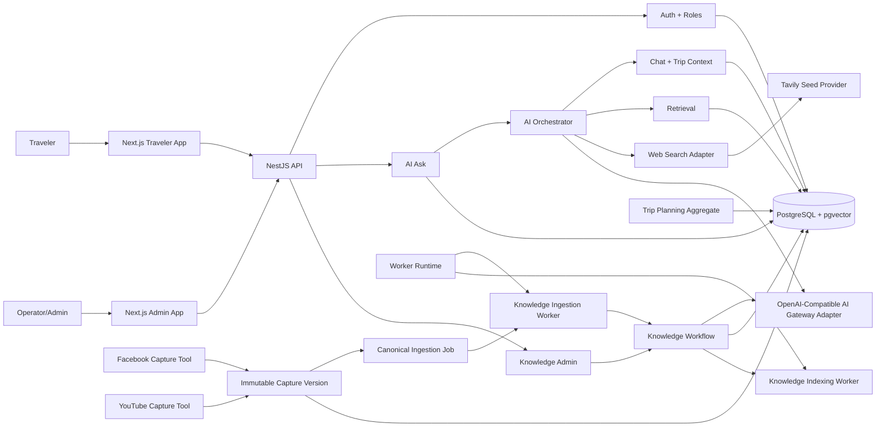
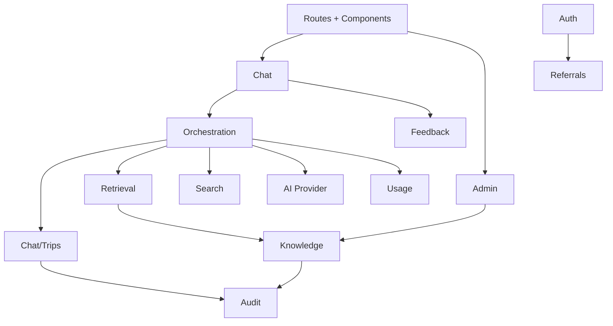
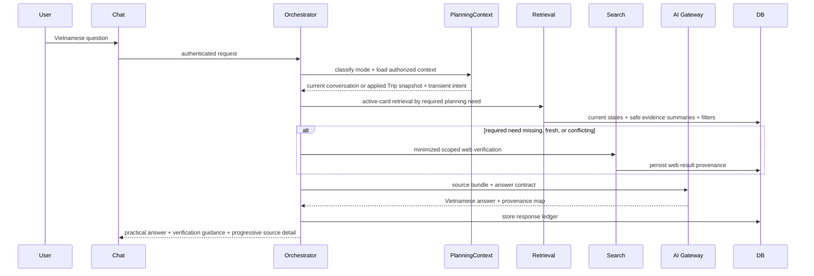

# XuyenViet AI Travel Information MVP Architecture Spine

## Paradigm

Modular monolith, DB-owned retrieval, provenance-first AI orchestration.

The MVP ships one coherent modular-monolith workspace and one owned data plane through four existing process units: traveler presentation, admin presentation, NestJS API, and Worker. Product modules stay separated by server-side boundaries, not independently owned domain services. AI answer generation is a controlled orchestration pipeline, not free-form model use.

## Authority And Reading Order

This Spine is the authoritative architecture contract. Stable `AD-*` decisions bind all lower-level design and implementation. [README.md](README.md) defines the progressive-disclosure reading order; [retrieval-trip-aware-solution-design.md](retrieval-trip-aware-solution-design.md) and its companions project the v6.2 decisions into developer-facing flows, contracts, fixtures, and release gates. Companion documents may add detail but may not weaken or override an AD.

## System Shape

```mermaid
flowchart LR
  Traveler[Traveler] --> TravelerWeb[Next.js Traveler App]
  Operator[Operator/Admin] --> AdminWeb[Next.js Admin App]
  TravelerWeb --> API[NestJS API]
  AdminWeb --> API
  API --> Auth[Auth + Roles]
  API --> Chat[AI Ask]
  API --> Admin[Knowledge Admin]
  Chat --> Orchestrator[AI Orchestrator]
  Admin --> Knowledge[Knowledge Workflow]
  Orchestrator --> ChatContext[Chat + Trip Context]
  Orchestrator --> Retrieval[Retrieval]
  Orchestrator --> Search[Web Search Adapter]
  Orchestrator --> AIGateway[OpenAI-Compatible AI Gateway Adapter]
  Knowledge --> AIGateway
  ChatContext --> DB[(PostgreSQL + pgvector)]
  TripPlan[Trip Planning Aggregate] --> DB
  Retrieval --> DB
  Knowledge --> DB
  FacebookCapture[Facebook Capture Tool] --> CaptureVersion[Immutable Capture Version]
  YoutubeCapture[YouTube Capture Tool] --> CaptureVersion
  CaptureVersion --> IngestionJob[Canonical Ingestion Job]
  IngestionJob --> IngestionWorker[Knowledge Ingestion Worker]
  IngestionWorker --> Knowledge
  Knowledge --> IndexingWorker[Knowledge Indexing Worker]
  Worker[Worker Runtime] --> IngestionWorker
  Worker --> IndexingWorker
  CaptureVersion --> DB
  Auth --> DB
  Chat --> DB
  Search --> Tavily[Tavily Seed Provider]
```

## Adopted Decisions

### AD-1: MVP Runtime Is A Modular Monolith With Presentation-Only Next.js Apps

Binds: traveler/admin presentation, NestJS domain API, Worker runtime, and shared TypeScript domain/database/contracts packages to one coherent modular monolith and PostgreSQL data plane.

Prevents: independent chat/admin/retrieval implementations choosing incompatible service contracts or release paths.

Rule: Build feature modules with server-side interfaces; do not split into services for MVP.

Rule: `apps/web`, `apps/admin`, `apps/api`, and `apps/worker` are separate process/deployment units inside the same modular-monolith workspace and PostgreSQL ownership model. Separate deployment does not grant a presentation app, API controller, or Worker loop an independent domain aggregate or contract.

Rule: `apps/web` is the traveler presentation application. It must not own domain route handlers, server-action writers, database access, Auth.js sessions, or BFF transport after the direct API cutover.

Rule: Treat a future mobile app as a new client channel over stable server/API boundaries, not a reason to extract shared packages or change deployable shape during the web MVP.

Seed: Next.js App Router presentation clients, NestJS versioned API, dedicated Worker, and typed direct API clients.

### AD-2: PostgreSQL Owns Product State And Retrieval State

Binds: users, roles, conversations, messages, trip projects, chat/trip context, knowledge cards, source records, embeddings, web results, feedback, and audits share one PostgreSQL data plane.

Prevents: provider-hosted vector stores or search tools becoming hidden source-of-truth for approval state, provenance, or deletion.

Rule: Persist embeddings in pgvector tables linked to first-class product rows; never store retrievable knowledge only inside an external vector store.

Seed: hosted PostgreSQL with pgvector available for later hybrid retrieval. Epic 5 starts with deterministic metadata-filtered retrieval over approved knowledge-card records; Postgres full-text search and vector similarity are deferred until metadata eligibility, provenance, and source-bundle contracts are stable.

### AD-3: Drizzle Owns Schema And Migrations

Binds: schema evolution, data access, and migrations to code-reviewed TypeScript definitions.

Prevents: ad hoc SQL drift across AI Ask, admin, retrieval, and evaluation work.

Rule: All persistent tables and indexes are introduced through migrations; raw SQL is allowed only inside reviewed migration/query helpers for pgvector/full-text operations.

Rule: Deployments run forward Drizzle migrations before starting or routing traffic to a workload that needs the changed schema. The migration command uses the target-scoped PostgreSQL advisory lock and Drizzle's applied-migration ledger; it does not require a schema release matrix, runtime policy, or separately recorded global schema version.

Rule: Runtime readiness reports process configuration, database reachability, and assigned dependency/loop health. API, web, admin, and Worker runtimes must not gate readiness, traffic, or job claiming on a global schema version, a release matrix, or environment-provided schema policy.

Rule: Backward compatibility is a concrete domain/data concern. When a durable representation needs a transition, the owning migration and domain reader/writer must define and test the old-data handling explicitly. Worker leases, fencing, retries, and idempotency remain the protection against interrupted or overlapping job processing.

### AD-4: NestJS Auth Is Public Sign-In Plus Google OAuth And Server-Side Roles

Binds: public sign-in access, required Google OAuth before AI Ask, and server-side role checks for admin/operator capabilities.

Prevents: client-only authorization, separate admin auth, or accidental operator access for normal travelers.

Rule: Public entry/sign-in routes may be reachable without an allowlist; AI Ask routes and actions require an authenticated session; every admin/operator route/action validates session and role before reading or mutating protected data.

Rule: NestJS owns Google OAuth, opaque PostgreSQL session lifecycle, cookie issuance/revocation, CSRF validation, and current-principal resolution. Browser session cookies are secure, HttpOnly, host-only where deployment permits, and never contain a JWT, user ID, role, provider token, or database credential.

### AD-5: Feature Ownership Boundaries Are Explicit

Binds: module ownership to these domains: Auth, Chat/Trips, Knowledge, Retrieval, Search, AI Orchestration, Admin, Feedback/Eval, Usage, Referrals, Audit.

Prevents: circular ownership of chat/trip context, knowledge cards, sources, and answer provenance.

Rule: UI components call their feature's server entrypoints; feature modules do not reach into another module's tables except through exported server functions or query helpers.

```mermaid
flowchart TB
  UI[Routes + Components]
  UI --> Chat
  UI --> Admin
  Chat --> Orchestration
  Admin --> Knowledge
  Orchestration --> ChatTrips[Chat/Trips]
  Orchestration --> Retrieval
  Orchestration --> Search
  Orchestration --> AI[AI Provider]
  Orchestration --> Usage
  Auth --> Referrals
  Retrieval --> Knowledge
  Knowledge --> Audit
  ChatTrips --> Audit
  Chat --> Feedback
```

### AD-6: Mutations Are Server-Side And Audited

Binds: chat/trip changes, knowledge approval, card edits, source edits, feedback, and deletion actions to authenticated server-side mutation paths with audit context.

Prevents: client-side writes, unaudited operator edits, or AI directly persisting sensitive state.

Rule: Every mutation records actor, target, operation, timestamp, and relevant before/after summary where appropriate.

Rule: Each mutable aggregate has one owning command module: Chat/Trips owns conversations, messages, trip projects, chat/trip context, chat/trip embeddings, and user-owned deletion of chats/trips; Knowledge owns source material, ingestion jobs, cards, card evidence, review/verification recommendations, relations, and search-index dirty markers; Search owns web results; AI Orchestration owns assistant response provenance; Usage owns append-only AI usage events; Referrals owns referral codes and referral attribution; Feedback/Eval owns feedback and eval runs; Audit owns meaningful state-transition and operator-action events.

Rule: Usage events are operational/accounting telemetry and must not be treated as credit ledger entries.

Rule: MVP referral attribution records do not create rewards, balances, payout obligations, ranking status, or credit conversion.

Rule: Non-owning modules may read through query helpers but must not export or call generic table upserts/deletes for another module's aggregate.

### AD-7: Knowledge Cards Are AI-First Provisional Aggregates

Binds: knowledge-card creation, publication, evidence, review, verification, and traveler retrieval.

Prevents: a second claim aggregate, mandatory operator approval, or raw community observations being expressed as official facts.

Rule: An extracted candidate is an operational artifact only. After deterministic validation and an independent AI judge decision, the system creates or updates one canonical `knowledge_card`; no separate persistent claim aggregate exists in the MVP.

Rule: `knowledge_cards` own the current normalized fact, conditions, confidence, freshness risk, monotonic `content_version`, current judge summary, one `lifecycle_state`, separate domain `knowledge_state`, and `verification_requirement`.

Rule: `lifecycle_state` is exactly `draft | pending_operator | active | suppressed | archived | rejected`. `knowledge_state` is domain-only: `community_observation | community_pattern | conditional | conflicted`. `verification_requirement` is `none | operator_required | failed`. Operator confirmation is recorded by a fenced recommendation resolution and audit metadata; it is not evidence corroboration. Independent corroboration is derived from active supporting evidence with distinct independence keys.

Rule: Only an evidence-eligible `active` card may be retrieved. `draft`, `pending_operator`, `suppressed`, `archived`, and `rejected` cards are not retrievable. `conflicted` cards cannot support a factual itinerary recommendation. An active card has `verification_requirement = none` and no open primary operator work.

Rule: Every card has one or more current `knowledge_card_evidence` records. Evidence contains only a bounded validated quote/span, source reference, observed/captured time, conditions, support level, display policy, and active/inactive/removed state. Raw source material remains operator-only and never enters traveler source bundles.

Rule: A model may propose an evidence quote but never provides authoritative offsets. Knowledge resolves a quote only when Unicode-normalized matching, limited to formatting/decorative-character removal and whitespace normalization, maps it to exactly one passage in the immutable capture. It persists the exact raw substring and system-derived Unicode code-point span. No match or multiple matches fails closed; normalized text and model offsets are never persisted or accepted as evidence.

Rule: A card may be active without operator review only when code validates its evidence span and privacy policy and the independent judge meets the PRD hard gates and thresholds. Operator approval records review; it is not a publication prerequisite.

Rule: Every evidence record stores a deterministic `independence_key`: the normalized canonical source identity for a directly authored source, or the known original source identity when the capture is a repost/share. `community_pattern` requires at least two active supporting evidence records with distinct independence keys. Freshness-sensitive road, safety, EV, price, hours, availability, booking, and promotion candidates complete as `needs_operator`; their card enters `pending_operator` with `verification_requirement = operator_required` and one fenced `verification` work item. An authorized operator may publish, revise and requeue, or suppress the card without upgrading it to `community_pattern`.

### AD-7A: Facebook Capture Is Operator-Controlled And Raw-Material Only

Binds: queued Facebook URL intake, browser automation capture, raw source material persistence, and later AI extraction.

Prevents: Facebook URL ingestion diverging into public request-path scraping, stored Facebook credentials, unreviewed traveler-visible content, or automated trust upgrades.

Rule: Facebook URLs are first-class `sources` rows with `kind = facebook`; a URL without readable text is a queued source, not a failed source and not an AI-readable source. Each successful capture creates an immutable capture artifact/version with a content hash; jobs and evidence reference that exact capture version, never a mutable raw-text row.

Rule: The capture mechanism is an operations tool, seeded as a Playwright-based browser automation script using an operator-controlled persistent browser profile on the Ubuntu Desktop operations machine. It is not part of the public traveler request path and must not run from user-triggered web requests.

Rule: The capture tool may read queued Facebook sources, open the canonical URL in the operator's visible browser session, extract visible post text and safe capture metadata, show a confirmation preview, then append an immutable capture artifact/version and select it as the source's current capture. It must not store or persist Facebook cookies, access tokens, local storage, passwords, full HTML dumps, hidden page data, or browser profile data in PostgreSQL.

Rule: Captured Facebook text remains operator-only raw source material. The AI-first ingestion pipeline may create active provisional community cards from it only after evidence validation and independent judging. Facebook/community trust defaults remain unless corroboration or an operator changes source metadata under the source policy.

Rule: Capture writes must be auditable as operator/admin mutations where practical: source ID, actor or operations identity, capture timestamp, capture method, before/after raw-text presence, and non-sensitive error summary on failure.

### AD-8: AI Ask Uses A Mode-Aware Context Pipeline

Binds: answer context to one server-owned mode: unscoped answer, applied current Trip plan, hypothetical exploration, or pending-proposal review. Applied Trip state is durable planning authority; conversation and proposal inputs remain transient unless an owner-confirmed command changes the Trip.

Prevents: treating Trip and chat as competing memory authorities, loading Trip constraints into a private answer, presenting a hypothetical or pending change as committed state, or using external/general evidence before owned context and required planning needs are established.

Rule: The AI orchestrator assembles a source bundle before model generation and passes explicit provenance metadata into the answer prompt.

Rule: AI Orchestration selects exactly one replayable planning mode after owner and canonical URL-scope validation: `current_plan | explore_change | validate_proposal | unscoped_answer`. Chat/Trips supplies an immutable, exact Trip snapshot when scope is valid. Current-turn intent is bounded and ephemeral; proposal context references one current pending proposal and its version fences. Retrieval consumes this pinned decision and must not reinterpret transcript text as committed Trip authority.

Rule: Current-plan answers pin the exact Trip aggregate, item, constraint, canonical-path, and route-registry versions used. Explore-change answers preserve that snapshot as the committed baseline and label transient differences. Proposal validation pins the proposal and affected-item versions. Unscoped/private answers load no Trip snapshot or constraints.

```mermaid
sequenceDiagram
  participant User
  participant Chat
  participant Orchestrator
  participant PlanningContext
  participant Retrieval
  participant Search
  participant AIGateway as AI Gateway
  participant DB
  User->>Chat: Vietnamese question
  Chat->>Orchestrator: authenticated request
  Orchestrator->>PlanningContext: classify mode + load authorized context
  PlanningContext-->>Orchestrator: current conversation or applied Trip snapshot + transient intent
  Orchestrator->>Retrieval: active-card retrieval by required planning need
  Retrieval->>DB: current states + safe evidence summaries + filters
  alt required need missing, fresh, or conflicting
    Orchestrator->>Search: minimized scoped web verification
    Search->>DB: persist web result provenance
  end
  Orchestrator->>AIGateway: source bundle + answer contract
  AIGateway-->>Orchestrator: Vietnamese answer + provenance map
  Orchestrator->>DB: store response ledger
  Orchestrator-->>Chat: practical answer + verification guidance + progressive source detail
```

### AD-9: Web Search Is Provider-Adapted, Scope-Resolved, And Externally Provenanced

Binds: web fallback to a search adapter contract: query, title, URL, snippet/content, score, checkedAt, sourceType, confidence.

Prevents: provider lock-in, source-less answer facts, unresolved geography becoming a factual premise, and technical trust labels leaking into traveler copy.

Rule: Search-derived information retains external provenance and never becomes reusable XuyenViet knowledge until it is ingested into a card that satisfies publication policy. Route- or place-specific web information may become a factual premise only when its applicable geography and time resolve consistently with the planning need; unresolved or mismatched results remain verification leads. Traveler UI uses practical verification guidance rather than internal labels such as `unverified`. Official/provider pages are preferred by query construction, include/exclude domains, country bias, and post-filtering.

Rule: Search captures immutable provider results. Retrieval creates immutable fact-scoped web geography projections keyed by the capture payload hash, route-registry snapshot, and resolver version, then records a query-specific scope decision for each requirement and leg. A result with unresolved or mismatched geography cannot become a factual premise, satisfy a required need, or authorize a different fact from the same result.

Seed: Tavily Search API for MVP fallback because it returns title, URL, content, score, Vietnam country bias, domain filters, and freshness controls. [ASSUMPTION]

Rule: Tavily remains provisional until an architecture spike validates Vietnamese corridor queries, official/provider preference, URL/title/snippet/date availability, rate limits, and failure behavior.

### AD-10: AI Gateway Access Is Adapter-Based And Source-Bundled

Binds: chat generation, extraction, embeddings, and evaluation calls to an OpenAI-compatible AI Gateway provider adapter.

Prevents: direct model calls that invent source labels, write memory directly, or bypass audit metadata.

Rule: Every model call declares purpose, model, prompt version, input source bundle, and output schema expectation where applicable.

Rule: AI provider adapter calls must return or emit usage metadata when available, including model, token counts, provider request ID if available, latency, and failure status. The Usage module persists this metadata without storing raw prompt/response content beyond existing message/provenance records.

Rule: AI Gateway model selection reads from a managed model catalog, not from scattered hard-coded model strings. Each active model record includes gateway model name, intended purposes, capability flags, pricing metadata, and effective date/version information.

Rule: Model capability flags must represent at least text input, image input, image output, embeddings, extraction, evaluation, streaming, and cache pricing support where applicable.

Rule: Usage cost estimates are derived from provider usage metadata plus the selected model pricing record when available. Missing pricing must not block safe answer generation, but it must be visible as missing-cost metadata in usage records.

Rule: Direct OpenAI API calls are not used. AI calls go through the OpenAI-compatible AI Gateway configured by `AI_GATEWAY_BASE_URL` and `AI_GATEWAY_API_KEY` per environment. Public MVP launch is blocked until gateway/provider data-processing settings and privacy notice text are verified so submitted project data is not used for provider model training where configurable.

Rule: YouTube video knowledge analysis, when enabled, runs only in the server-side `youtube:capture` operations script and calls a configured Gemini video-capable model using `GEMINI_API_KEY`. The key is not an AI Gateway credential and the script is its only allowed consumer; it is never exposed to browser code, request-serving routes, audit summaries, or logs. The script accepts an operator-submitted canonical individual-video URL and a versioned prompt, then persists only bounded operator-only evidence, safe metadata, usage, and audit outcomes. It must not request or persist a full transcript, media, YouTube credentials, cookies, HTML, hidden provider payloads, or raw model prompt/response logs.

Rule: Gemini video analysis is evidence generation, not source verification. Every resulting knowledge card follows AD-7's canonical AI-first publication, review, verification, conflict, and retrieval policy; internal source/verification metadata and high-risk operator gates remain intact, while traveler copy follows the PRD's practical-guidance rule. The adapter must fail closed for inaccessible, unsupported, restricted, blocked, or over-limit videos and must never fabricate a transcript or a knowledge card. Playwright/direct browser scraping and undocumented YouTube APIs are excluded from this integration.

### AD-11: Answer Provenance Is Persisted, Not UI-Derived

Binds: every assistant answer to stored provenance categories, knowledge card IDs, chat/trip context IDs, web result IDs, model name, prompt version, and evaluation metadata.

Prevents: citations that appear in the UI but cannot be audited, debugged, or measured later.

Rule: The UI derives any traveler trust disclosure from stored response provenance, not by re-parsing answer text. Default traveler answer UI does not render generic source/confidence sections, provenance categories, retrieval policy, reasoning labels, audit state, or provider/model metadata.

Rule: `assistant_response_provenance` is row-per-source-item, not only a JSON blob. Each row stores `message_id`, `source_category`, exactly one nullable source reference for chat/trip/knowledge/web when applicable, source rank, retrieval score, source type, verification status, `used_in_prompt`, `cited_in_answer`, and a source snapshot.

Rule: The orchestrator persists provenance with the assistant message in the same transaction; UI, eval, and audits consume this table only.

Rule: A traveler disclosure projection contains only the plain-language verification need, optional safe disclosure trigger, and exact persisted provenance-row references needed to resolve a detail view. It must not contain internal state names, confidence codes, source categories, provenance IDs, prompt/model/provider metadata, retrieval scores/policy, or audit/worker status as display strings.

### AD-12: Context Is Split Between Chat Sessions And Trip Projects

Binds: current discussion facts to chat sessions and focused travel-planning state to trip projects.

Prevents: overbuilt global memory and keeps personalization understandable in a ChatGPT/Gemini-like session and project model.

Rule: AI extraction proposes chat context or trip project updates; the Chat/Trips module validates allowed travel-planning fields before persistence and rejects clearly disallowed sensitive data.

Allowed chat/trip context: start city, traveler count, child age range, travel preferences, prior trips, avoided/repeated places, budget range, hotel style, driving tolerance, vehicle/EV needs, food/activity preferences, itinerary constraints, and current trip details.

### AD-13: Users Delete Their Own Chats And Trip Projects

Binds: deletion to user-owned chat sessions and trip projects.

Prevents: heavy support workflows and makes data control match familiar chat-product behavior.

Rule: A user can delete a chat session they own; deletion removes or disables that conversation's messages, extracted chat context, derived embeddings, and normal retrieval access.

Rule: A user can delete a trip project they own; deletion removes or disables project context, all linked project conversations and their messages/chat context, derived embeddings, and normal retrieval access.

Rule: Deletion may retain minimal non-content audit metadata for operational integrity, but deleted chat/project content must not appear in normal user UI or retrieval context.

Rule: New tables that store chat/project-derived retrievable content must define what happens when the owning chat or trip project is deleted.

Rule: Deleting an ordinary chat invalidates its reconstructable execution payloads, current-turn intent, retrieval runs, web-scope decisions, prompt manifests, derived context, and embeddings, but it cannot mutate an unrelated Trip plan. Deleting a primary conversation requires an owner-scoped replacement or deletion of the owning Trip Project. Deleting a Trip invalidates its snapshots, canonical-path references, retrieval runs, projections, and derived context; retained audit metadata must not reconstruct traveler content.

Rule: Chat/Trips `deleteOwnedConversation(...)` and `deleteOwnedTrip(...)` are the deletion coordinators. In one PostgreSQL transaction they fence the owner aggregate and invoke exported invalidators for Chat/Trips, Retrieval, Search, AI Orchestration, Feedback/Eval, and Usage reconstructable rows. The command reports success only after every invalidation commits. Production-derived evaluation membership is removed while aggregate non-content metrics may remain; message-owned web captures cannot survive as reusable traveler knowledge.

### AD-14: Environments And Secrets Stay Separate

Binds: dev, staging, and production to separate databases, secrets, OAuth config, and search/AI API keys.

Prevents: test data, public users, admin rights, and provider credentials from mixing.

Rule: Public sign-in must not require an allowlist; AI Ask and authenticated personalization require Google OAuth; admin/operator access requires Google OAuth plus role check. Local/dev bypasses must not be deployable defaults.

### AD-15: Deployment Uses Four Railway-Oriented Process Units And One Data Plane

Binds: traveler presentation, admin presentation, NestJS API, Worker, migration execution, and hosted PostgreSQL to the repository's current container/process topology.

Prevents: assuming one web process owns every surface, coupling domain ownership to a deployment unit, or relying on unmanaged local infrastructure for public MVP traffic.

Rule: The repository's separate traveler, admin, API, and Worker Docker targets are the current Railway-oriented deployment convention. Each process consumes only its approved presentation, transport, or Worker boundary; PostgreSQL remains the shared owned data plane. Actual production service/database evidence is verified at the operational gate and must not be inferred from a Docker target alone.

Rule: Provider-specific features remain behind config/adapters. A future hosting-provider change does not alter module ownership, direct-API authority, or Worker-only continuous execution without an architecture update.

Rule: Production deployment includes separately supervised Node runtimes for canonical knowledge ingestion and knowledge-search indexing. Worker processes use PostgreSQL job/index state, expose operational logs and health/restart supervision, and are not run inside request-serving serverless executions. Legacy extraction is not a routine production worker.

Seed: the current Docker targets run the two Next.js apps, NestJS API, and Worker as separate Railway-oriented services with hosted PostgreSQL. The exact production PostgreSQL provider and its extension capabilities remain deployment evidence, not an assumed architecture feature.

### AD-16: Streaming Starts After Context Assembly

Binds: chat streaming to the moment after retrieval/search context and provenance ledger inputs are assembled.

Prevents: partial AI answers that cannot satisfy persisted provenance and safe disclosure requirements.

Rule: Long-running extraction and embedding may run as background tasks; user answers must not stream before the orchestrator knows which provenance inputs were used. Traveler UI translates any relevant pending or failed follow-up work into a short practical message and never exposes consumer/job/status names.

Rule: During streaming, partial assistant tokens are transient UI state. The final assistant message, retrieval decision, provenance rows, and usage events are persisted through the orchestrator; the UI must reconcile to persisted final content after completion.

Rule: If streaming fails before finalization, the app shows a recoverable failure state and must not create a misleading completed assistant message.

Seed latency target: first visible answer within 5 seconds without web search and within 10 seconds with web search. [ASSUMPTION]

### AD-17: Traveler Retrieval Is Scope-First, Field-Aware, And Fail-Closed

Binds: active-card eligibility, geographic/facet allowlisting, field-aware lexical search, source-bundle inputs, indexing work, and later evidence-gated retrieval upgrades.

Prevents: stale or unsafe knowledge entering traveler source bundles, or an index/ranking implementation bypassing current owner-row eligibility and provenance.

Rule: The v6.2 production path validates current owner-row eligibility, resolves canonical query scope and required facets, builds a deterministic allowlist, then runs a versioned field-aware lexical implementation inside that allowlist. PostgreSQL full-text search with the exact deployed version/provider and Vietnamese `simple + unaccent` configuration is the intended baseline only after a G0 deployability/quality spike and critical recall/false-exclusion gates pass. Otherwise `v6_active` retains a deterministic indexed field-aware lexical implementation and FTS remains inactive. The indexing worker owns active, stale, and disabled search-document transitions.

Rule: Traveler retrieval is fail-closed. A card is retrievable only when its current `lifecycle_state` is `active`, its domain classification permits the requested use, `verification_requirement = none`, linked source metadata is traveler-safe, current active evidence exists, and all required retrieval metadata is present. Unknown, missing, stale, disabled, non-active, failed-verification, or operator-only state excludes the item.

Rule: Retrieval eligibility must support current publication/knowledge/review/verification states, current active evidence, source-safe linkage, card type, route segment/location, conditions, tags, freshness-sensitive flag, traveler-safe wording policy, and source type. Lexical score may rank eligible candidates but must not override owner-row eligibility.

Rule: Canonical IDs and reviewed/versioned route assertions grant geographic authority; free text, source metadata, embeddings, model output, and lexical similarity do not. A scope assertion authorizes only its exact atomic fact/facet contribution and requirement/leg. Unknown scope is not nationwide scope, and one fact on a card cannot authorize another.

Rule: Retrieval projects one machine-readable use policy per selected card: `contextual_use` or `exclude`. `active + community_observation/community_pattern/conditional + verification_requirement = none` is `contextual_use` only within stated conditions and with state-appropriate community wording; `conflicted`, a non-active lifecycle, failed verification, or missing active evidence is `exclude`. The answer prompt must enforce this policy.

Rule: FTS activation and any `pg_trgm`, embeddings, RRF, reranking, or AI grey-band stage are separately versioned behind Retrieval. Each may ship only after its prerequisite spike/evaluation identifies the failure class it improves and proves quality uplift without safety, latency, cost, provenance, or deletion regression. They never bypass allowlists or become a source of truth.

Rule: Indexing/backfill work for later search or embeddings must define activation, stale/disabled transitions, and rebuild behavior before those rows influence traveler answers.

### AD-18: Traveler Frontend Has Three Canonical Shell States

Binds: public entry, first signed-in use, and active AI Ask planning to one frontend state model.

Prevents: homepage, chat-empty, and active-chat stories creating incompatible route/shell/detail behavior.

Rule: The public logged-out homepage is the root entry surface with sign-in CTA and sign-in-gated ask box. It does not render the authenticated app sidebar.

Rule: The logged-in empty AI Ask state renders the app sidebar, centered greeting, centered composer, and starter prompts. It must not render an empty right detail panel before the first answer or selected entity exists.

Rule: Active AI Ask renders left sidebar, center answer/conversation surface, and a right contextual detail panel when a selected answer entity exists.

Seed: Keep `/` as public entry and `/ai-ask` as the authenticated planning shell in the existing Next.js App Router structure.

### AD-19: Contextual Detail Panel Is Derived UI State

Binds: right-panel content to persisted assistant message content, retrieval decisions, and provenance/source-bundle snapshots.

Prevents: the detail panel becoming a second mutable aggregate, a second chat thread, or a UI-only source of truth.

Rule: Detail panel state is derived from selected answer entities and resolved through owning feature read models: Chat/Trips for conversations/projects/context, Retrieval/Knowledge/Search for source-backed detail, and AI Orchestration provenance for assistant-answer source usage.

Rule: The detail panel may expose actions such as `Dùng trong kế hoạch`, `Xem tuyến đường`, or `Lưu` only by calling the owning server-side command module. It must not mutate another feature's aggregate directly.

Rule: The detail panel is not map-first. Google Maps or map-like spatial integration remains deferred and must not be introduced as an implicit dependency of this redesign.

### AD-20: Selectable Answer Annotations Use Persisted, Provenance-Bound Entity Descriptors

Binds: inline source, warning, trip-fact, action, place, hotel-area, route-segment, and cost annotations to a stable persisted render contract.

Prevents: UI teams independently parsing Vietnamese answer prose to create links, detail panels, or provenance claims.

Rule: Selectable answer annotations are best-effort post-answer enrichment. Their descriptors are validated against persisted assistant-message text and stored provenance/retrieval/source-bundle snapshots before storage and rendering.

Rule: A descriptor type is `source | warning | trip_fact | action | place | hotel_area | route_segment | cost`. It includes a display label, answer text range or section, source category, one or more owning provenance-row references where applicable, and bounded traveler-safe display metadata.

Rule: Every annotated range uses `{ start, end, text }`, where `start` and `end` are zero-based UTF-16 code-unit offsets into the final persisted assistant-message content, `end` is exclusive, and `text` exactly equals `content.slice(start, end)`. Ranges require integer bounds `0 <= start < end <= content.length`; the validator rejects overlapping ranges and any mismatch after persistence/backfill. The client renders persisted offsets only and never normalizes, re-searches, or re-matches Vietnamese prose to recover an entity.

Rule: Every descriptor that carries provenance IDs validates every referenced provenance row belongs to the same assistant message, conversation, and user as the annotation. A descriptor with no provenance IDs may not resolve provenance-derived detail or actions. Cross-message, cross-conversation, cross-user, unknown, or duplicate provenance references are rejected for every descriptor type.

Rule: `place`, `hotel_area`, `route_segment`, and `cost` descriptors require at least one persisted provenance-row reference owned by the same assistant message, conversation, and user as the descriptor. Their label and summary must be the validated annotated answer range. A descriptor with unknown, cross-message, cross-conversation, or cross-user provenance; unmatched text; raw source material; operator-only fields; provider payloads; or an inferred source claim is rejected.

Rule: Entity descriptor quick facts use only the server-projected safe provenance view: `title`, `type`, `locationName`, `routeSegment`, `confidence`, `freshnessSensitive`, `sourceType`, `verificationStatus`, `checkedAt`, and safe HTTP `url`. Each quick fact is `{ label, value }`, both trimmed strings of at most 160 characters, with at most six facts per descriptor. URLs remain in the source/provenance view, not arbitrary quick-fact values. No arbitrary `source_snapshot` JSON is passed to annotation generation, persistence, or the traveler UI.

Rule: Entity descriptor actions are optional. A persisted action is `{ command, label, arguments }`, where `command` is a registered owning-feature server command identifier and `label` is an answer-anchored or safe-projection string. The persisted arguments are descriptive only: the owning server read model derives or mints the executable, descriptor-bound argument/capability set for the current user. The command validates that binding as well as typed input, authorization, and ownership at execution. Unknown commands, arbitrary client routing, label-only actions, and arbitrary persisted target IDs are rejected.

Rule: Source/confidence UI remains governed by AD-11: render from stored provenance, not by re-parsing answer text. Entity selection does not create a new mutable place, hotel, route, or cost aggregate; actions remain server-side commands owned by their existing feature module.

### AD-21: Sidebar Read Models Are Chat/Trips-Owned And Server-Gated

Binds: conversation history, trip project lists, active row state, and account/admin navigation to a single shell read model.

Prevents: client-side ownership filtering, duplicated sidebar data loaders, or admin links leaking to normal travelers.

Rule: Conversation history and trip project sidebar data are loaded through Chat/Trips-owned server read functions scoped to the authenticated user.

Rule: Admin/operator navigation entries are included only after server-side role checks. Normal traveler payloads must not include admin-only navigation or counts.

Rule: The sidebar may collapse to an icon rail or mobile sheet, but data ownership and authorization rules do not change across breakpoints.

### AD-22: Global UI Foundation Is Root-Owned; Reusable Primitives Are Data-Free

Binds: app-wide font loading, CSS design tokens, base surface behavior, reduced-motion behavior, and reusable presentational primitives.

Prevents: route and feature components independently redefining theme colors, typography, focus treatment, or shell variants during the traveler-shell redesign.

Rule: `src/app/layout.tsx` and `src/app/globals.css` own application-wide fonts, semantic CSS tokens, base surfaces, and global accessibility-related visual behavior. Feature modules must consume those definitions rather than recreate global theme rules.

Rule: Data-free reusable UI primitives live under `src/components/ui`. Feature components retain domain behavior, server-action wiring, and feature-specific data contracts; primitives do not import feature modules or call server entrypoints.

Seed: The existing Tailwind CSS 4 setup remains the styling runtime. This architecture does not require adopting a component-library package.

### AD-23: Product Icons Use One Local Typed SVG Boundary

Binds: brand-adjacent product icons and icon-only controls across the public entry, authenticated shell, composer, sidebar, and detail inspector.

Prevents: multiple icon libraries, copied inline SVGs, emoji, text glyphs, and inconsistent accessibility behavior accumulating independently in feature components.

Rule: Product icons are exported from one local typed SVG module under `src/components/ui`. It exports named React icon components with a common SVG-prop-compatible API; it owns product-icon names, paths, and third-party SVG normalization if ever adopted. A feature may compose or style an icon, but it does not define a competing icon set, feature-local SVG paths, or icon-library adapter without an architecture update.

Rule: This is a migration boundary, not a claim about current code. Existing feature-local product SVGs move to the canonical module as their owning shell surface is redesigned; after a surface is migrated, it imports all product icons from that module.

Rule: Every icon-only control has an accessible name, visible keyboard focus treatment, and a hover/focus tooltip. Destructive confirmations retain explicit text; icon-only controls do not remove required user confirmation or error recovery copy.

### AD-24: AI Ask Has One Server-Loaded Shell Model And One Client Workspace State Model

Binds: the authenticated planning-shell route, selected conversation/project URL state, transient workspace state, and desktop/tablet/mobile presentations.

Prevents: separate breakpoint-specific data loaders, multiple owners of selected detail state, or client state that can diverge from the active Chat/Trips route.

Rule: `src/app/ai-ask/page.tsx` remains the server-authenticated route composer and loads user-scoped shell data through owning feature read functions. Chat/Trips owns conversation and trip-project selection represented in the URL.

Rule: `AiAskComposer` owns transient client workspace state: draft input, selected attachment preview, request/streaming state, mobile sheet state, and selected answer-detail descriptor. The descriptor remains derived UI state under AD-19 and AD-20.

Rule: Desktop, tablet, and mobile render the same server-loaded shell data and client workspace state. CSS layout and sheets/drawers change presentation only; they do not create alternate loaders, persistence, or state owners.

Rule: After create, select, delete, project switch, or stream completion, URL-selected conversation/project state is canonical. `AiAskComposer` may update messages and summary lists optimistically while work is pending, but terminal mutation state reconciles through router navigation or refresh. A stale, deleted, or unauthorized URL resource clears local selection and uses the server-safe shell.

Rule: A selected persisted descriptor has exactly one interactive detail surface. Desktop column and mobile sheet are controlled views of the same selection; inactive duplicate views are inert and excluded from assistive technology. Breakpoint changes preserve selection and route state and transfer focus predictably rather than creating independent panel state.

### AD-25: One Source-Version Ingestion Job Orchestrates AI Stages

Binds: source triage, extraction, independent judging, relation matching, retries, and publication outcomes.

Prevents: separate queues re-running completed AI stages, disagreeing about the source lifecycle, or leaving operators unable to identify the current outcome.

Rule: Knowledge owns one stateful ingestion job for each source capture version. For v2 text ingestion, discovery submits the complete immutable redacted capture once and persists scoped semantic candidates; one independent batch grounding-and-judgment call returns exactly one quote proposal or `evidence:null` for every candidate. The server resolves a unique normalized quote match, then derives the exact raw Unicode code-point span; only grounded candidates enter relation work. Job status is technical only: `queued -> running -> completed | failed`; resumable execution detail belongs in a checkpoint, and aggregate counters are observability only.

Rule: A candidate has `processing_status = queued | processing | completed | failed` and non-null immutable `ai_disposition = apply | needs_operator | discard` plus immutable `outcome_reason_code` once completed; a failed candidate has no business disposition. A database trigger rejects changes to either decision field after completion. Human action never rewrites the AI decision. `candidateCount` counts persisted discoveries, `completedCandidateCount` and `failedCandidateCount` count terminal processing states, and `needsOperatorCandidateCount` is the completed `needs_operator` subset; counters are idempotent observability projections only. A job completes only after discovery is terminal and every candidate is completed or failed.

Rule: Recapture creates a new source capture version and ingestion job. It never overwrites a completed job's provenance. The ingestion job records the submitted-by provenance, while automation mutations use the `system-knowledge-pipeline` service actor.

Rule: Workers claim a stage transactionally with `FOR UPDATE SKIP LOCKED`, a lease/fencing token, and expected job stage/version. Every stage result and card mutation uses compare-and-swap against that token and expected card/content version. Stale or duplicate workers cannot publish, attach evidence, or overwrite a later decision.

### AD-26: Publication Mutations Use Transactional Dirty Markers

Binds: AI publication, operator edits, verification, conflict handling, source removal, audit, and search indexing.

Prevents: a stale projection continuing to authorize a card after its source or risk state changes.

Rule: `transitionKnowledgeCard(...)` is the only production writer for card lifecycle state, verification requirement, primary/sampling recommendation state, candidate-to-card completion association, lifecycle audit metadata, and lifecycle-caused index invalidation. It runs in one PostgreSQL transaction under existing card/source advisory locks and expected version fences, accepts a named trigger and actor, and returns `resolved | stale | invalid`. Authenticated API commands invoke it synchronously for operator decisions; the Worker invokes it for continuous ingestion, conflicts, projection work, and scheduled sampling selection. API requests never claim jobs or execute ingestion/index loops; `apps/admin` never imports it.

Rule: A primary work item has type `verification | relation | risk | missing_context`; sampling is separate. Recommendation status is `open | resolved | superseded`. One card version fence may have at most one open primary item and one open sampling item. Opening primary work requires the same-version card to be `pending_operator`; resolving its only primary item atomically activates, suppresses, rejects, or requeues the card. An active card requires eligible active supporting evidence with validated span, source/capture eligibility, and retrieval metadata; losing final support atomically suppresses or requeues it and disables its projection. A suppressed card with new operator work transitions to `pending_operator` in the same transaction.

Rule: `suppressed`, `archived`, and `rejected` transitions disable the current search document in the same transaction; the indexing worker asynchronously rebuilds or disables projections idempotently by `(knowledge_card_id, content_version)`.

Rule: High-risk conflict immediately moves an active card to `pending_operator`, classifies it as `conflicted`, opens one fenced relation or risk item, and disables its projection. Source withdrawal suppresses or requeues the card according to remaining eligible support. Neither waits for review. Retrieval re-checks current owner-row eligibility before every source-bundle inclusion, so index lag cannot re-enable an ineligible card.

Rule: Source removal is a retryable Knowledge command. Before deleting or hiding a source/capture artifact, it locks every dependent evidence/card, marks evidence removed and traveler-invisible, re-evaluates each card from remaining active evidence, and suppresses a card that loses final eligible support while disabling its projection. It then records a concise removal audit. It completes only when every dependent card is re-evaluated and no removed evidence remains traveler eligible; partial work resumes idempotently from the removal command state.

### AD-27: Evidence Accumulates Selectively; Relations Do Not Auto-Merge Facts

Binds: duplicate handling, supporting/conflicting evidence, condition-aware facts, and cardinality of prompt evidence.

Prevents: semantic similarity joining unrelated locations, volatile evidence silently replacing valid observations, or a duplicate-card explosion.

Rule: Candidate matching is scoped by card type plus normalized location/route. Code validates scope and evidence before an independent relation judge may attach a candidate. Auto-attach requires the same fact and equivalent conditions; materially distinct compatible conditions create a new card; redundant/same-source candidates complete as `discard`; ambiguous, high-risk, conflict, state-changing, or missing-observed-date relations complete as `needs_operator` and create the applicable primary work item.

Rule: New evidence supplements active evidence by default. It deactivates older evidence only for time-varying facts or when the older record is no longer suitable. A card retains at most three active supporting and one active conflicting evidence record for retrieval, selected by recency, source independence, and quality. Inactive evidence is operational data with short retention and a deactivation reason.

### AD-28: Current-State Audit Is Lean And Actor-Correct

Binds: audit volume, current judge summary, operational artifact retention, and mutation attribution.

Prevents: a fact-version graph that cannot scale or a submitter being incorrectly attributed with autonomous AI decisions.

Rule: Cards retain current lifecycle/domain/verification-requirement state, `content_version`, current judge summary, and currently effective evidence. Durable audits record meaningful lifecycle transitions and operator actions. Failed candidates and superseded extraction/evaluation artifacts retain safe code/version metadata for short operational retention, not unlimited raw AI output.

Rule: `system-knowledge-pipeline` is the actor for automated triage, judging, relation, publication, conflict, and indexing mutations. The source submitter remains provenance and is linked to the source/job; they are not represented as the actor for automated decisions.

Rule: A recommendation references the card `content_version`, active evidence-set revision, and work type. Resolving it is compare-and-swap against those references; a changed card receives new fenced work rather than inheriting an earlier resolution. A `verification` item grants an authorized operator the final decision to publish, revise and requeue, or suppress the card; this is audit-recorded and does not relax automated evidence validation or rewrite the candidate disposition.

Rule: Quality sampling creates card-version-bound sampling items for 15% of auto-active cards during the first four weeks. `knowledge_sampling_obligations` records one immutable obligation for every `needs_operator` candidate and is distinct from actionable recommendation work. Before high-severity containment, the system persists an exact cohort definition and card/version membership; it opens fenced `risk` work for remediable cards transitioned to `pending_operator`, or suppresses/de-indexes unsafe cards without successor work. Sampling never rewrites a candidate decision or silently creates verification work.

Rule: Retention commands delete Facebook source/capture artifacts and dependent operational artifacts after 180 days when they support no active or reviewable card. Inactive evidence and safe failed-stage artifacts expire on the same 180-day schedule unless a shorter operational policy applies; deletion preserves only the concise state/action audit required by AD-28.

### AD-29: Trip Planning Is A Chat/Trips-Owned Structured Aggregate

Binds: Trip Project anchors, legs, activities, constraints, states, primary conversation, Trip Home read model, proposals, and change history.

Prevents: confirmed itinerary state being left only in chat transcripts, duplicated as mutable `chat_context`, or introduced as a cross-feature Places/Maps aggregate before those capabilities are approved.

Rule: Chat/Trips owns one single-owner Trip Project aggregate. Its structured planning rows are owner-scoped and reference the owning `trip_project`; non-owning modules receive only exported read models or invoke Chat/Trips commands.

Rule: The aggregate distinguishes stable plan state from conversational context. Anchors, dated legs, activities, owner-confirmed accommodations, alternatives, item state, and owner-confirmed trip constraints are structured Trip Planning records. The primary conversation is the exclusive plan-authoring surface: chat requests may cause AI Orchestration to draft a proposal, but `chat_context` and transcript text never become an alternative itinerary writer or source of truth.

Rule: A transport leg may own nullable canonical origin, canonical destination, selected route-path, and route-registry snapshot references. These references become durable authority only through an owner-confirmed, aggregate/item-version-fenced Trip proposal operation. Existing free-text labels migrate with null canonical references and never gain inferred route authority. Retrieval owns and validates referenced registry identities; it never writes the Trip aggregate.

Rule: A plan item has exactly one kind: `anchor | leg | activity`. An anchor has exactly one `anchor_role`: `origin | destination | region | required_stop | accommodation`; `type` is null for anchors. A leg or activity has exactly one type: `transport | visit | food | rest | accommodation`; `anchor_role` is null for them. Every item has exactly one state: `idea | planned | confirmed | backup`; an `idea` item is valid open planning state, not an error. `confirmed` records owner confirmation or a supplied real constraint only; it is not a booking, provider, live route, weather, or availability assertion. A `backup` item references exactly one structured plan item in the same Trip Project that it substitutes for; it is never an unscoped global alternative.

Rule: A mutable plan item carries a monotonic version. Parent references must remain within the same Trip Project; only activities may parent to a leg; cycles are forbidden. An ordering scope is exactly `(trip_project_id, parent_item_id)`, including a null parent for root anchors and legs; ordinals are unique within that scope and commands atomically renumber it. Commands that create, reorder, update, remove, or change a plan item state lock the owning Trip Project and validate the aggregate/item versions and ordering scope they depend on before commit. Beyond the AD-29 canonical path reference, the first tranche stores no dynamic weather, live route/ETA, availability, provider, booking, exact-location, budget tracking or actual expenses, checklist, vault, or collaboration state in this aggregate; owner-maintained budget range remains a trip constraint.

Rule: `trip_project_constraints` is one owner-scoped, versioned structured record per Trip Project. It holds only travel-relevant travelers/children, vehicle or EV needs, driving tolerance, budget range, preferences, and avoid-list values. A chat request may cause AI Orchestration to propose a constraint update, but only an owner-confirmed Chat/Trips proposal command writes it; a constraint correction participates in the Trip Project aggregate version and deletion lifecycle. No separate manual constraint editor is introduced in this tranche.

Rule: The Trip Home read model is derived from current structured plan state and pending proposal state. Its deterministic priority is: pending unexpired proposal with expiry, other pending unexpired proposal, confirmed-item gap, next future planned/confirmed leg by planned time, then preparation. A confirmed-item gap exists only when confirmed transport lacks planned date/time or origin/destination context, or confirmed accommodation lacks date/time or place/area; an open `idea` or incomplete `planned` item is never a gap by itself. Ties use earliest expiry, then earliest planned time, then stable item creation time or ID. An empty plan or plan with no dated future leg selects preparation. Explicit lifecycle phases, owner phase overrides, and on-trip today focus are deferred. Trip Home does not infer live conditions from unavailable providers.

### AD-30: Primary Conversation And Change Proposals Are Explicit Commands

Binds: primary-conversation migration, AI-drafted persistent changes, user confirmation, expiry, conflict handling, and plan history.

Prevents: an AI response directly mutating a Trip Project, a newer confirmed proposal being overwritten by a stale suggestion, or legacy conversation history disappearing during the one-primary-conversation transition.

Rule: `trip_projects.primary_conversation_id` is nullable only during a forward, idempotent migration. The migration and every later replacement command are owner-scoped, select or create exactly one conversation linked to that same Trip Project and owner, and preserve all existing linked conversations. The project pointer must not reference a cross-project, cross-owner, deleted, or unlinked conversation. These commands lock/fence the Trip Project and never convert transcript content into structured plan records.

Rule: A Trip Change Proposal is an immutable, typed draft owned by one Trip Project and generated by the AI Orchestration path or an owner command. It records proposal status `pending | applied | dismissed | expired`, a bounded rationale, explicitly identified operations, the expected Trip Project aggregate version, expected versions of every affected existing item, ordering/parent preconditions for create or reorder operations, and an optional expiry. It is not a plan item and does not change retrieval context merely by existing.

Rule: Only `applyApprovedTripChange(...)` in Chat/Trips may apply a proposal. In one transaction it authenticates the owner, locks the Trip Project, verifies proposal ownership/status/expiry, expected aggregate/item versions, and ordering/parent preconditions, applies all operations or none, records actor-correct audit/change-history rows, marks the proposal `applied`, and advances affected item/project versions. A conflict, expired proposal, missing item, or unauthorized request applies nothing and returns a safe refresh-required result.

Rule: `expireTripChangeProposal(...)` is an idempotent Chat/Trips command. Pending-proposal reads used by Trip Home and proposal review, and proposal application, invoke it for elapsed expiries; a scheduled worker may invoke the same command. In one fenced transaction it marks an elapsed pending proposal `expired`, sets its terminal timestamp, and writes exactly one safe history row with the `system-trip-planning` actor. Dismissing or expiring a proposal never mutates plan state. Change history records only safe operation summaries, actor, timestamp, proposal ID, and affected structured-item references; it does not persist raw model prompts/responses or turn free-form answer text into authoritative state.

Rule: AI Orchestration may read the Trip Planning aggregate and emit a schema-validated proposal draft, but it may not call direct table writes or bypass the Chat/Trips proposal command. Provider output, answer annotations, and detail-panel actions remain untrusted inputs until the owner-confirmed command validates them.

Rule: The typed proposal operation set includes setting or clearing a transport leg's exact canonical origin, destination, selected path, and registry snapshot as one validated route-choice change. Apply revalidates that the referenced path connects the canonical endpoints in the pinned active registry snapshot. A stale, retired, mismatched, unresolved, or unauthorized reference applies nothing and returns review/refresh guidance.

### AD-30A: Chat-First Trip Recommendations Are Chat/Trips-Owned Decisions

Binds: unscoped conversation recommendation, Trip Project creation recommendation, dismissal fencing, existing-project matching, primary-conversation selection, and traveler recommendation actions.

Prevents: the browser or model automatically creating/attaching a Trip Project, leaking another owner's project through matching, re-prompting after a decline, or turning rendered prose into a command.

Rule: Chat/Trips owns typed server decisions for `trip_creation_recommendation` and `trip_context_recommendation`. A creation decision is `none | clarify | offer`; a context decision is `none | clarify | single | multiple`. Each actionable decision is bound to the authenticated owner, current conversation, and a server-calculated context revision/fingerprint.

Rule: Existing-project candidates are queried owner-scoped before matching. Initial matching uses deterministic normalized trip facts and bounded recency signals; uncertain matches resolve to `clarify` or `none`. A decision never exposes another owner's project existence, title, route, metadata, or match score.

Rule: Declining a creation recommendation persists a decision fence for its conversation and context revision. The service may re-offer only after material context change or an explicit user request to save. Client state, rendered assistant prose, and local storage are not authority for dismissal or re-offer eligibility.

Rule: `acceptTripCreationRecommendation(...)` is an explicit, idempotent Chat/Trips command. It revalidates owner, decision binding, and current context before atomically creating the Trip Project and its primary conversation under existing aggregate rules. For an AD-40 profiled conversion it also creates the initial pending proposal from the current eligible manifest in that same transaction. It never turns unconfirmed extracted facts into confirmed plan state without the existing proposal path.

Rule: `continueInTrip(...)` requires an explicit owner selection and changes URL-selected scope to the selected project's existing primary conversation. It does not copy, merge, link, or replay an ordinary conversation into the Trip Project. A private-answer choice neither loads nor persists that Trip Project's constraints for the turn.

### AD-30B: Traveler Presentation Uses Plain-Language State Projections

Binds: traveler-visible loading, verification, unavailable, error, source-detail, and recommendation messages to safe presentation projections.

Prevents: internal implementation vocabulary, provider diagnostics, request identifiers, audit records, provenance taxonomy, or technical state machines appearing in consumer UI.

Rule: Server feature modules return traveler-facing state as bounded Vietnamese presentation copy plus an allowed recovery action. Raw API error codes, request/correlation IDs, provider/model names, internal job/consumer states, source/provenance categories, confidence codes, retrieval policy, audit metadata, and stack/database diagnostics remain server/operator/log-only data.

Rule: The browser may use machine-readable state discriminators to select an approved presentation, but it must not render those discriminators or concatenate technical failure details into traveler messages. Operator/admin surfaces may expose technical data only through separately authorized, safe operational projections.

### AD-31: Audit And Automated Execution Use First-Class Actors

Binds: automated ingestion, indexing, capture, proposal expiry, audit persistence, history persistence, usage telemetry, worker entrypoints, and user-facing/admin actor read models.

Prevents: non-human rows in `users`, workers impersonating the submitter or an authenticated session, user metrics counting autonomous work, and incompatible actor shapes across audit surfaces.

Rule: `users` contains authenticated people and deliberate person fixtures only. It is never a polymorphic actor registry; system actors cannot have an OAuth account, session, user role, referral, ownership, or authorization privilege.

Rule: Every actor-taking server API accepts the domain union `AuditActor`. A `user` actor has a real `users.id` and an immutable nonblank email snapshot. A `system` actor has one cataloged system ID, no user ID, and no person email. Conversion from an authenticated session occurs only at authenticated request boundaries; worker entrypoints construct a system actor directly.

Rule: `audit_events` and `trip_plan_change_history` use the same user-or-system XOR persistence shape. A user row requires `actor_class = 'user'`, a non-null user FK, and email snapshot where the table retains one; it has no system ID. A system row requires `actor_class = 'system'`, a nonblank cataloged system ID, and null user/email fields. Database checks enforce both shapes; application validation rejects invalid shapes before writes.

Rule: System IDs are immutable execution-class identifiers, not display labels. The initial catalog is `system-ai-orchestration`, `system-knowledge-pipeline`, `system-trip-planning`, `system-facebook-capture`, and `system-youtube-capture`; labels are server-owned catalog metadata. Canonical source-version ingestion, legacy extraction, and knowledge indexing use `system-knowledge-pipeline`; proposal expiry uses `system-trip-planning`; capture uses its corresponding Facebook or YouTube ID; synchronous authenticated model calls use `system-ai-orchestration`. `system-youtube-capture` is never created by seed data.

Rule: A field denoting ownership, requester, submitter, reviewer, approver, referral, session, or conversation remains a real-user FK and rejects system actors. A field denoting autonomous execution, creation, update, resolution, capture, or model invocation persists a required system executor ID. `sources.submitted_by_user_id` is always a real person: a source discovered by Facebook/YouTube capture inherits the originating source's submitter and stores source lineage; the capture system is executor only. A background job preserves the human requester/submitting user separately from the worker executor.

Rule: The executor persistence shape is `executor_system` as a nonblank cataloged ID, with an index beginning on that column. It is system-only; user execution remains represented by the existing semantically named real-user field, never a polymorphic executor. The migration applies this shape to `knowledge_cards`, `knowledge_source_suggestions`, automated `knowledge_recommendations` resolution/supersession, source/capture artifacts that record executor, and `ai_usage_events`. Existing `created_by_user_id` and `resolved_by_user_id` fields retain human-only semantics, become nullable only where historical automated rows require it, and their terminal-state checks distinguish human resolution from system resolution.

Rule: `ai_usage_events` replaces `user_id` with nullable `initiated_by_user_id` and required `executor_system`; it retains nullable conversation/message references for user-initiated work and permits them to be null for worker-only work. Its writer accepts `{ initiatedByUserId?, executorSystem, ... }`, never an ambiguous `userId`. User roster and future user-billing views aggregate `initiated_by_user_id` only. Worker-only work and retries are attributed to their cataloged system executor and appear in operations reporting, never under the submitting operator.

Rule: This development-stage change is a clean-break schema migration. Update or remove the reserved-user migrations, seed fixtures, test helpers, and actor APIs in the same change; reset and reseed the disposable development database rather than backfilling or preserving fake-user history. A clean database after all migrations and `db:seed` contains no non-human `users` row. If production or durable customer data is introduced before this work ships, stop and replace this rule with an expand-migrate-contract plan before applying it there.

Rule: Audit owns the exported `AuditActor` union, system catalog, session conversion, validation, and write helpers. No feature directly inserts `audit_events`, `trip_plan_change_history`, or `ai_usage_events`; owning modules call the typed Audit/Usage boundary. Tests or lint enforcement reject bypassing these helpers. Tests cover permitted and rejected shapes, worker attribution, requester preservation, clean-database migration and seed output, and the inability to authenticate or role-assign a system actor.

### AD-32: Canonical Ingestion Is The Only Post-Capture Pipeline

Binds: Facebook and YouTube capture handoff, source-version processing, background worker topology, operator actions, and legacy extraction retirement.

Prevents: one immutable capture version entering competing extraction/publication queues, legacy auto-approval bypassing canonical validation/judgment/relation gates, or operators treating a capture-review state as processing authority.

Rule: Every readable Facebook or YouTube capture atomically appends one immutable `source_capture_versions` row and ensures exactly one canonical `knowledge_ingestion_jobs` row for that version. `knowledge:ingestion-worker` is the only supported worker that may turn a new capture version into candidates, cards, recommendations, or publication outcomes.

Rule: New UI actions, server actions, scripts, and scheduled services must not enqueue `knowledge_extraction_jobs` for a capture version. `knowledge_extraction_jobs` and `knowledge:extraction-worker` are historical compatibility only, disabled in the routine production topology. A time-bounded migration/recovery exception requires an explicit operator-approved procedure, reconciliation against the canonical job, and no auto-approval of cards from that capture version.

Rule: `source_capture_versions` are immutable content-hashed capture identities. A source's current-capture pointer selects the version eligible for processing; a canonical ingestion job references that exact version. Capture review queues are operator inspection/recapture surfaces, not a second processing authority.

### AD-33: Direct Browser API And NestJS-Owned Session Authority

Binds: browser authentication, direct API admission, session lifecycle, CSRF, browser-origin policy, request principal construction, and legacy BFF/Auth.js retirement.

Prevents: a second authentication authority in Next.js, browser-specific BFF credentials, domain code coupled to cookie parsing, browser token storage, and a capability retaining parallel Next/BFF/API writers.

Rule: NestJS is the sole Google OAuth and browser-session authority. It resolves a valid opaque session ID from an HttpOnly secure cookie into a current `RequestPrincipal` only after checking session expiry/revocation, user state, current roles, and authorization version. Domain policy and controllers consume that principal, never cookie data or Auth.js serialization.

Rule: Browser session expiry uses a 30-day sliding window. NestJS renews a valid active session only within the last seven days of that window. Logout revokes the session and clears its cookie. The approved cutover is a clean break: existing Auth.js sessions are not adopted, so users authenticate once after deployment.

Rule: Browser mutations require NestJS CSRF admission. Browser origins are explicitly allowlisted, credentialed CORS never uses a wildcard, and same-site ingress routes traveler `/v1/*` and `/auth/*` traffic to NestJS. The ingress contains no authentication or domain behavior and is not a BFF.

Rule: A capability is direct-API complete only when its presentation client calls NestJS, it has one command writer, and its matching Next route/server action/BFF adapter/direct database owner is removed in the same cutover. Read-only parity comparison may run only outside production and never changes the selected response or writes state.

### AD-34: Required Planning Needs And Coverage Are Versioned Retrieval Contracts

Binds: query planning, candidate contributions, evidence selection, prompt packing, gap handling, telemetry, and release evaluation to one requirement vocabulary and coverage model.

Prevents: card count being mistaken for answer sufficiency, two stages inventing incompatible facet names, one leg satisfying another leg's need, unrelated evidence filling a gap, or packing silently dropping a required need.

Rule: Retrieval owns one versioned travel-facet vocabulary and intent-to-requirement profile. Every execution materializes bounded requirement keys before candidate generation, with exact facet, importance, scope/leg, constraint identity, and freshness need. Independently built stages consume these keys rather than derive competing vocabularies.

Rule: Coverage is computed only from exact contributions present in the final render manifest. Each requirement outcome is `satisfied | missing | requires_verification | requires_clarification`. Selection-time coverage lost to version revocation, packing, or source-handle capacity is recomputed as a gap before model generation. Card count, similarity, source prestige, or a contribution for another scope never marks a requirement satisfied.

Rule: Under candidate, token, or source-handle pressure, consequential required needs precede useful and optional needs. Every uncovered required need is surfaced as a concise limitation, fresh-verification action, or bounded clarification while any safe useful partial guidance remains available.

### AD-35: Route Resolution And Supported Coverage Are Explicit Product Boundaries

Binds: Trip canonical-path authority, the Retrieval route registry, origin/destination coverage assertions, per-leg applicability, traveler limitation projection, and route fixtures.

Prevents: free-text routes granting hard authority, a partial registry hard-excluding valid alternatives, ambiguous routes silently selecting a popular path, path facts leaking across legs, or XuyenViet implying nationwide/live-routing coverage.

Rule: Retrieval owns immutable versioned route-registry releases and active, effective origin/destination coverage assertions. It resolves each query leg against an exact registry snapshot to `authoritative_selected | authoritative_complete | known_partial | ambiguous_paths | no_path | stale_selected_path`, with pinned path IDs, assertion revision when applicable, and typed reason codes.

Rule: Only `authoritative_selected` and `authoritative_complete` grant hard positive/negative path authority. `known_partial` and `ambiguous_paths` provide bounded soft applicability and preserve uncertainty; `no_path` disables route-wide claims while allowing exact place and explicitly general evidence. Partial, ambiguous, no-path, and outside-coverage states project safe useful guidance, a clear limitation, and a next action without claiming live navigation, traffic, closure, or guaranteed safety.

Rule: A Trip path whose referenced immutable registry release is retired or incompatible preserves its stored meaning for review/history but loses hard retrieval authority and resolves as `stale_selected_path`. Current active registry/coverage rules govern new execution. Only an owner-confirmed `set-leg-path` proposal may refresh the stored choice; automatic path replacement is forbidden.

Rule: Retrieval `publishRouteRegistryRelease(...)` is the sole registry writer, invoked through an authorized bounded operations path in the existing Worker runtime. It drafts and validates a code-reviewed manifest, builds required projections, and compare-and-swap activates one immutable release plus its coverage assertion set per read policy in one transaction. Partial validation/build/activation failure leaves the previous release active and grants no new route authority; no admin UI or continuous Worker loop is required.

### AD-36: Retrieval And Web Decisions Are Replayable, Bounded Manifests

Binds: planning mode, Trip snapshot, query plan, registry/config versions, candidate decisions, requirement contributions, web facts, selection, prompt rendering, and persisted provenance into one reproducible execution chain.

Prevents: historical runs changing meaning with mutable projections, `usedInPrompt` being inferred from candidates, web geography being re-resolved differently after an answer, or full private traces being retained without bound.

Rule: Each run pins its read mode, planning mode, Trip/proposal references, normalized-question digest, requirement profile, registry and coverage assertions, eligibility/ranking/selector/runtime policy versions, selection manifest, and prompt-render manifest. `usedInPrompt` derives only from the exact render manifest; `citedInAnswer` remains a separate same-turn validated fact.

Rule: Normal production stores bounded selected/rendered decisions, exact requirement outcomes, bounded top rejection reasons, and aggregate excluded counts. Full candidate traces are limited to versioned evaluation runs or time-bounded diagnostic sampling. Traveler-derived payloads inherit chat/Trip deletion and retention rules.

Rule: Retrieval is the sole writer for retrieval runs, deterministic requirement keys and contributions, requirement outcomes, selection manifests, web query/scope decisions, and read-policy records. AI Orchestration owns `finalizeAiAnswer(...)` workflow coordination, prompt-render manifests, and answer provenance without taking ownership of other aggregates. In one shared PostgreSQL transaction it invokes transaction-aware owner ports: Chat/Trips inserts the assistant message, Retrieval seals the run, Usage appends the usage event, and AI Orchestration writes the prompt manifest/provenance. The coordinator cannot import or directly write another owner's tables. A provider failure seals a failed run and appends failure usage without a completed assistant message; one run/idempotency fence prevents a second terminal result.

Rule: Requirement-key identity is a deterministic digest of the exact intent-profile version and canonical facet, importance, scope/leg, constraint, and freshness fields. The profile owns expansion cardinality, per-leg duplication, and duplicate coalescing. Retrieval creates immutable `knowledge | web` requirement contributions with exact fact identity, owner/capture revisions, eligibility/scope/freshness decisions, and permitted render variants. A changed field or generation rule creates a new profile/contribution identity; selector, renderer, provenance, and Eval only consume them.

Rule: Replayable web execution includes an immutable minimized-query manifest binding requirement keys, allowed scope terms, excluded private-context classes, query-builder/provider-policy versions, and request digest. Every derived web fact pins its text digest and segmentation/extraction version. Persisted authorization follows one referential chain: capture -> fact assertion/projection -> requirement/leg scope decision -> requirement contribution -> render manifest -> provenance.

### AD-37: Evaluation Profiles And Release Gates Have Explicit Owners

Binds: retrieval datasets, planning-mode/route fixtures, numeric thresholds, evidence windows, shadow comparison, production cutover, rollback, and optional experiments.

Prevents: vague "approved threshold" gates, safety cases being averaged into statistical cohorts, model/index experiments shipping without demonstrated value, or release ownership being split across Product, Retrieval, and Eval.

Rule: Feedback/Eval owns immutable corpus and Trip fixtures, cohort membership, evaluation runs/results, and versioned numeric `RetrievalGateProfile` records. Critical-authoritative cohorts enforce zero known hard-off-route contribution, unrelated-need satisfaction, hypothetical-as-committed behavior, private Trip leakage, and silent required-gap omission. Standard cohorts use approved numeric recall, precision, coverage, usefulness, latency, cost, and call-rate guardrails.

Rule: Every gate result pins the corpus, fixtures, read mode, Trip/registry/runtime configurations, and gate-profile version. Retrieval and owning modules execute shadow/cutover/rollback safely; the Product Owner approves production cutover from the recorded report. Rollback changes the versioned read mode and does not require destructive schema or data rollback.

Rule: Retrieval owns one PostgreSQL-backed active read-policy record. `activateRetrievalReadPolicy(...)` is one compare-and-swap writer with discriminated transition reasons. `shadow | cutover | cleanup` validates the expected current policy, exact passing qualification report, Product Owner approval, and runnable rollback policy. `rollback` validates the expected current policy, a failing rollback report or incident, an authorized actor, and a target previously recorded as runnable and qualified/approved; it requires no new passing report. The transition records target qualification, trigger report/incident, previous/next policy, and audit. Deployment config may seed/cache but cannot write or override this authority; every run pins the committed record at start.

Rule: A release evidence window contains one exact comparable tuple of code revision, read policy, corpus/fixtures, registry/coverage, requirement/facet profile, eligibility, ranking, selector, runtime, parser, and resolver versions. Changing any member restarts the window. The closed gate profile fixes maximum hard-off-route, unrelated-need satisfaction, source-metadata leakage, web-scope premise misuse, recent-warning-as-live-authority, provider-failure unsafe recovery, hypothetical/pending-as-committed, private Trip leakage, silent required-gap omission, and critical hard-filter/cap false exclusion to literal zero; material provenance correctness is literal one. It also includes denominator-definition versions and explicit quality/operational limits. A missing or weaker profile cannot activate.

### AD-38: The Broad-Query Card-Count Trigger Is Temporary Compatibility Only

Binds: the legacy fewer-than-three behavior, v6 shadow comparison, required-need cutover, telemetry, retirement evidence, and rollback.

Prevents: Story 4.5's historical card-count rule surviving as permanent product behavior or being removed before required-need coverage proves non-regression.

Rule: In `v6_shadow`, legacy remains the sole traveler-authoritative path. The v6 shadow performs no provider call, traveler mutation, response selection, prompt usage, or answer provenance write; it may store bounded evaluation telemetry only. The fewer-than-three trigger may affect only the legacy traveler path or legacy comparison telemetry. It remains subordinate to AD-34 coverage and never authorizes unrelated evidence. `v6_active` triggers web work from uncovered/freshness-sensitive requirements, conflict, or explicit current verification.

Rule: Each shadow request has one immutable paired execution ID linking exactly one `authoritative` legacy run and at most one `shadow` v6 run. Only the authoritative role may select/persist the traveler answer, provider usage, prompt usage, or provenance. Shadow persists only a `would-render` evaluation manifest. Comparison evidence pins both run IDs, policies, code/config tuples, and the authoritative selected result; retries preserve the pair, and chat/Trip deletion invalidates both roles together.

Rule: Retirement requires the approved requirement vocabulary and Architecture contract, versioned broad-query-compatibility and missing-need cohorts, a passing shadow evidence window from an exact gate profile, a recorded evaluation report, and Product Owner cutover approval. The cutover record names the retired policy version and rollback read mode.

Rule: Behavioral disablement and physical compatibility cleanup are separate gates. Until cleanup, rollback may target the retained runnable legacy policy. The versioned gate profile owns the minimum legacy rollback window; Feedback/Eval owns the cleanup report and Product approves it. Physical cleanup requires that window, `COMP-06`, a passing cleanup report, and a retained known-safe `v6_active` rollback policy before Retrieval removes target-count code/schema/config. A removed legacy policy may never remain named as an executable rollback target.

### AD-39: Material Planning Context Is Collected Through A Scoped Multi-Turn Gate

Binds: intent-specific context requirements, natural-language extraction, clarification-session state, journey/day/leg/stop preference scope, readiness evaluation, and entry to retrieval and answer synthesis.

Prevents: a detailed itinerary silently assuming one-way travel, one partial reply being treated as complete, a destination preference leaking to transit stops, accommodation/food/activity questions using one global preference set, or an autonomous model loop manufacturing context without a new traveler message.

Rule: Retrieval owns reusable immutable `PlanningContextProfile` and `ClarificationPlanPolicy` records, scope/decomposition validation and comparator rules, and a pure completeness evaluator. The plan policy owns numeric caps for deliverable instances, scope nodes, graph depth/parents, values per field, and reference/text lengths and rejects cycles, duplicates, orphan parents, and over-limit output. A profile declares requested deliverable classes, typed context keys, materiality, conditional applicability, allowed scopes, validation rules, and safe-assumption policy. Context sufficiency is evaluated for the exact requested deliverable and scope; there is no globally “complete traveler profile.”

Rule: Chat/Trips owns the persisted conversation-bound `PlanningClarificationSession`, its immutable traveler-instantiated scope-graph revisions, typed deliverable instances, scoped values, revision, and legal transitions under the AD-6 context boundary. For a new intent/session revision, AI Orchestration may coordinate one versioned bounded `clarification_plan` call to propose deliverable instances and scope nodes such as journey, destination stay, transit-stay group, meal, or activity slots; it creates no itinerary recommendation, evidence claim, route authority, provider search, or Trip mutation. Retrieval returns a typed `ValidatedClarificationPlan` under the pinned profiles, scope rules, and structural policy. Chat/Trips `initializeClarificationSession(...)` or `evolveClarificationPlan(...)` atomically persists the validated graph/instances with the expected conversation/session revision, is idempotent by plan attempt, and rejects stale, terminal, deleted, partial, or unvalidated input. AI Orchestration then coordinates `clarification_extract` against each new traveler message and calls Retrieval's pure evaluator before invoking the Chat/Trips reducer; it owns no clarification repository. Model output is untrusted proposal data and cannot declare readiness or invent an undeclared context key.

Rule: One session contains typed deliverable instances, each with its exact class, task/scope identity, profile/completeness versions, field states, assumptions, readiness, and answer-claim state. A material unresolved field blocks only the instances that depend on it; independently ready instances may enter Retrieval under an exact immutable claim while blocked siblings are excluded. The server returns an acknowledgement or safe invariant guidance plus a concise clarification covering unresolved material fields; after a partial natural-language reply it preserves valid resolved fields and asks only for what remains. Retrieval and main answer synthesis for a blocked instance begin only at `ready`, or in an explicitly permitted bounded-assumption mode whose assumptions and disclosure handles are persisted and traveler-visible. Each cycle requires a new traveler message; preflight prompts never call themselves autonomously.

Rule: Every context value has authority `message_evidence | applied_trip_snapshot | bounded_assumption`, exact source identity, and temporal/spatial/task scope. Retrieval's versioned pure relation/comparator evaluates each pinned Chat/Trips-owned graph as `equal | ancestor | descendant | overlap | sibling | unrelated`. Scope nodes may include profile-declared semantic groups such as destination stays or transit stays; later concrete instances bind through `evolveClarificationPlan(...)` as descendants rather than copying a group value globally. A narrow override requires strict ancestry or an explicit profile precedence edge; incomparable overlap becomes `ambiguous`, never latest-write-wins. A narrower explicit value overrides a compatible broader default only within that scope; it never becomes a journey-wide value or leaks to siblings. Thus a higher-quality destination stay and simple sleep-only transit stays remain simultaneously valid requirements. Message evidence may guide the current deliverable but never masquerades as or rewrites applied Trip authority.

Rule: `reduceClarificationMessage(...)` is the sole Chat/Trips session-mutation owner port. It validates owner, source-message order, expected session/content revisions, profile/scope/Trip/proposal fences, exact UTF-16 evidence spans, and extraction idempotency; it applies validated deltas, recomputes instance readiness, and rejects stale, duplicate-semantic, terminal, or deleted work. For a blocked turn it runs inside the clarification-finalization transaction; for ready instances it persists their exact authoritative answer claim before provider work. Chat/Trips owns a monotonic conversation content revision incremented with every relevant message insert/delete; timestamps or message counts are not fences. Legal session/instance transitions and one active-session uniqueness are closed contracts. Intent change supersedes rather than mutates the old session.

Rule: A blocked turn terminates through `finalizeClarificationTurn(...)`, not the main-answer path. One shared PostgreSQL transaction revalidates command/session/message/profile/Trip fences, invokes the Chat/Trips reducer owner port, inserts its bounded assistant clarification message, appends extraction Usage through its owner port, and completes the existing AI Ask command with a replayable success projection. It creates no Retrieval run, web call, selection/prompt-render manifest, answer provenance, or main-answer usage. For profiled clarification turns, synchronous preflight in the existing API path replaces and suppresses `ai_ask.context_extraction.v1`; the background extractor never changes readiness or the same scoped values. Other unprofiled turns retain the existing asynchronous enrichment.

Rule: A ready instance is claimed by exactly one authoritative answer run under the shared prepare/finalize fence. Finalization revalidates session/content revision, plan policy, profile/scope graph, exact ready instance IDs, Trip/proposal fences, and assumption records immediately before commit; changed, superseded, abandoned, completed, or deleted state discards or safely refreshes the stale answer. It completes only the claimed instances and recomputes the parent in the same transaction: the session remains `active` while any instance is `collecting | ready | claimed`, becomes `completed` only when every instance is `completed | abandoned`, or becomes `superseded` on intent replacement. Completed/abandoned instances are terminal and a later request creates a new instance/session. Every permitted assumption pins typed value, scope, policy/profile version, trigger, and mandatory disclosure handle; omission from the final render manifest fails closed. Clarification values remain current-planning inputs and cannot update durable Trip routes, constraints, stays, meals, or activities without the existing owner-confirmed proposal boundary.

Rule: Preflight uses the existing synchronous AI Gateway adapter and existing `extraction` model purpose with distinct versioned `clarification_plan` and `clarification_extract` prompt stages; it adds no service, queue, Worker loop, cache, model-catalog purpose, or environment flag. At most one attempt of each required stage exists per AI Ask command, source message, expected session revision, and prompt version; the server never recursively asks a model to continue. Missing model, timeout, invalid schema, or failure before terminalization preserves the user message/session, records failure Usage, persists a safe retry clarification when possible, and never falls through to Retrieval, web, the streaming answer model, or an unrecorded assumption. Reusable profiles/policies contain no traveler data; instantiated graphs, validated plan results, plan/extract attempts, target/task digests, and their payloads are reconstructable owner-derived content and are invalidated with the owning conversation or Trip, leaving only non-content aggregate metrics.

### AD-40: Chat-To-Trip Conversion Uses A Persistent Current-Revision Opportunity

Binds: persistent chat conversion CTA, eligibility lifecycle, context refresh, conversion command, initial Trip proposal, idempotency, and deletion.

Prevents: treating a hidden or unclicked CTA as a decline, converting a stale context snapshot, copying a raw transcript into a Trip, silently applying extracted preferences, or creating duplicate Trips on retry.

Rule: After an unscoped profiled turn has committed a useful answer and at least one durable planning deliverable is ready, Chat/Trips may expose one owner-bound `TripConversionOpportunity` for that ordinary conversation. Its traveler projection is a stable `Chuyển thành chuyến đi` CTA while status is `eligible`. Merely not clicking never changes status or creates a decline fence. An explicit dismiss action alone records the AD-30A decline fence for the exact material context. A temporarily insufficient/ambiguous projection or reopened dependent deliverable suspends the same opportunity; a later eligible projection restores that ID with a new manifest. Only owner/conversation deletion, ownership loss, conversion of the ordinary conversation into an incompatible scope, or unrecoverable withdrawal of the pinned policy/schema invalidates it.

Rule: Chat/Trips owns the opportunity, canonical conversion-context projection, and immutable bounded manifest revisions by extending the existing recommendation decision/context aggregate, not by adding another service or authority. A versioned deterministic `TripConversionProjectionPolicy` selects all eligible non-superseded completed claims through the current conversation content revision, orders them by content revision then stable claim ID, and reduces values using the pinned AD-39 scope comparator: compatible different-scope values accumulate, a later explicit equal-scope value replaces the earlier value only under the field's declared replacement rule, and unresolved contradiction suspends conversion. It maps supported explicit scoped fields to existing Trip proposal operations and bounded Trip-title seed data; AI/model output cannot select the claim set or invent this mapping. Each manifest references one canonical projection revision and contains a schema-validated canonical typed conversion payload plus its serialization digest; it pins policy, proposal-schema and serialization versions, content revision, exact claims/value identities, eligible instances, and source-message watermark. It contains no raw transcript, prompt, model reasoning, provider payload, unresolved/ambiguous value, or proposal operation derived only from a bounded assumption. At least one supported operation is required for eligibility. A material persisted context change supersedes the prior manifest and refreshes the current one; presentation keeps the same opportunity identity unless explicitly dismissed.

Rule: The existing `acceptTripCreationRecommendation(...)` owner port is the sole explicit conversion command; AD-40 extends its decision/result contract rather than adding a parallel endpoint. Under the same conversation/opportunity lock and versioned state machine used by refresh/dismiss/delete, it resolves the opportunity's latest eligible manifest, revalidates the ordinary conversation, content/projection revisions, terminal AI Ask watermark, clarification claims/instances, profiles, scopes, projection policy/proposal schema/serialization, canonical payload digest, and deletion fences, and rejects or safely refreshes stale/ambiguous input. It never trusts a client-provided context snapshot. The server projects the CTA as visible but disabled while any newer traveler turn is unterminalized, and command admission independently rejects that state across clients; concurrent material context change cannot yield a conversion from the older manifest.

Rule: A successful conversion atomically creates exactly one Trip Project, its separate primary conversation, and one initial `pending` Trip Change Proposal whose bounded typed operations are derived from the revalidated manifest. The ordinary conversation remains separate and is not copied, merged, linked, or replayed. No extracted value becomes a confirmed constraint, anchor, leg, stay, meal, activity, or route choice until the owner reviews and applies that proposal through AD-30; unsupported or unresolved context stays out of the proposal and remains visible as a planning gap.

Rule: Opportunity version/state transitions are closed: `eligible -> suspended | dismissed | consumed | invalidated`, `suspended -> eligible | invalidated`; `dismissed`, `consumed`, and `invalidated` are terminal. Transition reasons are closed: `context_insufficient | context_ambiguous | deliverable_reopened` produce `suspended`; `context_eligible` restores `suspended -> eligible` with a new manifest; `owner_deleted | conversation_deleted | ownership_lost | scope_incompatible | policy_withdrawn | proposal_schema_withdrawn` produce `invalidated`; `traveler_dismissed` produces `dismissed`; `conversion_committed` produces `consumed`. Pending-turn disablement is projection-only and changes no opportunity state. Refresh, suspend, dismiss, accept, and delete compare-and-swap the expected opportunity version/current manifest under the same owner/conversation lock. Material change may refresh the same nonterminal opportunity. A later eligible revision after `dismissed` or recoverable `policy_withdrawn | proposal_schema_withdrawn` may create a new opportunity ID only after a currently supported policy/schema reprojects it; owner/conversation deletion, ownership loss, or incompatible scope cannot re-offer on that owner/conversation. Accept idempotency derives its request digest from command version, owner, opportunity, and resolved manifest digest. Only a committed success reserves the key and replays the same destination/proposal while they exist; validation/refresh/transient failure does not consume it, changed digest returns `key_reused`, source deletion after success preserves a non-content replay ledger, and destination deletion tombstones that ledger to `destination_deleted`. Conversation deletion invalidates open opportunities/manifests; Trip deletion follows AD-13 for the created Trip, primary conversation, proposal, and terminal destination references. `continueInTrip(...)` remains a scope switch to an existing Trip and never transfers ordinary-chat context; any future existing-Trip import requires a separate explicit pending-proposal command.

Rule: Profiled opportunity refresh is part of the existing synchronous API terminalization path: after `finalizeClarificationTurn(...)` or `finalizeAiAnswer(...)` commits the current Chat/Trips clarification reduction/answer claim, that flow invokes `refreshTripConversionOpportunity(...)` through its transaction-aware owner port before returning the final recommendation projection. Profiled eligibility, pending-turn projection, accept, and dismiss read only the canonical clarification claims/conversion projection and never wait for or consult `ai_ask.context_extraction.v1` or legacy flat `chat_context`; AD-39 suppresses that outbox effect for these turns. Unprofiled legacy recommendations may retain the old extractor path only as explicit migration compatibility. This adds no Worker or asynchronous readiness authority.

## Shared Data Contracts

Frontend shell state contract:

- Public logged-out state: root entry, sign-in CTA, sign-in-gated ask box, no authenticated sidebar payload.
- Logged-in empty state: authenticated shell, user-scoped sidebar payload, centered composer, starter prompts, no right detail panel.
- Active AI Ask state: authenticated shell, user-scoped sidebar payload, selected conversation/trip context, answer sections, selectable answer entity descriptors, optional right detail panel.

Selectable answer entity descriptor minimum fields:

- `type`: `source | warning | trip_fact | action | place | hotel_area | route_segment | cost`
- `label`: Vietnamese display label
- `range`: `{ start, end, text }` using AD-20 zero-based UTF-16, exclusive-end semantics against the final persisted assistant message
- `section`: answer section identifier when available
- `sourceCategory`: `trip_context | chat_context | knowledge | web | general` when applicable
- `owner`: safe reference to the owning provenance row/snapshot; entity descriptors require one or more provenance-row references
- `detail`: bounded traveler-safe summary and at most six `{ label, value }` quick facts from the AD-20 safe-provenance allowlist, with each field anchored to the answer text or linked safe projection
- `provenance`: stored provenance row IDs and safe source snapshot references; entity descriptors require non-empty provenance IDs
- `action`: optional registered `{ command, label, arguments }` object resolved and authorized by its owning server module; never a client-derived route or label-only behavior

Detail panel payloads are read models. They are not persisted as separate product state.

Current MVP annotation descriptors are best-effort post-answer enrichment from a separate gateway completion and may be empty. The UI renders only descriptors persisted after range, provenance, and safe-detail validation; it must not infer additional selectable entities from free-form answer prose at render time.

UI foundation contract:

- `src/app/layout.tsx` and `src/app/globals.css` own application-wide font loading, semantic CSS variables, base page surfaces, and reduced-motion behavior.
- `src/components/ui` contains data-free presentational primitives and the canonical typed SVG icon module.
- Feature modules own feature components and may consume UI primitives, but UI primitives do not import feature modules, database access, server actions, or route state.
- The idle AI Ask composer contains only prompt input, optional icon-only attachment trigger, and icon-only send trigger. Attachment guidance, validation details, and attachment preview are contextual UI state, not persistent shell content.
- Icon-only controls expose accessible labels, visible focus, and hover/focus tooltips. Text remains required for destructive confirmation and non-obvious or high-risk actions.

AI Ask workspace state contract:

- Server-loaded shell state: authenticated user, role-gated navigation, user-owned conversation summary list, user-owned trip-project summary list, active URL-selected conversation/project, and persisted messages/provenance.
- URL-owned state: active conversation and trip-project selection.
- Transient client-owned state: prompt draft, selected image preview, request/streaming status, mobile navigation/detail sheet visibility, and selected answer-detail descriptor.
- Responsive presentation may move sidebar/detail surfaces between columns, rail, and sheets but reuses this state model and server-loaded data. A selected persisted descriptor has exactly one interactive detail presentation; inactive duplicate views are inert and excluded from assistive technology.
- Client copies of messages and summary lists are optimistic only while a request or mutation is pending. Terminal create/select/delete/project-switch/stream states reconcile to the URL-selected server shell; deleted, stale, or unauthorized resources clear client selection.

Core persisted entities:

- `users`, `accounts`, `sessions`, `roles`
- `referral_codes`, `referral_attributions`
- `trip_projects`, `conversations` with a monotonic content revision, `messages`, `chat_context`, `planning_clarification_sessions`, `trip_recommendation_decisions` with current conversion-manifest revisions, `assistant_response_provenance`
- `trip_project_constraints`, `trip_plan_items`, `trip_change_proposals`, `trip_plan_change_history`
- `context_embeddings`
- `sources`, `raw_source_material`, `source_capture_versions`, `knowledge_ingestion_jobs`, `knowledge_ingestion_candidates`, `knowledge_cards`, `knowledge_card_evidence`, `knowledge_card_relations`, `knowledge_recommendations`, `knowledge_sampling_obligations`, `knowledge_card_search_documents`
- `route_registry_releases`, `route_locations`, `route_segments`, `route_paths`, `route_path_memberships`, `route_coverage_assertions`
- `retrieval_executions`, `retrieval_runs`, `retrieval_shadow_comparisons`, `retrieval_requirement_keys`, `retrieval_requirement_contributions`, `retrieval_requirement_outcomes`, `retrieval_selection_manifests`, `retrieval_would_render_manifests`, `prompt_render_manifests`
- `web_query_plan_manifests`, `web_search_results`, `web_evidence_scope_projections`, `web_evidence_scope_decisions`
- `retrieval_read_policies`, `retrieval_cutover_records`, `ai_gateway_models`, `ai_usage_events`, `feedback`, `eval_runs`, `retrieval_gate_profiles`, `audit_events`

AI usage event minimum fields: nullable real initiating-user ID, required execution actor, conversation ID when applicable, trip project ID when applicable, message ID when applicable, purpose, provider, model, prompt version when applicable, request timestamp, latency, success/failure status, provider usage metadata when available, and estimated cost fields when configured. User-facing/admin roster metrics aggregate the initiating-user field only; system execution metrics use the actor catalog.

AI Gateway model record minimum fields: gateway model name, display label, provider/gateway identifier when available, intended purposes, capability flags, active status, pricing currency, input unit price, output unit price, cache read/write unit prices when supported, pricing unit, effective timestamp or version, created/updated timestamps, and operator/admin audit metadata where applicable.

Usage events reference the model record or pricing version used for cost estimation when available. Usage events may also retain the raw gateway model name returned by the provider for reconciliation.

Referral attribution minimum fields: referred user ID, referral code, referrer user ID when resolvable, campaign/source metadata when available, captured timestamp, and immutable first-attribution marker. MVP does not calculate reward amounts.

Internal source and verification metadata remain machine-readable for policy and audit; they are not rendered as default traveler confidence labels.

Persisted knowledge-source fields are `source_type` as `curated | community` and `verification_status` as `unverified | verified`; `official` and `partner` are boolean source metadata. Traveler wording is derived from applicable provenance, freshness, and risk and provides practical verification guidance where needed. Web search results always have `verification_status = unverified`, even when their web-result source type is official/provider.

Canonical source linkage:

- `sources`: source kind, URL/canonical URL, label, publisher, collected/checked date, source type, verification status, official/partner flags
- `raw_source_material`: source ID, raw text or file metadata, raw metadata JSON, operator-only flag
- `source_capture_versions`: immutable source ID/version sequence, content hash, bounded operator-only material, safe capture metadata, capture executor/time, and source current-capture pointer relationship
- `knowledge_card_evidence`: card ID, source ID, bounded quote/span, observed/captured time, conditions, support level, display policy, evidence state, and deactivation reason when inactive
- `knowledge_card_relations`: source candidate/card relation as `duplicate | supporting | conflicting | superseding | conditionally_compatible`, with safe current decision metadata
- `knowledge_ingestion_jobs`: one canonical row per source capture version, technical status, checkpoint, aggregate candidate counters, safe retry/failure metadata, submitted-by provenance, and prompt/model references
- `knowledge_ingestion_candidates`: candidate content, processing status, immutable AI disposition/reason, versioned execution facts, and optional canonical card association
- `knowledge_recommendations`: version-fenced primary or sampling work with `open | resolved | superseded` status and its operator/system resolution metadata
- `knowledge_sampling_obligations`: immutable `needs_operator` candidate quality-control obligation with its creation fence and later sampling disposition
- `knowledge_card_sources`: compatibility linkage derived from current effective evidence until the existing schema is migrated; it is not sufficient for traveler evidence policy on its own
- Embedding rows: owner table, owner ID, content hash, embedding model, embedding status as `active | stale | disabled`, owner status snapshot, created/disabled timestamps

Retrieval must join embeddings/search documents back to current owner rows and filter current lifecycle, domain classification, verification requirement, evidence, and source-safe state. Every non-active card must have no active retrievable projection. Updating retrievable text marks previous projections stale or disabled in the same transaction before a new version becomes active.

Knowledge card types are fixed from the PRD unless changed through PRD update: place, food, hotel area, activity, service, route note, warning, cost note, parking, EV charging, kid-friendly tip, discount/promotion, general travel tip.

Multimodal input rule: User-submitted AI Ask images are owned by the conversation/chat session or selected trip project context that accepted them. Operator-submitted knowledge images are owned by source/raw-source records. New image-bearing tables must define deletion behavior before migration approval.

Multimodal provider rule: Image inputs passed to the Gateway must be validated for allowed MIME type, size, ownership, and surface before provider calls. Raw provider payloads and image-derived notes must not be exposed outside their owning traveler/admin surface.

Trip Planning minimum persisted contract:

- `trip_projects`: owner ID, current aggregate version, nullable migration-only `primary_conversation_id` constrained to a same-owner linked conversation, and existing project metadata.
- `trip_project_constraints`: Trip Project ID, owner ID, one structured constraint record with travelers/children, vehicle or EV needs, driving tolerance, budget range, preferences, avoid-list values, monotonic version, and created/updated timestamps. It contains no actual expenses, payment data, or provider-derived state.
- `trip_plan_items`: Trip Project ID, owner ID, kind, discriminated anchor role or leg/activity type, same-project parent only for an activity under a leg, required same-project alternative target for `backup` and null alternative target otherwise, `idea | planned | confirmed | backup` state, ordinal unique within `(trip_project_id, parent_item_id)`, bounded user-confirmed label/notes, optional planned date/time, monotonic version, and created/updated timestamps. A transport leg may also hold nullable canonical origin, canonical destination, selected path, and registry-snapshot references changed only by AD-30 proposal commands. It contains no provider snapshot, booking credential/reference, exact GPS history, or dynamic weather/route result.
- `trip_change_proposals`: Trip Project ID, owner ID, creator class, `pending | applied | dismissed | expired` status, bounded rationale, typed operation list, expected aggregate and affected-item version fences, ordering/parent preconditions when applicable, optional expiry, and terminal timestamp. Proposal operations identify only the target item and permitted structured-field changes; they do not embed executable SQL, arbitrary routes, or provider/model payloads.
- `trip_plan_change_history`: Trip Project ID, owner ID, proposal ID when applicable, AuditActor persistence shape, operation class, affected item references, safe before/after summary, and timestamp. It is audit/history, not a second mutable plan projection.

Trip Planning deletion rule: deleting an owned Trip Project cascades or transactionally removes its constraints, plan items, proposals, and change history from normal use with the existing project conversation/context data. Any retained minimal audit metadata is non-content and cannot reconstitute deleted plan state. Deleting a primary conversation requires an owner-scoped replacement selection or an explicit project-level delete; it must not leave a live Trip Project pointing at a deleted conversation.

## Retrieval Contract

Retrieval implements AD-17 and AD-34 through AD-39 as the scope-first faceted cascade defined in [retrieval-trip-aware-solution-design.md](retrieval-trip-aware-solution-design.md). The normalized source bundle contains the exact clarification claim and scoped context/assumptions when applicable, pinned planning context, selected active knowledge contributions, eligible external web contributions, explicit uncovered requirement outcomes, and a general-reasoning marker. Traveler prompts contain only traveler-safe bounded snapshots; they exclude raw source material, copied post bodies, image-analysis notes, operator-only evidence, provider payloads, and admin-only metadata.

The executable contract shapes and ownership boundaries are in [retrieval-trip-aware/contracts.md](retrieval-trip-aware/contracts.md). Canonical mode, path, coverage, missing-need, replay, deletion, and compatibility cases are in [retrieval-trip-aware/fixtures.md](retrieval-trip-aware/fixtures.md). If a companion conflicts with this Spine, the Spine wins and the companion must be corrected before story readiness.

## Evaluation Contract

Feedback/Eval owns beta quality measurement. It stores versioned beta prompt sets, rubric dimensions, evaluator prompt/model version, run outputs, linked assistant responses/provenance, usefulness scores, hallucinated unsupported-claim flags, missing-uncertainty flags, and generic-ChatGPT comparison flags.

The five PRD beta prompts remain the initial product-quality set. V6.2 adds versioned critical-authoritative and standard cohorts for required-need coverage, route applicability, planning-mode isolation, canonical Trip path behavior, replayable web scope, provider failure, capacity pressure, deletion, and compatibility retirement. [retrieval-trip-aware/evaluation-and-release-gates.md](retrieval-trip-aware/evaluation-and-release-gates.md) owns the gate profile lifecycle and evidence checklist under AD-37.

## Operational Envelope

Production must have:

- Separate production database and secrets.
- Separately supervised Node worker processes for canonical ingestion and knowledge-search indexing, with restart/health monitoring and logs distinct from request-serving Next.js runtime. Legacy extraction is disabled except for an explicitly approved, time-bounded compatibility recovery.
- Server-side auth and role enforcement for protected personalization/admin capabilities.
- Audit trail for operator/admin mutations.
- Logging for model provider, search provider, latency, failures, and answer provenance IDs.
- PostgreSQL-authoritative retrieval read policy, registry/config identity, gate profile, and cutover/rollback records. The existing Worker exposes only a bounded registry-publish operation; v6.2 introduces no new service, queue, continuous Worker loop, or environment flag.
- User-owned deletion path for chat sessions and trip projects.
- Backup/restore path for PostgreSQL before public user onboarding.
- Facebook capture, if enabled, must run from an operator-controlled operations environment with a separate local browser profile and no stored Facebook credentials in application secrets or the database.
- A verified clean database migration for system actors: actor-shape validation, repository search showing no reserved-user creation path, and no non-human rows from `db:seed`.

## Deferred

- Final production service/database evidence and hosted PostgreSQL extension capabilities; the current repository convention is Railway-oriented Docker deployment.
- A separately approved Facebook rights and display policy before any traveler-visible direct quote or broad group discovery; public-MVP traveler surfaces remain limited to XuyenViet-authored paraphrase, practical verification guidance, and canonical links that pass the PRD's public-access, URL-safety, and removal conditions.
- Dedicated self-service privacy dashboard beyond chat/trip deletion.
- Google Maps integration.
- Whether selected right-detail panel state is URL-addressable or transient UI state. Default implementation may keep it transient unless shareability/back-button semantics become a story requirement.
- Dedicated map canvas or map provider integration for answer entities.
- AI-generated image output until a concrete traveler or operator workflow is approved.
- Public submissions, credit wallets, payment deposits, reward balances, referral reward calculations, ranking multipliers, reward-to-credit conversion, booking transactions, affiliate automation, and partner transaction flows.
- Mobile app channel.
- Service decomposition.
- `pg_trgm`, pgvector/hybrid ranking, RRF, rerankers, and AI grey-band adjudication until an AD-37 experiment gate proves a concrete v6.2 failure-class improvement.
