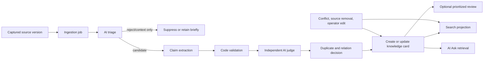
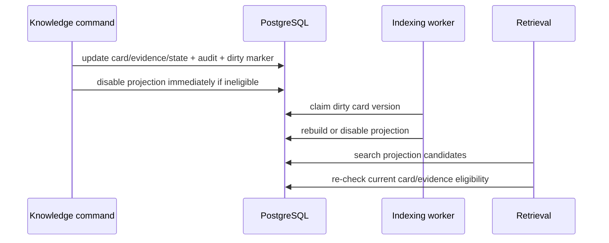

# Community Knowledge Pipeline Solution Design

## Purpose

Turn captured community sources, initially Facebook post text, into short planning facts quickly without making operator review a publication gate. The system publishes only evidence-grounded, policy-safe facts and preserves uncertainty, conditions, and provenance for retrieval.

This document explains the workflow. `ARCHITECTURE-SPINE.md` is the binding engineering contract when they differ.

## Operating Model



The system has one ingestion job per source capture version. It progresses through:

```text
queued -> triaging -> extracting -> judging -> relating
      -> published | suppressed | review_recommended | verify_first | failed
```

Completed stages are not rerun after a retry. Workers claim each stage with a transaction, lease/fencing token, and expected stage version; every commit uses compare-and-swap so stale workers cannot publish later. A recapture creates a new immutable source version and a new job.

## Canonical Data

`knowledge_card` is the sole canonical fact aggregate. A candidate claim is temporary extraction output, not a persistent product aggregate.

| Record | Holds | Retention intent |
| --- | --- | --- |
| `knowledge_cards` | Current short fact, conditions, states, confidence, current judge summary, `content_version` | Card lifecycle |
| `knowledge_card_evidence` | Current bounded quote/span, exact immutable capture version/hash, source, date, conditions, support, display and evidence state | While active; short retention after inactive |
| `knowledge_ingestion_jobs` | Current pipeline stage/outcome and safe retry details per capture version | Operational retention |
| `knowledge_card_relations` | Current duplicate/support/conflict/superseding decision | Operational/current relationship need |
| `knowledge_review_recommendations` | Priority, reasons, suggested operator action, resolution | Until resolved plus operational retention |
| `knowledge_card_search_documents` | Rebuildable lexical projection | Rebuildable |

Do not retain full prompts, provider payloads, unlimited extraction JSON histories, or old wording versions by default.

## Card State Model

The four state dimensions answer different questions and must not be collapsed.

| Dimension | Values | Meaning |
| --- | --- | --- |
| Publication | `active`, `suppressed`, `archived` | May traveler retrieval use it? |
| Knowledge | `community_observation`, `community_pattern`, `conditional`, `uncertain`, `conflicted`, `confirmed`, `superseded` | How should it be described? |
| Review | `none`, `ai_recommended`, `in_review`, `reviewed` | Does an operator need or have review? |
| Verification | `not_required`, `required`, `corroborated`, `failed` | Does the claim require external corroboration? |

Examples:

| Situation | Publication | Knowledge | Review | Verification |
| --- | --- | --- | --- | --- |
| First-hand parking observation with clear quote | active | community_observation | none | not_required |
| Several independent matching reports | active | community_pattern | none | not_required |
| Road condition reported during rain | active | conditional | ai_recommended | required |
| Conflicting current EV charger reports | active or suppressed | uncertain/conflicted | ai_recommended | required |
| Removed source with no remaining evidence | suppressed | superseded or uncertain | reviewed if handled | failed or not_required |

`verification_state = required` permits caveat-only use. It never turns a card into `confirmed` by itself.

## Publication Decision

Code must reject a candidate before publication if any hard gate fails:

- Citation quote does not match the captured source text at its submitted span.
- Fact, quote, or source projection contains disallowed PII or sensitive content.
- Location, route, or travel context is insufficient to identify a planning use.
- Content is opinion-only, question-only, spam, commercial promotion, or unsafe to publish.
- A high-risk conflict is unresolved.

The independent judge then applies current thresholds:

| Signal | Active threshold |
| --- | ---: |
| Travel relevance | >= 0.75 |
| Extractability | >= 0.70 |
| Evidence grounding | >= 0.90 |
| Specificity | >= 0.65 |
| Actionability | >= 0.65 |
| First-hand likelihood | >= 0.55 |
| Spam/commercial risk | <= 0.25 |

Scores cannot override failed code validation. The extractor never makes the final publication decision for its own output.

High-risk topics include road status, safety, EV charging, prices, hours, availability, booking policy, and promotions. They may be active only as conditional caveats while verification is required; they cannot drive itinerary decisions as settled facts.

## Evidence And Relation Rules

An evidence record is separate from the source link. It represents the exact bounded text that supports the current card.

```text
Evidence state: active | inactive | removed
Support: supporting | conflicting
Display: operator_only | traveler_visible | fact_only
```

Facebook evidence defaults to `operator_only`. A quote/link may become `traveler_visible` only when the source is accessible, the quote is short and relevant, and neither quote nor projection contains PII or sensitive content. Each evidence record carries an independence key from its canonical author/source identity; a community pattern requires two distinct active supporting keys.

New evidence supplements existing evidence by default. It replaces/deactivates older evidence only for volatile facts or when old evidence is no longer suitable. Retrieval selects at most three supporting and one conflicting active evidence records, favoring recency, source independence, and quality.

Relation matching is scoped before AI comparison:

1. Find candidates with the same card type and normalized location/route.
2. Reject exact same-source or redundant quote/fact candidates.
3. Ask the relation judge only about the closest scoped candidates.
4. Attach only when the judge confirms the same fact and equivalent conditions.

Create a new card for materially distinct but compatible conditions. Attach conflicting evidence to the existing card rather than creating an opposite card, unless conditions clearly make the two facts compatible. Ambiguous relation, high-risk topic, state-changing merge, conflict, or absent observed date creates a review recommendation.

## Transaction And Indexing Rules

PostgreSQL owns eligibility. Search documents are projections.



Every meaningful state or operator change must atomically update the card, write a concise audit event, and mark the card version dirty. Suppression, archival, superseding, high-risk conflict, and source withdrawal disable the projection in the same transaction.

The indexing worker is idempotent by `(knowledge_card_id, content_version)`. Retrieval always re-checks current publication, knowledge, verification, evidence, and source-safe eligibility. An indexing delay must never re-enable a prohibited card.

## Retrieval And AI Ask

Traveler source bundles may include only:

- Current active fact, conditions, type, location/route, confidence, freshness and current states.
- State-aware usage instruction such as `caveat_only` or `do_not_use_for_itinerary_decision`.
- Traveler-safe source metadata and any approved bounded evidence projection.

They must never include raw Facebook text, operator-only evidence, media notes, provider payloads, private source data, or audit metadata.

| Card condition | Retrieval behavior |
| --- | --- |
| `community_observation` | `contextual_use`: State it as one community observation, never broad consensus |
| `community_pattern` | `contextual_use`: May say multiple independent community reports support it |
| `conditional` | `contextual_use`: Include material condition in the answer |
| `uncertain` | `caveat_only` |
| `conflicted` | `exclude`: ask, warn, search, or select a safer option without using it as a premise |
| `verification = required` | `caveat_only`; no itinerary-driving recommendation |
| `suppressed`, `archived`, `superseded` | `exclude` |

Web search runs when active knowledge is sparse, freshness-sensitive, uncertain, or conflicted. If it fails or is low confidence, AI Ask must say updated information could not be verified and recommend user confirmation rather than generate unsupported guidance. Search results remain external/unverified unless ingested through this same pipeline.

## Operator Workflow

Operators do not review every post or every card. The system offers a queue sorted by traveler impact and risk.

1. Operator opens a recommendation.
2. The screen shows the current short fact, card content version, evidence-set revision, state, conditions, risk reasons, source metadata, and highlighted bounded evidence.
3. Operator chooses one action: accept current wording, edit with evidence validation, suppress, restore, request verification, or resolve a relation/conflict.
4. The Knowledge command resolves the version-bound recommendation with compare-and-swap, then applies the state transition, audit, and index dirty marker atomically. A changed card gets a new recommendation rather than inheriting the prior review result.

Operator actions must never expose raw source material to travelers. Editing wording requires existing or newly added active evidence that validates the changed wording.

Quality sampling is separate from recommendation review:

- Review 15% of auto-active cards during the first four weeks.
- Review 100% of `verify_first` outcomes.
- Increase sampling for new models, prompts, categories, or detected policy failures.

## Retention And Removal

- Raw captured Facebook text is operator-only.
- Delete Facebook source/capture artifacts and dependent operational artifacts after 180 days when they support no active or reviewable claim.
- When a source is withdrawn, inaccessible, or subject to removal, run a retryable removal command that locks dependent evidence/cards, hides evidence/link immediately, re-evaluates cards using remaining evidence, suppresses when support is insufficient, and only then deletes or hides the artifact.
- Keep durable audit only for meaningful state transitions and operator actions.
- Keep failed or replaced AI artifacts only as safe operational metadata for short retention.

## Service Actor And Ownership

`system-knowledge-pipeline` is the actor for automatic triage, judge, relation, publication, conflict, and indexing mutations. The person who submitted a source remains source/job provenance, not the actor responsible for autonomous decisions.

Knowledge owns all mutations in this design. Retrieval may read only traveler-safe projections and may not repair eligibility by itself except disabling an ineligible stale search projection.

## Rollout Checks

Before group-level discovery expands, verify:

- Every sampled active card has a quote/span that code validates against its source.
- No PII or raw source text enters traveler bundles.
- High-risk conflicts de-index immediately.
- Retrieval never returns suppressed, archived, or superseded cards.
- AI Ask follows state-aware wording in evaluation prompts.
- Operator recommendations are actionable without requiring a full post read in normal cases.
