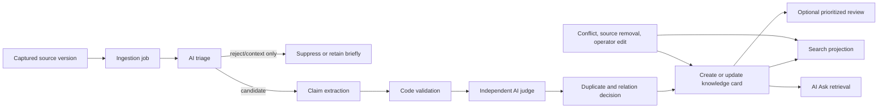
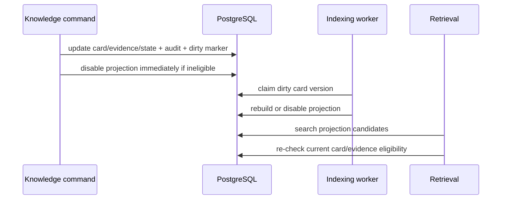

# Community Knowledge Pipeline Solution Design

## Purpose

Turn captured community sources, initially Facebook post text, into short planning facts quickly without making operator review a publication gate. The system publishes only evidence-grounded, policy-safe facts and preserves uncertainty, conditions, and provenance for retrieval.

This document explains the workflow. `ARCHITECTURE-SPINE.md` is the binding
engineering contract when they differ; this companion is updated to its normalized
lifecycle model.

## Operating Model


```mermaid
flowchart LR
  Capture[Captured source version] --> Job[Ingestion job]
  Job --> Triage[AI triage]
  Triage -->|reject/context only| Stop[Suppress or retain briefly]
  Triage -->|candidate| Extract[Claim extraction]
  Extract --> Validate[Code validation]
  Validate --> Judge[Independent AI judge]
  Judge --> Relate[Duplicate and relation decision]
  Relate --> Card[Create or update knowledge card]
  Card --> Index[Search projection]
  Card --> Review[Optional prioritized review]
  Card --> Ask[AI Ask retrieval]
  Conflict[Conflict, source removal, operator edit] --> Card
  Conflict --> Index
```

The system has one ingestion job per source capture version. Its status reports
technical execution only:

```text
queued -> running -> completed | failed
```

`checkpoint.step` records resumable discovery, extraction, judgment, or relation
detail. `candidateCount` counts persisted discoveries; `completedCandidateCount`
counts completed candidates; `failedCandidateCount` counts failed candidates; and
`needsOperatorCandidateCount` is the completed `needs_operator` subset. These are
idempotent observability projections only. A job completes only after discovery is
terminal and every candidate has completed or failed. Workers claim work with a
transaction, lease/fencing token, and expected version; every commit uses
compare-and-swap so stale workers cannot publish later. A recapture creates a new
immutable source version and job.

## Canonical Data

`knowledge_card` is the sole canonical fact aggregate. A candidate claim is temporary extraction output, not a persistent product aggregate.

| Record | Holds | Retention intent |
| --- | --- | --- |
| `knowledge_cards` | Current short fact, one lifecycle state, domain classification, verification requirement, confidence, current judge summary, `content_version` | Card lifecycle |
| `knowledge_card_evidence` | Current bounded quote/span, exact immutable capture version/hash, source, date, conditions, support, display and evidence state | While active; short retention after inactive |
| `knowledge_ingestion_jobs` | Technical status, checkpoint, aggregate counters, and safe retry details per capture version | Operational retention |
| `knowledge_ingestion_candidates` | Candidate extraction, processing status, immutable AI disposition/reason, and optional card association | Operational retention |
| `knowledge_card_relations` | Current duplicate/support/conflict/superseding decision | Operational/current relationship need |
| `knowledge_recommendations` | Version-fenced actionable primary/sampling work, status, reason, and resolution | Until resolved plus operational retention |
| `knowledge_sampling_obligations` | Immutable required later quality control for each `needs_operator` candidate | Operational retention |
| `knowledge_card_search_documents` | Rebuildable lexical projection | Rebuildable |

Do not retain full prompts, provider payloads, unlimited extraction JSON histories, or old wording versions by default.

## Card State Model

Each card has exactly one workflow state. Domain classification and verification
need are separate from workflow.

| Dimension | Values | Meaning |
| --- | --- | --- |
| Lifecycle | `draft`, `pending_operator`, `active`, `suppressed`, `archived`, `rejected` | Current workflow and retrieval eligibility |
| Domain classification | `community_observation`, `community_pattern`, `conditional`, `conflicted` | How an eligible fact is described |
| Verification requirement | `none`, `operator_required`, `failed` | Whether publication needs an operator decision or has failed |

Only `active` cards with `verification_requirement = none` and eligible evidence
are traveler-retrievable. `pending_operator` is never caveat-only retrieval; it is
not retrievable. Corroboration is derived from active supporting evidence with
distinct independence keys. Operator confirmation is a recommendation resolution
and audit event, not a card state or corroboration flag.

## Publication Decision

Code must reject a candidate before publication if any hard gate fails:

- Citation quote does not match the captured source text at its submitted span.
- Fact, quote, or source projection contains disallowed PII or sensitive content.
- Location, route, or travel context is insufficient to identify a planning use.
- Content is opinion-only, question-only, spam, commercial promotion, or unsafe to publish.
- A high-risk conflict is unresolved.

The independent judge then applies current thresholds:

| Signal | Active threshold |
| --- | ---: |
| Travel relevance | >= 0.75 |
| Extractability | >= 0.70 |
| Evidence grounding | >= 0.90 |
| Specificity | >= 0.65 |
| Actionability | >= 0.65 |
| First-hand likelihood | >= 0.55 |
| Spam/commercial risk | <= 0.25 |

Scores cannot override failed code validation. The extractor never makes the final publication decision for its own output.

High-risk topics include road status, safety, EV charging, prices, hours,
availability, booking policy, and promotions. They complete as
`needs_operator`, transition the card to `pending_operator` with
`verification_requirement = operator_required`, and open one version-fenced
verification item. They are not retrievable until the item resolves to an active
card or a terminal non-active state.

## Evidence And Relation Rules

An evidence record is separate from the source link. It represents the exact bounded text that supports the current card.

```text
Evidence state: active | inactive | removed
Support: supporting | conflicting
Display: operator_only | traveler_visible | fact_only
```

Facebook evidence defaults to `operator_only`. A quote/link may become `traveler_visible` only when the source is accessible, the quote is short and relevant, and neither quote nor projection contains PII or sensitive content. Each evidence record carries an independence key from its canonical author/source identity; a community pattern requires two distinct active supporting keys.

New evidence supplements existing evidence by default. It replaces/deactivates older evidence only for volatile facts or when old evidence is no longer suitable. Retrieval selects at most three supporting and one conflicting active evidence records, favoring recency, source independence, and quality.

Relation matching is scoped before AI comparison:

1. Find candidates with the same card type and normalized location/route.
2. Reject exact same-source or redundant quote/fact candidates.
3. Ask the relation judge only about the closest scoped candidates.
4. Attach only when the judge confirms the same fact and equivalent conditions.

Create a new card for materially distinct but compatible conditions. Attach conflicting evidence to the existing card rather than creating an opposite card, unless conditions clearly make the two facts compatible. Ambiguous relation, high-risk topic, state-changing merge, conflict, or absent observed date completes as `needs_operator` and opens applicable primary work.

## Transaction And Indexing Rules

PostgreSQL owns eligibility. Search documents are projections.


```mermaid
sequenceDiagram
  participant K as Knowledge command
  participant DB as PostgreSQL
  participant W as Indexing worker
  participant R as Retrieval
  K->>DB: update card/evidence/state + audit + dirty marker
  K->>DB: disable projection immediately if ineligible
  W->>DB: claim dirty card version
  W->>DB: rebuild or disable projection
  R->>DB: search projection candidates
  R->>DB: re-check current card/evidence eligibility
```

`transitionKnowledgeCard(...)` is the only production writer for card lifecycle,
verification requirement, primary/sampling work, candidate association, lifecycle
audit, and lifecycle-caused index invalidation. Authenticated API commands call it
synchronously for operator decisions; the Worker calls it for continuous
ingestion, conflicts, projection work, and scheduled sampling selection. API
requests never claim jobs or execute ingestion/index loops, and the admin
presentation application does not call the boundary.

Every meaningful lifecycle change atomically updates the card, writes a concise
audit event, and marks the card version dirty. Activation requires eligible active
supporting evidence with validated span, source/capture eligibility, and required
retrieval metadata. Suppression, archival, rejection, high-risk conflict, source
withdrawal, and loss of final eligible support disable the projection in the same
transaction.

The indexing worker is idempotent by `(knowledge_card_id, content_version)`. Retrieval always re-checks current lifecycle, domain classification, verification requirement, evidence, and source-safe eligibility. An indexing delay must never re-enable a prohibited card.

## Retrieval And AI Ask

Traveler source bundles may include only:

- Current active fact, conditions, type, location/route, confidence, freshness and current states.
- State-aware usage instruction such as `caveat_only` or `do_not_use_for_itinerary_decision`.
- Traveler-safe source metadata and any approved bounded evidence projection.

They must never include raw Facebook text, operator-only evidence, media notes, provider payloads, private source data, or audit metadata.

| Card condition | Retrieval behavior |
| --- | --- |
| `community_observation` | `contextual_use`: State it as one community observation, never broad consensus |
| `community_pattern` | `contextual_use`: May say multiple independent community reports support it |
| `conditional` | `contextual_use`: Include material condition in the answer |
| `conflicted` | `exclude`: ask, warn, search, or select a safer option without using it as a premise |
| non-`active` lifecycle or verification requirement not `none` | `exclude` |

Web search runs when active knowledge is sparse, freshness-sensitive, pending operator work, or conflicted. If it fails or is low confidence, AI Ask must say updated information could not be verified and recommend user confirmation rather than generate unsupported guidance. Search results remain external/unverified unless ingested through this same pipeline.

## Operator Workflow

Operators do not review every post or every card. The system offers a queue sorted by traveler impact and risk.

1. Operator opens a primary or sampling work item.
2. The screen shows the current short fact, card content version, evidence-set revision, state, conditions, risk reasons, source metadata, and highlighted bounded evidence.
3. Operator chooses one resolution: publish, revise and requeue, suppress, resolve a relation, or record a sampling result.
4. The Knowledge command resolves version-bound work with compare-and-swap, then applies the lifecycle transition, audit, and index dirty marker atomically. A changed card gets new fenced work rather than inheriting a prior resolution.

Operator actions must never expose raw source material to travelers. Editing wording requires existing or newly added active evidence that validates the changed wording.

Quality sampling is separate from recommendation review:

- Review 15% of auto-active cards during the first four weeks.
- Persist one immutable `knowledge_sampling_obligations` row for every `needs_operator` outcome; it is not an actionable recommendation or publication gate.
- Before high-severity containment, persist the exact cohort definition and member card/version set. Requeue remediable cards with one fenced `risk` item or suppress unsafe cards without successor work.
- Increase sampling for new models, prompts, categories, or detected policy failures.

## Retention And Removal

- Raw captured Facebook text is operator-only.
- Delete Facebook source/capture artifacts and dependent operational artifacts after 180 days when they support no active or reviewable claim.
- When a source is withdrawn, inaccessible, or subject to removal, run a retryable removal command that locks dependent evidence/cards, hides evidence/link immediately, re-evaluates cards using remaining evidence, suppresses a card that loses final eligible support, and only completes after no removed evidence remains traveler eligible.
- Keep durable audit only for meaningful state transitions and operator actions.
- Keep failed or replaced AI artifacts only as safe operational metadata for short retention.

## Service Actor And Ownership

`system-knowledge-pipeline` is the actor for automatic triage, judge, relation, publication, conflict, and indexing mutations. The person who submitted a source remains source/job provenance, not the actor responsible for autonomous decisions.

Knowledge owns all mutations in this design. Retrieval may read only traveler-safe projections and may not repair eligibility by itself except disabling an ineligible stale search projection.

## Rollout Checks

Before group-level discovery expands, verify:

- Every sampled active card has a quote/span that code validates against its source.
- No PII or raw source text enters traveler bundles.
- High-risk conflicts de-index immediately.
- Retrieval never returns a card whose lifecycle is not `active`.
- AI Ask follows state-aware wording in evaluation prompts.
- Operator recommendations are actionable without requiring a full post read in normal cases.
