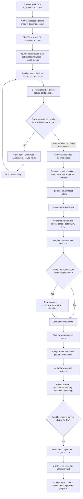
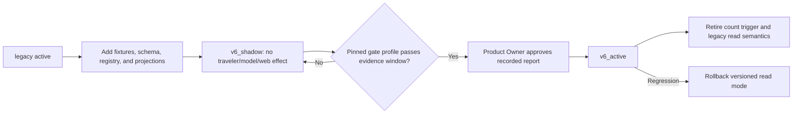

# Retrieval And Trip-Aware Answering Solution Design

## Purpose And Authority

This document projects AD-8, AD-9, AD-13, AD-17, AD-29, AD-30, and AD-34 through AD-40 into one buildable v6.2 slice. It explains flow and ownership; [ARCHITECTURE-SPINE.md](ARCHITECTURE-SPINE.md) remains authoritative.

The target outcome is a practical answer grounded in the exact committed Trip state and exact applicable evidence, while preserving a safe distinction between current plans, hypothetical changes, pending proposals, and private/unscoped questions.

## Brownfield Delta

Current code has a deterministic `TripAnswerContext` v1 and owner-scoped Trip aggregate, but transport legs retain free-text endpoints and no canonical path reference. Retrieval uses indexed lexical documents, stores a target count of three, and may trigger broad-query web fallback from that count. Web results retain provenance but do not yet have immutable fact-scoped geographic resolution.

V6.2 is a forward evolution of those owners. It adds no microservice, queue, worker workload, or environment flag. Existing PostgreSQL, NestJS, Worker, shared contracts, Chat/Trips, Retrieval, Search, AI Orchestration, and Feedback/Eval boundaries remain.

### Implementation Delta

| Capability | Current code | Target contract | Owning implementation slice | Activation gate |
|---|---|---|---|---|
| Planning context | `TripAnswerContext` v1; current project/chat fields | Four modes plus scoped multi-turn completeness gate and exact Trip/proposal/current-turn fences | AI Orchestration + Retrieval + Chat/Trips | G0 fixtures, G2 cutover |
| Clarification request path | Every admitted user message enqueues background `ai_ask.context_extraction.v1`; no pre-answer gate | Profiled turns use one synchronous extraction and suppress the overlapping background event; unprofiled turns remain unchanged | AI Orchestration + AI Ask command path | G0 fixtures, G2 cutover |
| Conversation fence | Lifecycle version and timestamps; no message-content revision | Chat/Trips monotonic content revision incremented with relevant message writes/deletes | Chat/Trips migration and commands | G0 schema review |
| Clarification terminal | Only main-answer `done/error` finalization exists | Existing AI Ask command persists a clarification message and terminal success with no Retrieval/web/main-answer artifacts | Chat/Trips + AI Orchestration + Usage owner ports | G0 fixtures, G2 cutover |
| Chat-to-Trip conversion | Typed `decisionId` flow waits for completed background context extraction, reads flat `chat_context`, and creates only a Trip/primary conversation | Profiled turn finalization synchronously refreshes persistent opportunity from canonical claims; click revalidates latest typed manifest and creates Trip, primary conversation, and pending proposal | Chat/Trips database/domain + AI Ask finalizers + shared contracts/API/OpenAPI + traveler presentation | G0 fixtures, G2 cutover |
| Canonical leg path | Free-text transport endpoint labels | Nullable exact endpoint/path/registry refs changed only by proposal | Chat/Trips migration and commands | G0 schema review, G2 |
| Route registry/coverage | No canonical registry authority | Immutable release, coverage assertions, bounded Worker publisher | Retrieval + database + Worker operation | G1 |
| Required needs | Card target count and query heuristics | Deterministic versioned requirement keys/contributions/outcomes | Retrieval + shared contracts | G0, G2 |
| Lexical retrieval | Indexed text, SQL `ILIKE`, TypeScript token scoring | Scope-first field-aware lexical; FTS only after exact-provider Vietnamese spike | Retrieval + indexing | G0 spike, G2 |
| Replay manifests | Current retrieval decision/provenance rows | Run, web-query, selection, prompt-render, and contribution chain | Retrieval + AI Orchestration | G1, G2 |
| Web scope | Captured provider result with coarse provenance | Immutable fact projection and requirement/leg decision | Search + Retrieval | G1, G2 |
| Gate profile | Existing beta evaluation result structures | Closed versioned safety/quality/operations profile | Feedback/Eval | G0 |
| Read-mode authority | No authoritative v6 policy row | PostgreSQL CAS policy and cutover record | Retrieval + authorized operations | G1, G2 |
| Compatibility trigger | Hard-coded target count of three | Legacy/shadow only, then gated behavioral and physical retirement | Retrieval + Feedback/Eval | G3 |
| Migration diagnostic | Failure copy still names a release matrix | Error reports actual advisory-lock/Drizzle failure boundary | Foundation migration cleanup | Before G2 |

## System Flow

## Ownership

| Owner | Owns | Must not own |
|---|---|---|
| Chat/Trips | Conversations/messages and monotonic content revision, clarification sessions/instances/values/assumptions/claims, persistent conversion opportunity/manifests, Trip aggregate, canonical route choice on a transport leg, exact planning snapshots, proposals and apply/dismiss/expire lifecycle | Context profiles/scope comparator, route registry, retrieval applicability, web evidence, model-selected or transcript-derived Trip mutations |
| Retrieval | Planning-context and required-need vocabulary/profiles, pure completeness evaluation, contributions, route registry and coverage assertions, query resolution, eligibility consumption, applicability, candidate generation, selection, query/scope manifests, read policy and retrieval telemetry | Clarification-session writes, Trip writes, Knowledge lifecycle writes, provider result capture, final answer generation |
| Knowledge | Card/evidence lifecycle and exact eligibility decision | Query-specific route/facet applicability |
| Search | Provider adapter and immutable external result capture | Knowledge publication, route authority, requirement satisfaction |
| AI Orchestration | Planning-mode/deliverable execution, versioned synchronous preflight extraction, bounded current-turn parsing, stage control, model call, prompt manifest/provenance writes, and terminal transaction coordination through owner ports | Clarification repositories, inventing context requirements, declaring completeness outside the profile evaluator, or direct message, Retrieval-run, Usage-event, Trip, or Knowledge table writes |
| Feedback/Eval | Immutable datasets, fixture manifests, cohorts, evaluation runs/results, numeric gate profiles | Runtime retrieval authority or release cutover execution |
| Product Owner | Approves production cutover and compatibility retirement from a recorded report | Recomputing technical metrics or bypassing failed safety gates |

## Planning-Mode Boundary

AI Orchestration makes one deterministic mode decision after NestJS authenticates the owner and validates the URL-selected conversation/Trip relationship.

| Mode | Durable authority | Retrieval scope | Required answer behavior |
|---|---|---|---|
| `current_plan` | Exact current Trip snapshot | Applied Trip state and canonical route choices | Describe only committed state as the current plan |
| `explore_change` | Current Trip snapshot remains baseline | Explicit bounded hypothetical route, stops, or constraints | Compare/describe the option without presenting it as applied |
| `validate_proposal` | Current Trip snapshot plus exact current pending proposal | Only proposal operations and affected scope | Explain effects and gaps; review/apply remains a separate owner command |
| `unscoped_answer` | No Trip authority | Current-turn explicit scope only | Load and persist no Trip constraints |

The mode record pins the Trip aggregate version, affected item versions, proposal revision when applicable, and a digest of bounded current-turn intent. Ambiguous signals that materially change route applicability produce safe common guidance plus one concise clarification.

## Multi-Turn Context Clarification

Clarification is a server-controlled gate for every deliverable class whose answer would materially change when required context is absent: multi-day itinerary, route comparison, accommodation, food, activity, and other profiled planning intents. It is not a universal extra model call for simple questions, and it is not a one-shot form.

Retrieval publishes immutable `PlanningContextProfile`, `ClarificationPlanPolicy`, instance-discovery, and scope-comparator versions. For a new intent/revision, AI Orchestration may use the existing synchronous AI Gateway `extraction` model purpose for one bounded `clarification_plan` prompt that proposes only deliverable instances and scope/group nodes. Retrieval validates it into `ValidatedClarificationPlan`; Chat/Trips atomically initializes or evolves the session and its traveler-instantiated graph revision through version-fenced owner commands. AI Orchestration then calls the versioned `clarification_extract` prompt for each new traveler message, obtains applied values from an exact Chat/Trips snapshot, and coordinates Retrieval evaluation plus the Chat/Trips reducer. Neither stage may recommend itinerary content, add undeclared context keys, persist session state directly, or mark an instance ready.

Each requirement instance is scoped through the pinned graph. Journey-level facts such as trip direction, dates, party, and vehicle may apply broadly. Preferences and constraints may instead attach to an exact date/day range, leg, stop/place, stay, meal, activity, or deliverable instance. Strict ancestry or an explicit profile precedence edge permits a narrow override; incomparable overlap becomes ambiguous. For example, `accommodation_quality=high` for the three-night Đà Nẵng destination stay can coexist with `accommodation_purpose=sleep_only` and a simple quality band for transit stops.

A partial reply merges only validated fields through a Chat/Trips compare-and-swap command. If a question asks direction, vehicle, and party but the reply provides vehicle and party, the next turn asks only direction. Material unresolved fields block the dependent detailed deliverable; unrelated ready instances may proceed only through an immutable answer claim that excludes blocked siblings. Safe common guidance or a skeleton may be returned only when the profile permits it; every typed assumption has a required render disclosure. A user refusal, intent change, stale version fence, or deletion closes or supersedes the instance/session rather than causing an implicit default.

Completing one answer claim completes only its included instances. The parent session stays active while any sibling is collecting, ready, or claimed; it completes only when every instance is completed or explicitly abandoned. Simultaneous claims must be disjoint and compare-and-swap fenced. Reusable profiles/policies contain no traveler data, while instantiated graphs, validated plans, attempts, and task/target digests follow conversation/Trip deletion.

A blocked turn is a normal durable AI Ask success containing the persisted assistant clarification message. Its shared transaction writes the Chat/Trips session/message, Usage event, and command terminal projection but creates no Retrieval run, web call, answer prompt/provenance, or main-answer usage. For profiled turns this synchronous preflight suppresses the current background `ai_ask.context_extraction.v1`; the background path remains only for unprofiled non-authoritative enrichment. Extraction failure persists safe retry guidance and failure usage and cannot fall through to the main model.

## Persistent Chat-To-Trip Conversion

After a useful answer commits for an ordinary unscoped conversation, Chat/Trips evaluates whether the completed clarification claims contain durable planning value. If eligible, the traveler sees one persistent `Chuyển thành chuyến đi` CTA. Leaving it untouched is neutral: the CTA remains while current context stays eligible and no decline fence is written. An explicit dismissal is distinct and retains the existing material-context decline behavior.

The CTA is presentation-stable but server-revisioned. Every material completed context change supersedes the previous bounded conversion manifest. A canonical conversation projection selects all eligible non-superseded completed claims through the terminal AI Ask watermark, deterministically replaces declared equal-scope values, accumulates compatible narrower scopes, and suspends on unresolved conflicts. The current manifest stores the exact schema-validated typed Trip seed and proposal operations and pins their canonical serialization, the projection/content revisions, source-message watermark, claims/instances/explicit values, conversion policy, and proposal schema. Raw messages, assistant prose, prompts, provider data, ambiguous or unresolved values, and operations derived only from bounded assumptions are never conversion input. While a newer traveler turn is still processing, the server keeps the CTA visible but disables it across clients.

On click, the existing `acceptTripCreationRecommendation(...)` port resolves and revalidates the latest eligible manifest rather than accepting the manifest first shown to the browser. AD-40 extends that contract instead of adding a parallel API. Accept, dismiss, refresh, and delete serialize through one opportunity-version CAS state machine. A successful idempotent transaction creates the Trip, its new primary conversation, and an initial pending Trip Change Proposal from the exact verified manifest payload. The original conversation remains ordinary and separate. Only the existing proposal Apply command turns reviewed typed operations into applied Trip state; the proposal review may expose omissions or planning gaps before Apply.

`continueInTrip(...)` remains intentionally different: it selects an existing Trip's primary conversation and transfers no ordinary-chat context. This keeps existing scope navigation safe while the new conversion path has an explicit review boundary.

For profiled turns, opportunity refresh runs through the Chat/Trips transaction-aware owner port immediately after clarification reduction or the answer claim terminalizes. It does not wait for, query, or recreate the suppressed `ai_ask.context_extraction.v1` effect and does not derive eligibility from legacy flat `chat_context`. Unprofiled legacy recommendation reads may retain that path only during the scheduled migration.

### Conversion Migration Ownership

| Slice | Existing-module owner | Required delta |
|---|---|---|
| PostgreSQL aggregate | Chat/Trips database migrations | Add opportunity/version/current-manifest uniqueness, canonical projection revisions, immutable typed manifests/digests, dismiss replay, success replay/tombstone, proposal identity/FKs, and the AD-39 conversation content revision; migrate without a second writer |
| Proposal contract | Shared Chat/Trips/domain contract | Export the existing closed proposal-operation union, parser, canonical serializer, and validator for both API/database accept and Worker proposal drafting; neither side reimplements it or imports Worker-domain internals in reverse |
| Shared wire contract | Shared contracts | Evolve creation projection and accept/dismiss parser/result from `decisionId` to stable `opportunityId`, add visible-disabled state and success `proposalId`, and keep the existing endpoint identity |
| NestJS boundary | Existing traveler commands controller + OpenAPI | Adapt the existing accept/decline request bodies and result schemas; no parallel conversion controller/route |
| Traveler presentation | Existing direct client + recommendation panel/composer | Render the stable `Chuyển thành chuyến đi` CTA and server-owned disabled state, refetch after each AI Ask terminal event, and never infer eligibility or disablement solely from local streaming state |

## Canonical Trip Path

A transport leg remains a `trip_plan_items` aggregate member. It gains nullable canonical origin, canonical destination, selected route path, and route-registry snapshot references. This is the smallest extension that preserves existing Trip ownership and avoids a second route-choice aggregate.

- `set-leg-path` changes all canonical route-choice references atomically through an owner-confirmed proposal.
- `clear-leg-path` removes route authority through the same proposal boundary.
- Apply validates owner, Trip/item versions, path/endpoints, and exact registry snapshot.
- Existing free-text endpoints migrate unchanged with null canonical references.
- No label parser, model, or migration may infer and persist an authoritative path.
- A retired/stale registry reference produces review/refresh behavior; it does not silently select a replacement.

## Route Resolution And Supported Coverage

Retrieval publishes immutable registry releases containing canonical locations, physical segments, paths, memberships, aliases, and active origin/destination coverage assertions. A coverage assertion states what the product can resolve for one OD pair and registry snapshot; it is not live navigation or a universal road graph.

Each query leg resolves to one state:

| State | Hard authority | Safe behavior |
|---|---|---|
| `authoritative_selected` | Exact Trip-owned or explicit current-turn selected path | Hard include/exclude along that path |
| `authoritative_complete` | Active coverage assertion proves the complete supported path set | Hard decisions across the asserted alternatives |
| `known_partial` | None from absence | Use known matches as soft guidance; expose uncovered scope |
| `ambiguous_paths` | None until material ambiguity is resolved | Return path-independent guidance and bounded alternatives or clarification |
| `no_path` | No route-wide authority | Use exact place and explicitly general evidence only; expose limitation and next action |
| `stale_selected_path` | Stored meaning remains reviewable but grants no current hard authority | Ask the owner to review/refresh through a proposal; never auto-select a replacement |

Outside supported coverage uses the same bounded behavior as `no_path` and must not be presented as nationwide route coverage.

## Required-Need Coverage

After every material context requirement for the requested deliverable scope is ready, Retrieval expands the question, mode, scoped clarification values, route state, and typed Trip constraints into bounded requirement keys before candidate generation. A key identifies one facet, importance, scope/leg, relevant constraint, and freshness class.

Candidate evidence contributes only after exact eligibility, scope, facet, and semantic decisions. The selector maximizes new required/useful coverage under candidate, token, and source-handle budgets. It does not fill quotas by card type or select top-K items without requirement contributions.

Requirement identity is a deterministic digest of the exact intent-profile version plus canonical facet, importance, scope/leg, constraint, and freshness fields. The profile owns per-leg expansion and duplicate coalescing. Retrieval is the sole creator of immutable knowledge/web contributions; each contribution binds one exact fact, owner/capture revision, scope/freshness decision, requirement key, and permitted render variant. A card containing two facts with different scope cannot contribute through a card-level shortcut.

Final outcomes are computed from rendered contributions:

- `satisfied`: applicable evidence survives final packing and version checks.
- `missing`: no applicable contribution remains.
- `requires_verification`: current/external confirmation is required.
- `requires_clarification`: a traveler decision, commonly path choice, is required.

An uncovered required need always becomes a concise limitation, permitted fresh-verification action, or bounded clarification. Safe partial guidance remains available. Unrelated evidence never makes the answer appear complete.

## Replayable Web Scope

Web fallback runs per missing or freshness-sensitive requirement. Retrieval first persists an immutable minimized-query manifest containing the exact requirement keys, allowed scope terms, excluded private-context classes, query-builder/provider-policy versions, and request digest. Search sends only those terms and does not send private Trip notes, child details, budget, or preferences unless the exact requirement needs that value.

Search stores the immutable provider result and its query-manifest reference. Retrieval derives atomic facts with an exact text digest and segmentation/extraction version, then creates immutable fact-level scope assertions keyed by capture ID, result payload hash, registry snapshot, and resolver version. A first-class query-specific decision binds one assertion to one requirement and leg.

- Exact/reviewed matched scope may become an external unverified premise.
- Unresolved scope remains a verification lead and does not satisfy coverage.
- Mismatched scope is excluded.
- One fact's place/route assertion cannot authorize another fact in the result.
- Provider failure keeps the gap and produces practical verification guidance.

## Selection, Rendering, And Provenance

The selection manifest pins requirement contributions and the ordered item/render variants selected under the runtime policy. The prompt-render manifest is produced after final owner/version checks and records only items actually rendered. Retrieval owns runs, keys, contributions, outcomes, selection manifests, and web query/scope decisions. AI Orchestration owns prompt-render manifests and terminal answer persistence.

`usedInPrompt` derives from the prompt-render manifest. `citedInAnswer` is separately validated against same-turn handles returned by the model. Packing or revocation that removes a required contribution must downgrade its final outcome before the model call; the orchestrator cannot preserve stale selection-time coverage.

`prepareAiAnswerRun(...)` persists the prepared run, selection, and prompt inputs under one run/idempotency fence before the provider call. AI Orchestration coordinates `finalizeAiAnswer(...)` in one PostgreSQL transaction through transaction-aware owner ports: Chat/Trips inserts the message, Retrieval seals its run, Usage appends its event, and AI Orchestration writes prompt/provenance rows. It imports no owner table directly. Provider failure seals a failed run and usage result without a completed message. Retrying cannot create a second terminal outcome.

Normal production stores bounded decisions and counts. Full candidate traces are limited to versioned evaluation runs or time-bounded diagnostics. No raw model reasoning is persisted.

## Migration And Cutover

Retrieval owns one PostgreSQL active read-policy row. One compare-and-swap command uses a discriminated reason: shadow/cutover/cleanup require a passing qualification report and Product Owner approval; emergency rollback requires a failing report/incident, authorized actor, expected current policy, and a previously qualified/approved runnable target but no new passing report. Deployment config may seed/cache but not override the row; every run pins it.

`v6_shadow` creates one paired execution with an authoritative legacy run and optional v6 shadow run. Only the authoritative role may select/persist the answer or provider/prompt/provenance usage. Shadow writes a `would-render` evaluation manifest, never a prompt-render manifest. Comparison pins both policies/config/code tuples and the authoritative result; retry/deletion operate on the pair. Cutover requires current projections, route fixtures, planning-mode isolation, deletion behavior, and one exact comparable gate-profile evidence window to pass.

The historical fewer-than-three trigger remains compatibility-only during legacy/shadow comparison. Required-need coverage is authoritative in `v6_active`. Behavioral disablement precedes physical cleanup. The gate profile owns the minimum legacy rollback window; Feedback/Eval produces the cleanup report and Product approves it. Before cleanup rollback may target retained legacy; after `COMP-06` and approved cleanup, rollback targets retained known-safe `v6_active` and removed legacy code is no longer named runnable.

## Deletion And Retention

- Chat/Trips coordinates deletion in one PostgreSQL transaction and reports success only after every owning module invalidates reconstructable rows.
- Ordinary-chat deletion removes or invalidates reconstructable question, current-turn intent, retrieval, web-query/scope, render-manifest, production evaluation membership, and derived-context payloads owned by that chat; it does not mutate an unrelated Trip.
- Primary-conversation deletion replaces the pointer through Chat/Trips or deletes the Trip atomically.
- Trip deletion invalidates exact snapshots, route-choice references, Trip-derived retrieval runs, projections, and reconstructable answer context.
- Minimal audit may retain non-content IDs, actor class, operation class, and timestamp only.
- Evaluation fixtures contain synthetic or approved bounded data; production-derived membership follows the owning chat/Trip deletion lifecycle while non-content aggregate metrics may remain.

## Product Traceability

| PRD package | Architecture decisions | Detailed proof surface |
|---|---|---|
| PCR-01, PCR-04; FR-61, FR-62; SC-10; AC-31 | AD-34, AD-38 | Required-need contracts, RN fixtures, coverage and compatibility cohorts |
| PCR-02; FR-65; SC-11; AC-32 | AD-9, AD-34, AD-36, AD-37 | Freshness requirements, web-scope fixtures, safety cohorts |
| PCR-03, PCR-06; FR-63, FR-64; AC-30 | AD-35 | Route-resolution contracts and RP fixtures |
| PCR-05; FR-16O-Q; AC-29 | AD-29, AD-30, AD-35 | Canonical path mutation, migration, stale-reference fixtures |
| PCR-07; FR-35; AC-11 | AD-9, AD-36 | Immutable fact-scoped web decision and replay fixtures |
| PCR-08; FR-16M-P, FR-30; SC-9, SC-12; AC-28 | AD-8, AD-29, AD-30, AD-36 | Planning-mode and proposal fixtures |
| FR-5, FR-16M, FR-61, FR-62; SC-10; AC-28, AC-31 | AD-34, AD-39 | Multi-turn context profiles, scoped values, readiness reducer, and CLAR fixtures |
| FR-7, FR-16J, FR-16K, FR-16L; PJ-01 | AD-30, AD-30A, AD-40 | Persistent current-revision conversion opportunity, TC fixtures, and pending-proposal boundary |
| PCR-09; FR-15; AC-33 | AD-13, AD-29, AD-30, AD-36 | Deletion fixture matrix |
| PCR-10; SC-8-12; AC-28-33 | AD-37, AD-38 | Versioned cohorts, evidence window, cutover and retirement report |

Production journeys PJ-01 through PJ-06 must each appear in the epic coverage map and at least one canonical fixture.
