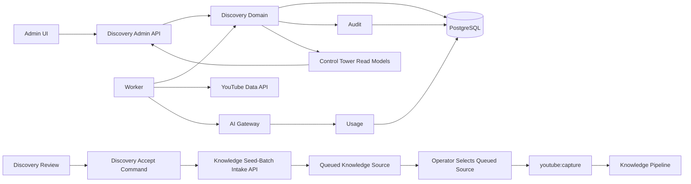

# Architecture Spine - AI-First YouTube Discovery

This architecture implements the active PRD's YouTube Discovery contract at UJ-6, FR-66..78, NFR-19..20, SC-13..14, and AC-34..41. It may refine mechanisms and failure handling but shall not broaden or weaken that product contract without a corresponding PRD update.

## Design Paradigm

PostgreSQL-backed modular workflow with Worker-owned scheduled execution. Discovery is a bounded, URL-only operational module. Its admin API owns commands and read models; the Worker owns due-run execution; PostgreSQL owns state, policy, leases, and audit. Knowledge capture remains a separate manually initiated workflow.

## Inherited Invariants

| Inherited | From parent | Binds here |
| --- | --- | --- |
| AD-3 | Project architecture spine | PostgreSQL and Drizzle own Discovery persistence and migrations. |
| AD-5, AD-6 | Project architecture spine | Discovery has explicit module ownership; all mutations are server-side and audited. |
| AD-10 | Project architecture spine | Only the manual, operator-controlled `youtube:capture` script may run Gemini video analysis. |
| AD-25, AD-26, AD-28, AD-31, AD-32 | Project architecture spine | Knowledge owns capture, ingestion, publication, audit/actors, and all post-capture lifecycle work. |

## Invariants & Rules

### AD-1 - Discovery Is URL-Only And Isolated From Knowledge Intake [ADOPTED]

- **Binds:** candidates, operator review, Knowledge intake handoff, capture handoff.
- **Prevents:** Discovery creating Knowledge sources, capture versions, ingestion jobs, evidence, or cards.
- **Rule:** A role-protected Discovery accept command calls the existing Knowledge seed-batch intake API with the candidate's canonical URL, exactly as the existing admin UI does. The command records `accepted` only after Knowledge returns `submitted` or `duplicate`; a failed intake leaves the candidate reviewable with a safe error. Discovery does not write `sources`, retain a source ID/link, or add an export aggregate. Discovery never invokes, schedules, enqueues, or retries `youtube:capture`.

### AD-2 - One Canonical Candidate Owns Discovery History [ADOPTED]

- **Binds:** candidate identity, dedupe, query appearances, ranking history, triage recommendation, operator actions.
- **Prevents:** duplicate review queues and incompatible candidate histories for the same video.
- **Rule:** Discovery and Knowledge intake share one exported canonicalizer for documented HTTPS `youtube.com`/`youtu.be` individual-video forms; it validates the video ID and returns a normalized `https://www.youtube.com/watch?v=<video-id>` URL. A Discovery candidate is unique by that video ID; query/run appearances reference that candidate. Immutable triage recommendation is `skip | defer | consider`; mutable operator state is `pending | accepted | deferred | skipped`. `accepted` means the existing Knowledge intake API has already returned `submitted` or `duplicate` for the candidate URL.

### AD-3 - Worker Owns Scheduled Discovery Execution [AMENDED 2026-08-13]

- **Binds:** query schedules, run creation, provider calls, retries, run state.
- **Prevents:** request-serving execution, platform-specific cron ownership, overlapping runs, and a hidden capture scheduler.
- **Rule:** Discovery is a registered Worker adapter with explicit readiness and telemetry. Its separately leased planning stage idempotently creates/refreshes system proposals; its due-query stage creates and claims runs only while the global switch is enabled. A due-query run searches, persists canonical candidates and immutable appearances, atomically enqueues one candidate-processing job per appearance, then completes. Candidate jobs independently perform enrichment, metadata triage, deterministic eligibility, and recommendation. Before every provider call, Discovery write, and retry/requeue write, the Worker compares current enablement under the matching active lease. A revoked run or job becomes `cancelled` with a safe terminal audit outcome and creates no further work. API/admin commands create or change policy/query state and read projections; they never execute Discovery stages. Provider-stage failures use bounded exponential backoff and safe terminal error codes at the candidate-job unit, so one URL cannot block a query or unrelated URL. Later scheduled query runs remain independent.

### AD-4 - One Query Proposal Aggregate Serves System And Operator Origins [ADOPTED]

- **Binds:** automated planning signals, operator-managed queries, schedules, priority, query lifecycle.
- **Prevents:** separate scheduling and ranking contracts for semantically equivalent queries.
- **Rule:** One `youtube_discovery_query_proposal` aggregate records `origin = system | operator`, reason, priority, query text, enabled/paused state, and cadence. System proposals derive only from coverage gaps, freshness risk, unresolved conflicts, and aggregated anonymized AI Ask demand. Global enablement controls all new Discovery planning and runs; per-query state controls an individual proposal.

### AD-5 - Metadata Triage Uses The AI Gateway And Cannot Authorize Work [ADOPTED]

- **Binds:** bounded enrichment, AI triage, schema validation, deterministic recommendation, usage attribution.
- **Prevents:** a second Gemini credential/path, unvalidated model output, or model-authorized capture.
- **Rule:** Discovery metadata triage uses the existing AI Gateway adapter and Usage model, never the Gemini video-analysis path. The model catalog has dedicated `youtube_discovery_triage` purpose with text-input and structured-extraction capability, plus a versioned triage prompt and Usage purpose. Triage input is bounded safe metadata plus derived signals; output is schema-validated as untrusted operational input. Deterministic Discovery policy validates canonical URL, public individual-video eligibility, dedupe, Knowledge-owned safe prior-capture eligibility lookup, and score bands before `skip`, `defer`, or `consider` can be shown. Candidate, channel, and query blocking/exclusion policy is deferred from the initial slice. No triage result creates Knowledge state or authorizes capture.

### AD-6 - Discovery Persists Safe Operational State Only [ADOPTED]

- **Binds:** candidate/query/run persistence, logs, audits, triage inputs, control-tower projections, retention.
- **Prevents:** Discovery becoming a raw-source, provider-payload, or traveler-content store.
- **Rule:** Persist only bounded video/channel metadata, sanitized derived comment signals, score factors, policy/version references, safe error codes, and audit summaries. Never persist raw comments, model prompts/responses, provider payloads, video media, transcripts, credentials, cookies, raw source material, evidence spans, or traveler content. Candidate/audit retention and derived-comment-signal TTL are policy-controlled; the initial candidate/audit default is 180 days, and comment-signal TTL is shorter.

### AD-7 - Policy And Operator Control Are Database-Owned And Admin-Only [ADOPTED]

- **Binds:** global switch, score bands/weights, cadence, retention, bounded worker concurrency/retry settings, candidate/query commands, control-tower read models.
- **Prevents:** scattered environment policy, unaudited operational changes, and presentation-layer domain ownership.
- **Rule:** Discovery policy is one versioned PostgreSQL record changed only through role-protected, audited admin API commands. Each run snapshots its effective policy version. Discovery has no hard budget/quota admission or reservation aggregate; provider/Usage telemetry is recorded where available. `apps/admin` is a typed API client only. Operator candidate actions and query changes are server-side commands with actor, target, action, timestamp, and safe before/after summary.

### AD-8 - Discovery Uses Closed Operational States And A Registered System Executor [AMENDED 2026-08-13]

- **Binds:** Worker adapter registration, run lifecycle, retries, cancellation, audit, Usage attribution, control-tower counters.
- **Prevents:** incompatible continuous worker loops, ambiguous terminal states, or discovery work attributed as another system capability.
- **Rule:** The registered Worker adapter capability and automated actor are both `youtube-discovery`; the immutable system executor ID is `system-youtube-discovery`. Query run and candidate job each use exactly `queued | running | retrying | completed | failed | cancelled`; their terminal states never reopen. Only the Worker moves either nonterminal record. Lease expiry returns nonterminal work to `queued`; policy revocation moves active work to `cancelled`. Every candidate job carries an immutable provenance tuple of candidate, appearance, originating run, and policy version; appearances remain immutable. Fenced candidate-job persistence remains linked to that originating run for audit, ranking history, and AI Usage. Each terminal transition writes one safe audit outcome, and each AI-triage invocation records the Discovery model purpose, prompt version, system executor, originating run, and candidate job.

### AD-9 - Candidate Processing Is Independently Durable [ADOPTED 2026-08-13]

- **Binds:** appearance enqueueing, candidate processing, retry/fencing, backpressure, historical discovered work, health projections.
- **Prevents:** one failing URL retrying an entire query, re-searching already persisted results, mutable discovery provenance, and unbounded candidate backlog.
- **Rule:** `youtube_discovery_candidate_jobs` is the Discovery-owned technical execution aggregate for one immutable appearance. A unique appearance-to-job relationship makes enqueue idempotent. The enqueue transaction is fenced by the active query-run lease and creates no duplicate appearance, job, ranking history, or review work. Candidate-job claim, recovery, retry, cancellation, completion, safe error code, lease, and fencing are independent from query-run state. The job uses its own immutable retry/concurrency-policy snapshots; every derived write is guarded by the job lease/fence and its immutable provenance tuple. Query runs do not wait for candidate work after enqueue.
- **Rule:** Scheduling applies a policy-bounded candidate-job backlog threshold before admitting a new due-query run. At or above the threshold, the scheduler records a bounded safe deferred/backpressure result and does not call YouTube search; it does not cancel or mutate queued candidate jobs. Backlog values, current job state, safe stage, retry timing, and terminal safe error code are exposed only through safe operational projections.
- **Rule:** The forward migration backfills exactly one queued job for every existing appearance lacking one. Backfill preserves original run/policy provenance, is idempotent, does not replay search, does not alter an appearance, recommendation, review state, or existing ranking history, and is subject to normal policy enablement and candidate-job fences when later claimed.



## Consistency Conventions

| Concern | Convention |
| --- | --- |
| Naming | Use `youtube_discovery_*` for Discovery-owned tables, jobs, policies, and read models. Use canonical YouTube video ID as the dedupe identity; preserve canonical URL as safe display metadata. |
| Data & formats | Provider input/output is bounded and schema-validated. Store timestamps in UTC. Safe errors use stable code plus bounded summary, never provider payload text. |
| State & cross-cutting | Discovery command mutations are audited; Worker work is lease/fence guarded; policy version is snapshotted per query run and candidate job; policy revocation fences every external call/write; normal admin reads use projections. |
| Operational states | Triage recommendation, operator review state, query-run state, and candidate-job state are separate closed enums; terminal execution states are never reopened. |
| Privacy | Derived comment signals are untrusted triage metadata, never Knowledge evidence or traveler-facing content. AI Ask signals are aggregate and anonymized. |

## Stack

| Name | Version |
| --- | --- |
| TypeScript | 5.8.3 |
| PostgreSQL + Drizzle ORM | Drizzle 0.44.5 |
| NestJS admin API | Existing project runtime |
| Worker runtime | Existing project runtime with registered Discovery adapter |
| YouTube Data API v3 | Documented API |
| AI Gateway adapter | Existing project boundary |

## Structural Seed

```text
packages/domain/
  youtube-discovery/       # policy, commands, deterministic eligibility/ranking
packages/database/
  youtube-discovery/       # Drizzle schema, repositories, migrations
packages/contracts/
  youtube-discovery/       # admin API contracts and safe read models
apps/api/
  youtube-discovery/       # role-protected admin transport
apps/worker/
  youtube-discovery/       # due-run claiming, enrichment, triage adapters
apps/admin/
  youtube-discovery/       # typed API client and control-tower UI
```

## Capability -> Architecture Map

| Capability / Area | Lives in | Governed by |
| --- | --- | --- |
| System/operator query proposals | Discovery domain, PostgreSQL | AD-3, AD-4, AD-7 |
| Search and appearance enqueue | Worker and Discovery domain | AD-2, AD-3, AD-6, AD-9 |
| Candidate enrichment, triage, ranking | Worker and Discovery domain | AD-3, AD-5, AD-6, AD-9 |
| Metadata AI triage and ranking | Discovery domain, AI Gateway, Usage | AD-5, AD-6 |
| Operator review and Knowledge intake handoff | Admin API/read models and Discovery domain | AD-1, AD-2, AD-7 |
| Discovery health/control tower | Discovery read models | AD-3, AD-6, AD-7, AD-8 |
| Manual capture handoff | Discovery accept command calls Knowledge seed-batch intake API, then existing `youtube:capture` workflow | AD-1, AD-2; inherited AD-10, AD-25, AD-32 |

## Deferred

- Initial score weights, score bands, cadence defaults, bounded worker concurrency/retry settings, review-age threshold, candidate retention default, and derived-comment-signal TTL: policy values, not architectural constants; establish through operations tuning.
- Exact coverage/freshness/conflict/demand read-model fields and aggregate latency: define in the upstream Knowledge/AI Ask integration story without persisting traveler content in Discovery.
- Candidate UI interaction design and control-tower layout: UX artifact owns presentation while AD-7 preserves the API/ownership boundary.
- Hard Discovery AI-cost budgets, quota reservations, projected capacity, and budget alerts: deferred until Discovery usage justifies enforcement beyond bounded concurrency and provider rate-limit handling.
- Candidate, channel, and query blocking/exclusion policy: deferred; the initial slice supports only Accept, Defer, and Skip candidate decisions.
