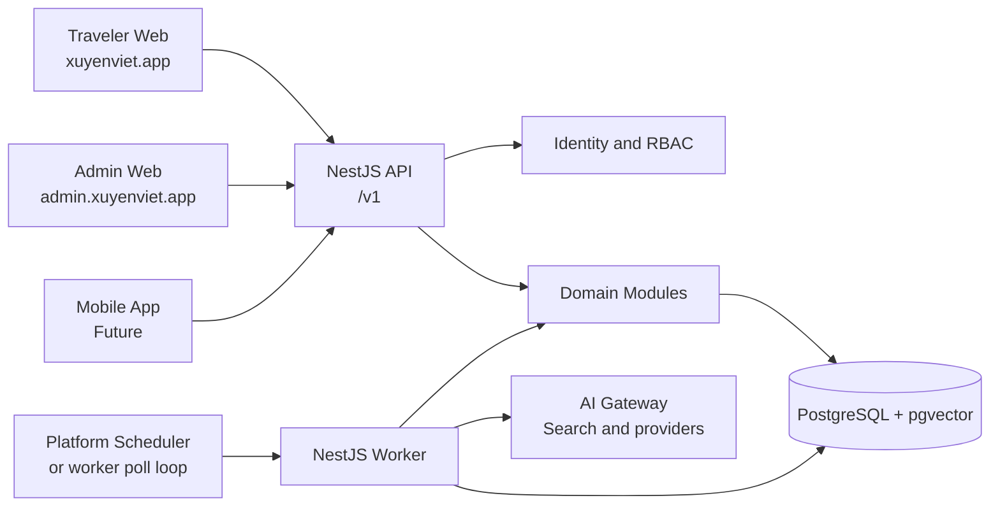

# Đề Xuất Chuyển Dịch Sang NestJS API Và Admin Tách Riêng

## Trạng Thái

**Hướng kiến trúc đã được phê duyệt, chưa bắt đầu implementation.** Tạo ngày 2026-07-28, cập nhật ngày 2026-07-28 theo Fast path. Các mục mang nhãn `[ASSUMPTION]` còn cần được xác nhận trong spike hoặc trước capability liên quan; chúng không thay đổi quyết định kiến trúc này.

Kế hoạch triển khai và kết quả rà soát codebase được ghi tại [Kế Hoạch Thực Hiện NestJS API Và Admin Tách Riêng](./nestjs-api-implementation-plan.md). Implementation vẫn chờ BMad baseline và các spike bắt buộc được hoàn tất.

Proposal này thay thế định hướng runtime của MVP hiện tại. PRD và Architecture Spine phải được cập nhật theo Workstream 0 trước implementation; cho đến khi việc cập nhật hoàn tất, chúng vẫn là nguồn chân lý cho product scope và các invariant chưa được proposal này thay thế.

## Quyết Định Đề Xuất

Chuyển dần từ Next.js full-stack sang một **modular monolith có API-first boundary**:

- NestJS trở thành owner duy nhất của public/domain API, authorization, use case và background execution.
- Next.js traveler web vẫn là frontend hiện tại, giữ App Router, React Server Components và UX hiện có.
- Admin trở thành Next.js application riêng, dùng cùng API contract nhưng deployment, origin và release lifecycle riêng.
- Worker là NestJS runtime riêng, không nhận public traffic và dùng cùng domain modules với API.
- Tất cả background work chạy liên tục thuộc Railway service `worker`; Railway Cron chỉ chạy short-lived `--once` sweeps, còn migration là release job riêng. Facebook browser capture tiếp tục là operator-controlled tooling ngoài Railway worker.
- PostgreSQL vẫn là data plane duy nhất; Drizzle schema/migrations và mọi invariant transactional vẫn được giữ trong giai đoạn chuyển đổi.
- Không tách microservice, database-per-service, event bus hay queue platform mới trong initiative này.

### Các Quyết Định Đã Chốt

- Mobile app là capability cần có trong 6-12 tháng tới; API-first boundary là đầu tư cần thiết, không chỉ là chuẩn bị giả định.
- Traveler browser không gọi Nest API trực tiếp. Next.js giữ Auth.js session và làm BFF trong phase đầu.
- Admin phải tách thành app/deployment riêng trước khi public deployment cho traveler.
- Railway là deployment target ban đầu cho monorepo, `web`, `admin`, `api`, `worker` và migration job.
- PostgreSQL dùng Railway PostgreSQL. Services trong cùng Railway environment giao tiếp qua private networking; không dùng public database URL cho traffic nội bộ.
- Public domains là `xuyenviet.app` cho traveler web, `admin.xuyenviet.app` cho admin, và reserve `api.xuyenviet.app` cho public/mobile API khi cần.
- Mobile nhiều khả năng dùng React Native; lựa chọn này cần được xác nhận khi lập kế hoạch mobile nhưng không chặn API contract hiện tại.
- Identity target state cho mobile là Nest-hosted OAuth/OIDC. Không tự viết OAuth/OIDC protocol, token signing, key rotation hay authorization server từ đầu; phải chọn một thư viện/authorization-server implementation được duy trì tốt trong technical spike.
- Database hiện là development data và được reset hằng ngày. Migration có thể clean-break trong development; trước public deployment phải chuyển sang expand-migrate-contract cho mọi thay đổi cần tương thích khi nhiều runtime cùng chạy.
- Team chấp nhận vận hành các workload và observability tương ứng.



## Mục Tiêu

- Tạo API contract ổn định, versioned và dùng được cho traveler web, admin và mobile app tương lai.
- Tách web presentation khỏi domain mutation/read policy để không tiếp tục nhân bản logic qua server actions, route handlers và mobile APIs.
- Đưa cron/poller/background operation vào runtime có module, dependency injection, lifecycle và observability rõ ràng.
- Cho admin release cadence, access boundary và operational UI riêng mà không phân tách product data hoặc business logic.
- Bảo toàn các invariant hiện có về ownership, authorization, audit, provenance, retrieval safety, job idempotency và PostgreSQL transaction.

## Không Mục Tiêu

- Rewrite toàn bộ ứng dụng hoặc đóng băng delivery sản phẩm để migration.
- Chuyển sang microservices hoặc mỗi domain một database.
- Thay PostgreSQL-backed jobs bằng Redis, BullMQ, Kafka, Temporal hoặc cloud queue trong cùng initiative.
- Thay đổi product scope, knowledge lifecycle, Trip Project ownership, AI policy hay retrieval policy.
- Dựng mobile app trong initiative này.
- Tạo một admin backend hoặc auth model độc lập với traveler API.

## Lý Do

### Mobile Là Một Client Thực Sự

Mobile không thể phụ thuộc vào Next.js server actions. Khi mobile được triển khai, API contract công khai phải có authentication, authorization, pagination, validation, error model và streaming semantics rõ ràng. Đưa boundary này vào NestJS sớm hơn mobile giúp tránh việc chuyển một lượng lớn UI-coupled server code trong lúc phát triển mobile.

### Background Work Đã Vượt Mức Request Runtime

Repository hiện có extraction, ingestion, indexing, source retention, Facebook/YouTube capture và Trip Change Proposal expiry. Các luồng knowledge đã dùng state trong PostgreSQL, retry, lease, fencing token và `FOR UPDATE SKIP LOCKED`; đó là nền tảng đúng cần giữ. NestJS giúp tổ chức process worker, lifecycle, config, health check và dependency graph, nhưng không thay thế các cơ chế đúng đắn trong database.

### Admin Có Bề Mặt Vận Hành Khác Traveler Web

Admin hiện có knowledge intake, review, source capture, quality, AI gateway và user-role workflows. Tách app giảm coupling UI/deployment với traveler surface và cho phép harden origin/CSP/observability riêng. Đây là tách presentation/runtime, không phải tách domain owner hoặc database.

## Các Invariant Phải Giữ

### Data Và Domain

- PostgreSQL là source of truth cho users, roles, chats, Trip Projects, knowledge, provenance, audit, usage, jobs và retrieval state.
- Drizzle tiếp tục là schema/migration owner duy nhất. Mọi schema thay đổi là forward-only migration được review.
- Mỗi aggregate có đúng một owning domain module: Chat/Trips, Knowledge, Retrieval, Search, AI Orchestration, Usage, Feedback/Eval, Referrals và Audit.
- API controller, admin UI và worker chỉ gọi command/query của owning module; không được viết trực tiếp generic CRUD qua bảng của domain khác.
- AI chỉ tạo answer, extraction hoặc typed proposal. AI không được tự mutate Trip Project, knowledge state hay dữ liệu nhạy cảm.

### An Toàn Và Quyền

- Authorization là server-side cho mọi read/mutation; client không tự quyết ownership hoặc role.
- Admin/operator vẫn cần Google identity cộng server-side role check; traveler không nhận admin navigation/data.
- AuditActor union hiện có phải được dùng nguyên vẹn. Worker/cron dùng system actor, không fake user.
- API DTO validation, file validation, rate limits và response projection là server responsibilities; không expose raw table shape, raw provider payload hoặc operator-only content.
- CORS chỉ allow explicit traveler/admin origins; mobile token flows không mở cookie/session endpoint cho arbitrary origins.

### AI, Retrieval Và Background Jobs

- Source bundle, provenance persistence, usage records và final answer policy vẫn được tạo trước khi answer được coi là hoàn tất.
- Traveler retrieval vẫn fail-closed theo owner-row state hiện tại, kể cả khi search/index projection bị lag.
- Job claim/retry/lease/fencing/idempotency tiếp tục nằm trong PostgreSQL. Cron hay scheduler chỉ kích hoạt/poll work; không là source of truth cho job completion.
- Worker chạy tách public API process và có restart supervision, health check, structured logs và alerting.

## Kiến Trúc Đích

### Repository Shape

Dùng pnpm workspace khi bắt đầu migration để cho phép shared TypeScript packages nhưng không ép tách package trước khi có consumer thực tế.

```text
apps/
  web/                 # Traveler Next.js frontend
  admin/               # Operator/admin Next.js frontend
  api/                 # NestJS HTTP API
  worker/              # NestJS worker process
packages/
  domain/              # Domain commands, queries, policies, ports
  database/            # Drizzle schema, migrations, db factory
  contracts/           # Versioned API DTO/schema and API type definitions
  config/              # Validated runtime configuration contracts
```

Không phải mọi mã hiện tại cần được chuyển vào package ngay. Migration bắt đầu bằng vertical slice: extracted domain service chỉ được đưa vào `packages/domain` khi cả Nest runtime và một client/worker cùng cần nó. Không tạo package chỉ để phản chiếu thư mục hiện có.

### NestJS Modules

API và worker import chung các module/domain service sau, nhưng có bootstrap/runtime adapter khác nhau:

| Module | Trách nhiệm |
|---|---|
| `identity` | Xác thực identity/token/session, mapping request principal, role lookup và auth guards. |
| `audit` | AuditActor validation, typed audit/usage writes và system executor catalog. |
| `chat-trips` | Conversations, Trip Projects, constraints, plan items, proposals, Trip Home. |
| `knowledge` | Sources, capture versions, ingestion, cards, evidence, recommendations, retention. |
| `retrieval` | Eligibility, search projections, source bundle và provenance reads. |
| `search` | External web search adapter và normalized result persistence. |
| `ai-orchestration` | Model selection, prompt/source bundle contract, streaming, response finalization and usage. |
| `admin` | Admin-only application services/read models; không sở hữu domain tables riêng. |
| `operations` | Worker loops, scheduled triggers, health/readiness and operational metrics. |

Controllers không gọi database trực tiếp. Worker processors cũng không sở hữu business logic riêng; chúng gọi cùng command/service với API nhưng đi qua system execution context.

### API Contract

- Public API có prefix `/v1`; breaking change chỉ qua version mới hoặc endpoint mới.
- OpenAPI được xuất từ Nest DTO validation schema và là API documentation/compatibility contract. Giai đoạn đầu không generate client SDK: `web` và `admin` dùng một thin, hand-written API client theo endpoint; mobile chỉ generate client khi số endpoint hoặc platform consumer làm việc đó có lợi ích rõ ràng.
- Dùng NestJS standard DTO + `class-validator`/`class-transformer` + Swagger/OpenAPI trong API app. Không thêm schema framework thứ hai hoặc code generator vào phase đầu.
- Response dùng task-oriented read model, không trả về Drizzle row nguyên bản.
- Mọi list endpoint có cursor pagination, stable ordering và ownership/role scope trước query result projection.
- Error response có machine-readable code, HTTP status, Vietnamese-safe user message khi phù hợp, và request/correlation ID; không trả stack trace, provider response hay raw SQL error.
- Mutation endpoint idempotency được thiết kế theo từng use case. Những command đã có aggregate/proposal fencing tiếp tục dùng fencing đó; external retry cần idempotency key chỉ khi request có thể bị retry qua network/mobile.

### Streaming AI Ask

AI Ask hiện dùng NDJSON streaming. API v1 giữ protocol này trong giai đoạn đầu để không buộc frontend rewrite. Contract phải được ghi rõ gồm `preparing`, `delta`, `done`, `error`, cancellation và persisted terminal state.

Nest controller chịu trách nhiệm transport stream; `ai-orchestration` chịu trách nhiệm tạo user message, source bundle, provider stream, final policy validation, assistant/provenance/usage transaction và Trip Change Proposal draft. Không được chuyển persistence/provenance xuống Next frontend hay controller.

SSE hoặc WebSocket là lựa chọn **deferred**. Chỉ đổi protocol khi mobile networking, reconnect semantics và observability chứng minh NDJSON không đáp ứng.

### Public Và Private Networking

- `web`, `admin` và `worker` gọi `api` qua `api.railway.internal` trên Railway private network; browser không gọi API trực tiếp trong phase đầu.
- `api.xuyenviet.app` được reserve từ đầu cho public/mobile API. Chỉ expose public endpoints khi mobile hoặc public integration cần chúng; public API vẫn bắt buộc OAuth/OIDC token, rate limit và API observability.
- Railway PostgreSQL chỉ nhận connection nội bộ từ workloads được cấp `DATABASE_URL`; không expose database cho browser hoặc admin UI.
- Railway environment là network boundary: staging và production có service discovery, credentials và database tách riêng.

### Admin Tách Riêng

`apps/admin` là Next.js app riêng cho operator/admin workflows:

- Chỉ gọi Nest API; không import database/domain mutation code và không dùng server action như domain boundary.
- Có domain/origin riêng, CSP/cookie policy riêng và deployment cadence riêng: `admin.xuyenviet.app`. Traveler web dùng `xuyenviet.app`; API public dùng `api.xuyenviet.app` khi được expose.
- Admin không có identity provider, user table hoặc role model riêng. Hai Next.js apps dùng cùng Google identity, `users`/`user_roles` source of truth và shared Auth.js configuration package; mỗi app dùng host-only session cookie trên domain của mình, không mở rộng cookie lên `.xuyenviet.app`.
- Navigation, counts, read models và mutation capabilities đều qua admin-scoped API guards.
- Tách app không làm admin có credential truy cập database trực tiếp.

Trong transition, admin có thể vẫn được serve tại `/admin` từ traveler app đến khi API slice tương ứng hoàn tất. Không chạy song song hai UI writer cho cùng command sau cutover.

## Authentication Và Session Boundary

Đây là quyết định rủi ro cao nhất và phải được spike trước public API migration.

### Đề Xuất

Giữ Google OAuth với Auth.js/NextAuth ở traveler web trong phase đầu, nhưng NestJS là resource server duy nhất cho domain API.

1. Next.js hoàn tất OAuth browser flow và tạo session theo chiến lược hiện tại trong PostgreSQL.
2. Sau khi session được xác thực server-side, Next.js gọi Nest API bằng short-lived, audience-scoped internal access token chứa `sub`, session reference, role/version claims và issuer/audience rõ ràng.
3. Nest guard xác minh token, expiry, issuer, audience và session/user validity trước khi tạo request principal. Role-sensitive request re-check role/version server-side hoặc dùng token TTL rất ngắn với invalidation contract.
4. Browser không nhận broad bearer credential dùng trực tiếp cho mọi API. Traveler Next.js đóng vai BFF cho browser trong phase đầu.
5. Khi mobile implementation bắt đầu, identity/token issuance chuyển sang Nest-hosted OAuth/OIDC integration, dùng authorization-code flow with PKCE. Đây là migration identity riêng, có overlap/cutover plan; mobile không dùng Auth.js session cookie hay internal web access token. Nest-hosted OIDC phải dùng một maintained authorization-server implementation, không tự triển khai protocol/token cryptography.

Lý do: tránh để browser cookie của Auth.js trở thành cross-origin API contract, tránh đưa NextAuth database/session parsing vào Nest, và không làm mobile phụ thuộc vào Next.js. Điều này cũng cho phép thay identity provider sau này mà không thay đổi domain API.

### Các Lựa Chọn Bị Loại

| Lựa chọn | Quyết định | Lý do |
|---|---|---|
| Nest đọc trực tiếp Auth.js session cookie/database | Không chọn | Coupling private cookie/session format với Nest; CSRF, rotation và future mobile flow trở nên mơ hồ. |
| Browser gọi Nest trực tiếp bằng Auth.js cookie | Không chọn trong pha đầu | Cross-origin cookie/CORS/CSRF complexity; web frontend hiện vẫn có BFF capability. |
| Rewrite OAuth/auth hoàn toàn sang Nest ngay từ đầu | Không chọn | Rủi ro cao, không cần để tách domain API/worker; làm gián đoạn sign-in đang hoạt động. |
| Dùng shared static service secret từ frontend | Cấm | Không đại diện user/session và không an toàn cho browser/mobile. |

Trước mobile implementation, cần chốt authorization-server library và Google identity federation/configuration cho Nest-hosted OAuth/OIDC. Không coi internal web access token là mobile identity solution cuối cùng.

### Quyết Định Phê Duyệt: Hai Token Boundary

- `web` và `admin` BFF mint internal short-lived token chỉ để gọi `api.railway.internal`. Token này không được gửi xuống browser, không có refresh capability, không được chấp nhận tại public API, và không phải OAuth/OIDC token.
- Mobile dùng Nest-hosted OAuth/OIDC access/refresh token qua authorization-code flow with PKCE khi mobile initiative bắt đầu. Mobile không dùng Auth.js cookie hoặc internal BFF token.
- Cả hai luồng map vào cùng domain-neutral `RequestPrincipal`: stable `users.id` là `sub`; role/version, issuer, audience, issued/expiry và token ID là claims/metadata tiêu chuẩn. Domain API không phụ thuộc cookie format hoặc serialized Auth.js session.
- Identity spike phải chốt issuer, audience, key rotation, TTL, logout/revocation và role-freshness cho internal token, đồng thời chứng minh public/mobile issuer sau này thay thế được mà không đổi API contract, ownership hay authorization policy.

## Worker, Cron Và Operations

### Phân Loại Công Việc

| Loại | Cơ chế đích | Ví dụ |
|---|---|---|
| DB-backed work queue | Long-running Nest worker poller; PostgreSQL claim/lease/fence | Extraction, ingestion, indexing, retry. |
| Idempotent periodic sweep | Worker poll loop hoặc platform scheduler gọi worker command | Proposal expiry, source retention, stale lease recovery. |
| Operator-controlled external tool | Tách command/runtime theo ràng buộc tool hiện có | Facebook browser capture, YouTube capture. |
| User-facing request work | Nest API request/stream path | AI Ask source bundle, answer stream, proposal draft. |

Railway Cron phù hợp cho short-lived sweep chạy xong rồi exit, ví dụ retention hoặc một expiry batch. Nó chạy theo UTC, khoảng chạy ngắn nhất là 5 phút và không đảm bảo chính xác từng phút; nếu một execution trước còn active, Railway bỏ qua lượt kế tiếp. Vì vậy cron không dùng cho poller dài hạn, high-frequency work hoặc deadline chính xác.

Worker dài hạn là Railway service riêng chạy một replica ban đầu. `@nestjs/schedule` không là cơ chế production mặc định cho job quan trọng. Nếu sau này scale worker thành nhiều replica, database claim/lease/fence/idempotency vẫn bảo vệ work; periodic trigger cần database leader lock hoặc Railway Cron gọi command short-lived. Các job quan trọng vẫn an toàn nhờ transaction, claim predicate và idempotency ở database.

Trip Change Proposal expiry hiện đã là library worker loop đúng hướng, dùng `FOR UPDATE SKIP LOCKED` và idempotent command. Migration chỉ cần thêm worker entrypoint, lifecycle, health/logging và supervision; không được rewrite thành in-memory cron state.

## Tác Động Theo Thành Phần

| Thành phần hiện tại | Tác động | Hướng xử lý |
|---|---|---|
| `src/app` traveler routes | Cao | Giữ UX/App Router; server actions/route handlers dần trở thành API client/BFF adapters. |
| `/api/ai-ask/stream` | Cao | Chuyển transport vào Nest sau AI Ask vertical slice; giữ NDJSON protocol và final persistence contract. |
| Auth.js + PostgreSQL sessions | Cao | Giữ ở phase đầu; thêm trusted token exchange/resource-server boundary; spike revocation/role freshness. |
| `/admin` routes | Cao | Tách thành admin app và deployment riêng trước public deployment; API hóa workflow đầy đủ, không direct DB access từ admin. |
| `src/features/*` domain logic | Trung bình đến cao | Tách UI/Next primitives khỏi use cases; giữ ownership and transaction semantics. |
| Drizzle schema/migrations | Trung bình | Chuyển vị trí workspace khi cần, nhưng một owner/config/migration history duy nhất. |
| Knowledge workers | Trung bình | Giữ PostgreSQL job state; đổi process entrypoint sang Nest worker và thêm operational hooks. |
| Capture scripts | Trung bình | Giữ operator-only security boundary; chỉ integrate qua explicit worker/command adapter, không biến thành public endpoint. |
| Tests | Cao | Contract tests, API integration tests và worker-process tests bổ sung; domain invariant tests di chuyển tối thiểu. |
| Docker/deployment | Cao | Tách API, web, admin, worker images/services; migrations chạy exactly once per release. |
| Observability | Cao | Correlation IDs xuyên web/API/worker, structured logs, health/readiness, job lag/retry metrics. |

## Lộ Trình Migration

### Giai Đoạn 0: Chuẩn Bị Và Spikes

Không thay đổi production ownership trước khi hoàn tất:

1. Auth/resource-server spike: internal token exchange, expiry, revocation, role changes, CSRF/CORS và logout behavior.
2. AI Ask stream spike: Nest NDJSON stream with cancellation, final persistence and provider failure behavior.
3. Railway spike: pnpm workspace, Railway PostgreSQL, `api.railway.internal` private networking, three public domains, migration job, service health checks, local development and CI builds.
4. Operations spike: worker startup/shutdown, readiness, poll loop supervision, duplicate scheduler behavior and metrics.
5. OpenAPI/client spike: Swagger/OpenAPI output, DTO validation, error model and a small hand-written Next BFF client.

Exit criteria: each spike has a short decision record, automated test coverage for failure modes, and no unresolved blocker for current auth/AI safety invariants.

### Giai Đoạn 1: Chuẩn Bị Domain Boundary Trong Code Hiện Tại

1. Extract Next-specific code from feature commands/queries: `FormData`, `redirect`, `revalidatePath`, `next/headers`, `after` and route-response formatting stay in UI/transport adapters.
2. Keep database transaction boundaries inside domain use cases.
3. Introduce request principal and system executor context independent of Auth.js session object.
4. Add contract/integration tests around the first selected vertical slice.

Exit criteria: a Nest controller could call the selected use case without importing any Next.js module.

### Giai Đoạn 2: Dựng API, Worker Và Admin Skeleton

1. Create Nest API with config validation, health/readiness, correlation IDs, auth guard, global validation and structured error filter.
2. Create Nest worker bootstrap with graceful shutdown, operational health and a single low-risk job loop.
3. Create the independent Next.js admin app, its Railway service, `admin.xuyenviet.app` domain and API-client/BFF boundary.
4. Publish `/v1` OpenAPI for health/version and one authenticated read model.
5. Keep Next as current runtime only while module extraction is in progress; do not ship public traffic on this mixed transport state.

Exit criteria: API, worker, web and admin deploy independently on Railway; database migrations remain single-run; private networking and public domain routing are verified.

### Giai Đoạn 3: Migrate AI Ask Và Xác Minh Runtime

Migrate AI Ask streaming end-to-end because it validates principal propagation, streaming, AI gateway integration, atomic provenance/usage persistence and user-visible failure handling.

1. Nest owns new `/v1/ai-ask/stream` endpoint.
2. Traveler Next.js calls it through BFF adapter while browser UX/protocol remains unchanged.
3. Verify terminal persistence, error behavior, cancellation and browser UX in development/staging.
4. Keep existing handler only as a development fallback while acceptance criteria stabilize; do not dual-write.

Không dual-write message/provenance/usage. Chỉ một route owner handles a request at a time; rollback changes routing, not aggregate ownership.

### Giai Đoạn 4: Migrate Worker Runtime

1. Move indexing, ingestion and extraction entrypoints to Nest worker one by one.
2. Preserve existing table state, SQL claims, fencing token and idempotency tests.
3. Add Trip Change Proposal expiry process entrypoint after its operational story is ready.
4. Retire legacy worker process only after lag/retry/lease recovery dashboards and restart behavior are verified.

### Giai Đoạn 5: Full Pre-Launch API Cutover

Migrate all remaining current transport surfaces before public launch: authenticated read models, user-owned Trip commands, knowledge admin commands, AI gateway admin, user/role administration, feedback, referrals and usage reads. The order remains module-by-module to preserve tests and ownership, but no legacy Next domain endpoint/action remains in the public-launch topology.

For each capability:

1. Publish API contract and authorization matrix.
2. Migrate Next traveler/admin transport to API client.
3. Verify integration, authorization, audit and rollback behavior.
4. Remove old server action/route owner only after cutover.

`apps/admin` must complete its full operational workflow before public traveler deployment. The legacy `/admin` routes and all legacy Next domain endpoints/actions are retired before public cutover.

### Giai Đoạn 6: Mobile Readiness

Before mobile implementation, freeze and document:

- Token/OAuth model, device session/revocation and account recovery.
- API versioning/deprecation policy.
- Offline/retry/idempotency policy for mutation commands.
- File upload/storage contract.
- AI streaming reconnection/cancellation contract.
- Push notification and background sync boundaries, if added.

## Cutover, Compatibility Và Rollback

Current database is development-only and reset daily, so use a **pre-launch clean cutover**, not a long-lived strangler migration. Domain modules move one at a time for engineering safety, then public launch starts only after all client transport is Nest API.

- Maintain a single writer per aggregate command. A temporary Next adapter may call an extracted use case during development, but no public topology has two domain transport paths.
- Development schema changes may be clean-break and database reset/reseed when that is faster and safer. Drizzle still owns all schema/migration history.
- Before staging/public data appears, switch to expand-migrate-contract. Do not remove fields/tables until all deployed runtime callers are retired.
- Rollback before public launch uses source control and development database reset. After public launch, rollback means traffic/code rollback only while schema and use case remain compatible; irreversible data reinterpretation needs an explicit rollout/runbook approval.

## Deployment Và Environment Model

Railway production runs four independently deployable workloads: `web`, `admin`, `api`, `worker`; database is Railway PostgreSQL. Railway supports shared pnpm monorepos through per-service build/start commands and watch paths.

- Each workload has separate health/readiness checks and least-privilege environment secrets.
- `api` owns API provider credentials and database access. `web`/`admin` use only the credentials needed for their BFF/auth role; browser never sees provider/database secrets. Internal callers use `api.railway.internal`, not `api.xuyenviet.app`.
- `worker` has provider/database access only for its allowed jobs. Capture runtimes receive narrower, explicit credentials and retain current operator-machine restrictions.
- One migration job runs per release. It must succeed before workloads requiring the schema are rolled out.
- Staging and production retain separate databases, OAuth configuration, API audiences, provider credentials and observability projects.
- Railway deployment health checks gate traffic switch during deployment but are not continuous monitoring; external uptime/alert monitoring remains required for `web`, `admin`, `api` and worker liveness.

## Test Và Acceptance Strategy

### Bắt Buộc Trước Cutover API

- API contract tests for success, validation, authorization, ownership and safe error projection.
- Integration tests against `DATABASE_URL_TEST` for each migrated command/query, including transaction rollback and audit/provenance rows.
- Stream tests for NDJSON order, abort, provider failure, final policy gating and persisted terminal state.
- Auth tests for expired, wrong audience, revoked/invalid session and changed role behavior.
- Worker tests for duplicate pollers, stale leases, retry, graceful shutdown and no-work versus error reporting.
- Frontend tests confirming unchanged user-facing behavior through the BFF/API adapter.

### Operational Acceptance

- API, worker, web and admin expose versioned readiness endpoints.
- Every request/job carries a correlation ID through logs, audit/usage metadata where applicable and provider calls.
- Dashboards/alerts cover API error rate and latency, stream failure, worker liveness, queue lag, retry exhaustion, lease recovery and provider error rate.
- Load test verifies API DB pool limits and AI stream concurrency before public traffic cutover.

## Chi Phí Và Trade-Off

| Lợi ích | Chi phí chấp nhận |
|---|---|
| Mobile-ready API contract | Thêm API versioning, contract governance và client maintenance. |
| Worker/cron runtime rõ ràng | Thêm process deployment, monitoring và incident surface. |
| Admin isolation | Thêm app/build/deploy và cross-origin/security policy. |
| Nest module/DI/lifecycle | Team cần duy trì boundary, không dùng controller như service locator. |
| Domain logic shared cho API/worker | Cần refactor dần away from Next-specific APIs. |
| Progressive migration | Có giai đoạn tạm thời nhiều runtime và adapter. |

Mobile và operation-heavy product đã là near-term direction, nên chi phí này được chấp nhận. Scope được giữ nhỏ bằng một modular API, một worker, OpenAPI documentation và thin hand-written clients; không thêm microservices, queue platform hay generated SDK trong phase đầu.

## Rủi Ro Và Giảm Thiểu

| Rủi ro | Giảm thiểu |
|---|---|
| Auth/session split gây logout, CSRF hoặc role bypass | Auth spike trước code migration; short-lived audience token; server re-check for sensitive roles; explicit logout/revocation tests. |
| Distributed monolith với domain logic bị copy | Một owner/use case per command; controller/UI không DB access; remove old writer after each cutover. |
| Cron chạy duplicate/missed job | PostgreSQL state/lease/fence/idempotency remains authority; platform scheduler only wakes worker; liveness/lag alerts. |
| Streaming regression hoặc mất provenance | Migrate AI Ask vertical slice early; retain protocol; transaction tests and shadow verification. |
| Admin tách app nhưng yếu hơn về authorization | Server API guard is authority; admin has no DB access; CSP/origin/secrets separate. |
| Schema migration làm old/new runtime incompatible | Expand-migrate-contract; compatibility matrix and release sequencing; no destructive cleanup during dual-run. |
| Cost/operational load tăng | Deploy one modular API + one worker first; no microservices/extra queue; instrument before scaling. |

## Các Câu Hỏi Còn Mở

1. Xác nhận React Native hay chọn framework mobile khác khi bắt đầu initiative mobile; API contract không bị chặn bởi quyết định này.
2. Chọn maintained authorization-server library và Google identity federation/configuration cho Nest-hosted OAuth/OIDC trước mobile implementation.
3. Chốt Railway service names, environment variables, private DNS/port mapping, custom-domain DNS records và PostgreSQL backup/restore policy trong deployment runbook.
4. Chốt exact CSP, cookie domain và redirect URL cho `xuyenviet.app`, `admin.xuyenviet.app`, `api.xuyenviet.app` trong auth/security spike.

## Điều Kiện Phê Duyệt

Chỉ cập nhật PRD/Architecture Spine và bắt đầu implementation khi:

- Auth/resource-server strategy được spike và chấp nhận.
- Railway private networking, custom domains, environment isolation và migration job được xác nhận.
- AI Ask streaming vertical slice đạt acceptance criteria trong development/staging.
- Tất cả current traveler/admin transport hoàn tất Nest API cutover; legacy Next domain endpoints/actions và `/admin` routes đã được retire trước public launch.
- Public-launch data migration, backup/restore và expand-migrate-contract policy được phê duyệt trước khi tạo durable user data.

## Tài Liệu Liên Quan

- [PRD hiện hành](../../_bmad-output/planning-artifacts/prds/prd-xuyenviet-2026-07-04/prd.md)
- [Architecture Spine hiện hành](../../_bmad-output/planning-artifacts/architecture/architecture-xuyenviet-2026-07-04/ARCHITECTURE-SPINE.md)
- [Trip Project Product Direction](./trip-project-product-direction.md)
- [Place Intelligence Và Enrich Dữ Liệu Lưu Trú](./place-intelligence-and-accommodation-enrichment.md)
- [Knowledge Retrieval And Traveler Memory Roadmap](../roadmaps/knowledge-retrieval-and-traveler-memory.md)
